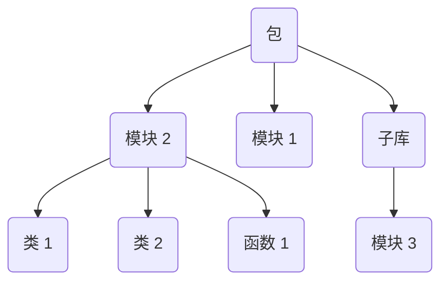

本文介绍 Python 项目工程化的基本方法。

## 快速开始

现代 Python 工程推荐优先使用 [uv](https://github.com/astral-sh/uv) 管理解释器、虚拟环境和依赖。下面是一个最小项目流程。

### 安装 uv

=== "macOS/Linux"

    ```bash
    curl -LsSf https://astral.sh/uv/install.sh | sh
    ```

=== "Windows"

    ```powershell
    powershell -ExecutionPolicy ByPass -c "irm https://astral.sh/uv/install.ps1 | iex"
    ```

安装后可以检查版本：

```bash
uv --version
```

### 创建项目

```bash
uv init demo
cd demo

# 固定当前项目使用的 Python 版本
uv python pin 3.12

# 查看项目实际使用的解释器版本
uv run python --version
```

### 添加依赖

```bash
# 添加运行依赖
uv add requests

# 添加开发依赖
uv add --dev ruff ty pytest

# 根据 pyproject.toml 和 uv.lock 同步环境
uv sync
```

### 运行和检查

```bash
# 运行脚本
uv run python main.py

# 格式化
uv run ruff format

# 代码检查
uv run ruff check

# 类型检查
uv run ty check

# 测试
uv run pytest
```

> [!tip]
>
> 开发中优先使用 `uv run <command>` 执行命令，这样不需要手动激活虚拟环境，也能保证命令运行在项目环境中。

## 工具

工欲善其事，必先利其器。好的工具可以让 Python 开发事半功倍。

### 工具安装

=== "Python Manager"

    小白推荐使用 Python [官方管理器](https://www.python.org/downloads/) 安装和管理 Python。

    安装好之后就可以使用 Python 自带的包管理工具 [pip](https://github.com/pypa/pip) 管理第三方包。pip 的特点是轻量、传统、兼容性好，但速度较慢。

    如果没有 pip，可以手动安装：

    ```bash
    python -m ensurepip --upgrade
    ```

=== "conda"

    数据科学任务推荐使用 [`conda`](https://github.com/conda/conda) 安装和管理 Python。

    conda 是 Anaconda 和 Miniconda 的包与环境管理工具，其中 Miniconda 是 Anaconda 的精简版，推荐使用 Miniconda。与 `pip` 不同的是，`conda` 不仅可以以虚拟环境的形式管理 Python 包，还能很方便地管理 Python 版本。这对于很多对 Python 版本有要求的项目来说很方便。特点：强大、跨语言、数据科学常用，但相对臃肿。

    以在 Linux 系统安装 Miniconda 为例，其他系统上的安装方法见 [Anaconda](https://www.anaconda.com/docs/getting-started/miniconda/install) 官网：

    ```bash
    # 创建安装目录（自定义）
    mkdir -p ~/software/miniconda3

    # 下载安装脚本
    wget https://repo.anaconda.com/miniconda/Miniconda3-latest-Linux-x86_64.sh -O ~/software/miniconda3/miniconda.sh

    # 下载并安装
    bash ~/software/miniconda3/miniconda.sh -b -u -p ~/software/miniconda3

    # 删除安装脚本（可选）
    rm ~/software/miniconda3/miniconda.sh
    ```

=== "uv"

    现代工程软件开发推荐使用 [`uv`](https://github.com/astral-sh/uv) 安装和管理 Python。

    uv 是一个超高速的 Python 包与环境管理工具。它的设计目标是成为 `pip` + `venv` + `virtualenv` + `pip-tools` + `pipx` 的统一替代品，同时兼具 Rust 语言的高性能和 Python 工具的灵活性。特点：新一代工具，统一包管理与环境管理，速度极快，未来有望成为主流。

    === "macOS/Linux"

        ```bash
        curl -LsSf https://astral.sh/uv/install.sh | sh
        ```

    === "Windows"

        ```bash
        powershell -ExecutionPolicy ByPass -c "irm https://astral.sh/uv/install.ps1 | iex"
        ```

### 工具更新

=== "pip"

    ```bash
    pip install --upgrade pip
    ```

=== "conda"

    ```bash
    conda update -n base conda
    ```

=== "uv"

    ```bash
    # 使用原生 shell 安装可以直接使用以下命令
    uv self update

    # 使用 pip 安装可以使用以下命令
    pip install --upgrade uv
    ```

### 工具配置

基本配置方法：

=== "pip"

    ```bash
    # 查看 pip 的配置（添加 -v 参数显示配置文件路径）
    pip config list
    
    # 设置配置
    pip config set <level>.<key> <value>
    
    # 取消配置
    pip config unset <level>.<key>
    ```

=== "conda"

    ```bash
    # 查看所有的配置文件及其配置
    conda config --show-sources
    ```

=== "uv"

    uv 没有 config 子命令一说，各种配置都被拆解为对应的子命令了，建议使用 `uv --help` 查看各种命令的用法。关于配置的查询顺序和优先级，详见 [uv | Configuration files](https://docs.astral.sh/uv/concepts/configuration-files/) 官方文档。

配置下载源：

=== "pip"

    ```bash
    # 临时换源
    pip install <package_name> -i https://pypi.tuna.tsinghua.edu.cn/simple/
    
    # 永久换源
    pip config set global.index-url https://pypi.tuna.tsinghua.edu.cn/simple/
    
    # 查看当前源设置
    pip config list
    
    # 恢复默认源
    pip config unset global.index-url
    ```

=== "conda"

    ```bash
    # 临时换源
    conda install <pkg> -c https://mirrors.tuna.tsinghua.edu.cn/anaconda/pkgs/main/
    
    # 永久换源
    conda config --add channels https://mirrors.tuna.tsinghua.edu.cn/anaconda/pkgs/main/
    conda config --add channels https://mirrors.tuna.tsinghua.edu.cn/anaconda/pkgs/free/
    conda config --set show_channel_urls yes
    
    # 查看当前源设置
    conda config --show
    
    # 恢复默认源
    conda config --remove-key channels
    ```

=== "uv"

    ```bash
    # 临时换源
    uv add requests --index https://pypi.tuna.tsinghua.edu.cn/simple/
    
    # 项目级换源
    # 编辑项目目录下的 pyproject.toml 文件
    [[tool.uv.index]]
    url = "https://pypi.tuna.tsinghua.edu.cn/simple/"
    default = true
    
    # 用户级换源
    # 根据 https://docs.astral.sh/uv/concepts/configuration-files/ 的指引找到当前系统存储的 uv.toml 并编辑
    [[index]]
    url = "https://pypi.tuna.tsinghua.edu.cn/simple/"
    default = true
    
    # 系统级换源
    # 编辑环境变量 UV_DEFAULT_INDEX=https://pypi.tuna.tsinghua.edu.cn/simple/
    ```

管理缓存：

=== "pip"

    ```bash
    # 查看缓存路径
    pip cache dir
    
    # 查看缓存信息（包括路径、大小、数量等）
    pip cache info
    
    # 清空缓存
    pip cache purge
    
    # 配置缓存路径
    pip config set global.cache-dir <path/to/cache/folder>
    ```

=== "conda"

    ```bash
    # 查看缓存路径
    conda config --show pkgs_dirs
    
    # 查看可清理的缓存
    conda clean --dry-run --all

    # 清空缓存
    conda clean --all

    # 配置缓存路径
    conda config --add pkgs_dirs </path/to/conda/pkgs>
    ```

=== "uv"

    ```bash
    # 查看缓存路径
    uv cache dir
    
    # 查看缓存大小（-H 表示符合人类习惯）
    uv cache size -H
    
    # 清空缓存
    uv cache clean
    
    # 配置缓存路径
    # 在环境变量中设置 UV_CACHE_DIR
    ```

## 管理

### 解释器管理

工程项目应明确 Python 版本，避免因为本地解释器不同导致依赖解析、语法支持或运行行为不一致。

=== "Python Manager"

    目前 Python 官方已经研发出了多版本解释器管理工具 Python Manager，直接下载即可。

=== "conda"

    可以在创建虚拟环境的时候指定 Python 解释器版本。

=== "uv"

    ```bash
    # 查询可下载的 Python 解释器版本
    uv python list
    
    # 下载指定版本的 Python
    uv python install <python_version>
    
    # 固定项目使用的 Python 版本，之后会在项目目录下生成一个 .python-version 的文本文件
    uv python pin <python_version>
    
    # 将 Python 二进制程序加入用户环境变量
    uv python update-shell
    
    # 激活虚拟环境后即可使用对应 Python 了
    uv run python --version
    ...
    
    # 删除指定版本的 Python
    uv python uninstall <python_version>
    ```

### 虚拟环境管理

不同的项目往往依赖不同的包，为了避免一个项目安装或升级包时影响另一个项目，一般推荐按照项目进行依赖隔离，隔离出来的环境被称作虚拟环境。

所谓虚拟环境，本质上就是拷贝（或链接）一个 Python 解释器，然后将各种依赖安装在指定目录下，从而起到了隔离的效果。

> [!note]
>
> 虚拟环境并不代表根解释器的完全拷贝，有些项目无关的文件并不会拷贝，所以不能删除根解释器。

基本操作：

=== "pip"

    无法管理，但是可以借助 Python 自带的 `venv` 库。
    
    ```bash
    # 创建环境
    python -m venv <venv_folder_name>
    
    # 激活环境 (Windows)
    .\<venv_folder_name>\Scripts\activate
    
    # 激活环境 (Linux)
    source ./<venv_folder_name>/bin/activate
    
    # 退出环境
    deactivate
    ```

=== "conda"

    > [!note]
    >
    > conda 会将虚拟环境统一管理，适用于多项目使用同一个虚拟环境的场景。conda 支持自定义虚拟环境的存储路径，这意味着我们可以将 conda 的虚拟环境自定义为便于同步的数据盘：
    >
    > ```bash
    > # 查看虚拟环境存储路径
    > conda config --show envs_dirs
    >
    > # 配置虚拟环境存储路径
    > conda config --add envs_dirs </path/to/conda/envs>
    > ```

    ```bash
    # 查看环境
    conda env list
    
    # 创建环境
    conda create -n <env_name> python=<python_version>
    
    # 激活 base 环境（方法一）
    source ~/software/miniconda3/bin/activate
    
    # 激活 base 环境（方法二）
    source activate base
    
    # 激活自定义的环境
    conda activate <env_name>
    
    # 退出环境
    conda deactivate
    
    # 删除环境
    conda remove -n <env_name> --all
    ```

=== "uv"

    使用 uv 初始化项目会自动生成一个虚拟环境目录：
    
    ```bash
    uv init
    ```
    
    当然也可以用下面的方法来更定制化的管理：
    
    ```bash
    # 创建环境
    uv venv <env_folder_path> [--python <version>]
    
    # 激活环境
    source <env_folder_path>/bin/activate   # Linux / macOS
    <env_folder_path>\Scripts\activate    # Windows
    
    # 删除环境
    rm -rf <env_folder_path>
    ```

环境同步：

=== "pip"

    ```bash
    # 导出环境
    pip freeze > requirements.txt
    
    # 复现环境
    pip install -r requirements.txt
    ```

=== "conda"

    ```bash
    # 导出环境
    conda env export > environment.yml
    
    # 复现环境
    conda env create -f environment.yml
    ```

=== "uv"

    用 `uv add`、`uv remove` 命令管理包时，`uv` 会自动维护两个文件：
    
    - `pyproject.toml`：记录你手动添加的顶层依赖（即你显式安装的包）；
    - `uv.lock`：记录完整的锁定依赖树（所有版本、所有子依赖、哈希等）。
    
    ```bash
    # 复现环境
    uv sync

    # 同样兼容 pip 项目
    uv pip install -r <path/to/requirements.txt>
    ```

### 依赖管理

如果使用了 [虚拟环境](#虚拟环境管理)，请在管理依赖之前提前激活虚拟环境。

依赖管理需要区分「顶层依赖」和「完整依赖树」。顶层依赖是项目直接声明需要的包，完整依赖树则包含这些包的子依赖及其精确版本。

| 文件 | 作用 | 是否建议提交 |
| --- | --- | --- |
| `pyproject.toml` | 记录项目元数据、顶层依赖和工具配置 | 是 |
| `uv.lock` | 记录完整锁定依赖树 | 应用项目建议提交 |
| `requirements.txt` | 传统 pip 依赖列表 | 老项目常见 |
| `environment.yml` | conda 环境描述文件 | conda 项目常见 |

uv 会自动维护 `pyproject.toml` 和 `uv.lock`。

查看依赖：

=== "pip"
    
    ```bash
    # 查看已安装的依赖
    pip list
    
    # 查看依赖信息
    pip show <pkg>
    
    # 查看依赖文件
    pip show -f <pkg>
    ```

=== "conda"

    ```bash
    conda list
    ```

=== "uv"

    ```bash
    uv pip list
    ```

安装与卸载依赖：

=== "pip"
    
    ```bash
    # 安装依赖
    pip install [options] <pkg>
    
    # 安装依赖（安装指定版本）
    pip install <pkg>==<version>
    
    # 安装依赖（从文件中读取依赖列表）
    pip install -r <file_name>
    
    # 安装依赖（同时安装扩展）
    pip install <pkg>[<plugin>]  # 例如 pip install "imageio[ffmpeg]"
    
    # 安装依赖（从 Git 项目下载，可指定分支或提交）
    pip install git+https://github.com/<username>/<repo>.git[@<branch>]
    pip install git+https://github.com/<username>/<repo>.git[@<commit_id>]
    
    # 安装依赖（强制安装最新版，--upgrade 可简写为 -U）
    pip install --upgrade <pkg>
    
    # 安装依赖（强制重新安装）
    pip install --force-reinstall <pkg>
    
    # 安装依赖（禁用构建隔离，适用于构建过程依赖当前环境中已有依赖的场景）
    pip install --no-build-isolation <pkg>
    
    # 卸载依赖
    pip uninstall <pkg>
    ```

=== "conda"

    ```bash
    # 安装依赖
    conda install <pkg>
    
    # 安装依赖（安装指定版本，注意只有一个等号）
    conda install <pkg>=<version>
    
    # 卸载依赖（方法一）
    conda uninstall <pkg>
    
    # 卸载依赖（方法二）
    conda remove <pkg>
    ```

=== "uv"
    
    ```bash
    # 安装依赖
    uv add [options] <pkg>
    
    # 安装依赖（安装指定版本）
    uv add <pkg>==<version>
    
    # 安装依赖（从文件中读取依赖列表）
    uv add -r <filename>
    
    # 安装依赖（从 git 源码安装）
    # 前提是项目包含构建配置文件：setup.py 或 pyproject.toml 或 setup.cfg
    uv add git+https://github.com/thu-ml/SLA.git
    
    # 卸载依赖
    uv remove <pkg>
    ```
    
    对于有前置依赖的依赖，可以在 `pyproject.toml` 中添加以下内容，这样 uv 就会先安装前置依赖，然后再安装对应的依赖：
    
    ```toml hl_lines="9-10"
    [project]
    name = "project"
    version = "0.1.0"
    description = "..."
    readme = "README.md"
    requires-python = ">=3.12"
    dependencies = ["cchardet", "cython", "setuptools"]
    
    [tool.uv]
    no-build-isolation-package = ["cchardet"]
    ```

更新依赖：

=== "pip"

    ```bash
    # 查看可更新的依赖
    pip list --outdated

    # 更新指定依赖
    pip install --upgrade <pkg>

    # 更新指定依赖到指定版本
    pip install --upgrade <pkg>==<version>

    # 按文件升级依赖
    pip install --upgrade -r requirements.txt
    ```

=== "conda"

    ```bash
    # 更新当前环境中的全部依赖
    conda update --all

    # 更新指定依赖
    conda update <pkg>

    # 更新指定依赖到指定版本
    conda install <pkg>=<version>

    # 根据 environment.yml 同步环境
    conda env update -f environment.yml --prune
    ```

=== "uv"

    方案一：先更新 uv.lock 然后更新依赖。适用于不需要修改版本约束的场景，因为该方法无法同步更新 pyproject.toml。

    ```bash
    # 更新 uv.lock 中的全部依赖版本
    uv lock --upgrade
    # 同步环境（下载并安装新版本依赖）
    uv sync
    
    # 更新 uv.lock 中的指定依赖版本
    uv lock --upgrade-package <pkg>[=<version>]
    # 同步环境（下载并安装新版本依赖）
    uv sync
    ```

    方案二：一次性更新 uv.lock 和 pyproject.toml，同时更新依赖。适用于需要修改版本约束的场景（例如依赖进行了破坏性更新）。

    ```bash
    uv add "pkg>=0.0.2"
    ```

## 项目结构

项目结构应服务于导入、测试和发布。小脚本可以简单组织；长期维护或需要发布的项目，建议使用 `src` 结构。

### 简单脚本结构

简单脚本结构适合学习代码、小工具和一次性脚本：

```text
demo/
├── main.py
├── pyproject.toml
└── uv.lock
```

运行方式：

```bash
uv run python main.py
```

### src 结构

`src` 结构适合可测试、可发布的项目：

```text
demo/
├── README.md
├── pyproject.toml
├── uv.lock
├── src/
│   └── demo/
│       ├── __init__.py
│       └── main.py
└── tests/
    └── test_main.py
```

其中：

- `src/demo/` 存放可导入的包代码；
- `tests/` 存放测试代码；
- `pyproject.toml` 存放项目元数据、依赖和工具配置；
- `uv.lock` 固定完整依赖树。

`src` 结构可以减少「当前目录恰好能导入，但安装后不能导入」的问题，更接近真实安装后的运行环境。

### pyproject.toml

`pyproject.toml` 是现代 Python 项目的核心配置文件。一个最小示例：

```toml
[project]
name = "demo"
version = "0.1.0"
description = "..."
readme = "README.md"
requires-python = ">=3.12"
dependencies = ["requests>=2.32.0"]

[dependency-groups]
dev = ["ruff", "ty", "pytest"]

[project.scripts]
demo = "demo.main:main"
```

其中 `[project.scripts]` 可以声明命令行入口。配置后可以运行：

```bash
uv run demo
```

## 模块

### 模块与包

模块 (Module) 即一个以 `.py` 为后缀的文本文件，其中可以包括变量、函数、类等 Python 对象。

包 (Package) 则是用于组织模块的目录，目录内可以包含子包和多个模块。可以简单地将 Python 中的包与 [C++ 中的命名空间](../../cs/cplusplus/index.md#命名空间) 类比：同一个包中不可出现同名模块，不同的包中可以出现同名模块。Python 包的基本结构如下图所示：




Python 工程的最佳实践是将 Python 对象按功能组织在对应的模块中，并通过导入和导出机制复用这些 Python 对象。

以下面的项目结构为例：

```text
myapp/
├── main.py
├── utils.py
└── pkg/
    ├── __init__.py
    ├── math_utils.py
    └── string_utils.py
```

从 Python 3.3 开始，`__init__.py` 不再是所有包的强制要求。但在普通工程项目中，仍建议保留它，用来明确目录是包，并集中暴露公开接口。

### 模块搜索顺序

当用 `import xxx` 尝试导入某一个模块时，Python 会按以下顺序搜索模块：

1. **当前执行脚本所在目录**。例如执行 `python main.py` 时，解释器会先在 `myapp` 中找。
2. **环境变量 `PYTHONPATH` 指定的路径**。可以通过 `export PYTHONPATH=/path/to/mylibs` 指定。
3. **标准包路径**。Python 自带的包，如 `os`、`sys` 等。
4. **第三方包路径**。通过 `pip install` 安装的库都在这里，即 `site-packages` 目录。

可以打印 `sys.path` 列表查看解释器的模块搜索路径：


可以看到解释器的确按照上述顺序搜索模块。其中空字符串就表示项目所在根目录，对于示例项目，就是 `/path/to/myapp`。

> [!note] PYTHONPATH $\ne$ 虚拟环境激活
>
> 设置 `PYTHONPATH` 只是告诉解释器额外去某个目录找模块，并没有改变 Python 的运行环境。
>
> 虚拟环境在激活时，会做的不仅仅是修改 `PYTHONPATH`，它还会：
>
> 1. 改变 `sys.prefix` 和 `sys.executable`，让解释器以虚拟环境为主。
> 2. 注入 `sitecustomize.py` 和 `site.py` 的钩子，使包索引、依赖解析与虚拟环境匹配。
> 3. 修改动态链接库的搜索路径。

### 导入方式

Python 对象的导入方式有两种：绝对导入和相对导入。

**绝对导入**。从项目根目录开始写路径，可以保证路径清晰，适合跨包引用。例如：

```python
# main.py
from pkg import math_utils  # 导入模块
from pkg.string_utils import clean_text  # 导入函数
```

**相对导入**。基于当前模块所在位置，使用 `.` 或 `..` 来表示相对路径，便于包的内部维护。例如：

```python
# 在 pkg/math_utils.py 内
from .. import utils             # 导入上一级目录的模块
from . import string_utils       # 导入同级目录的模块
from .string_utils import cos    # 导入同级目录模块的函数
```

### 导出方式

模块内的 `__all__` 变量可以约束 `from module import *` 导出的对象，也能表达模块希望公开的接口边界。

=== "使用 `__all__`"

    ```python title="utils.py" hl_lines="3"
    import math
    
    __all__ = ["Demo", "GLOBAL_VAR"]
    
    GLOBAL_VAR = "hello"
    
    class Demo:
        def __init__(self):
            print(f"cos(1) = {math.cos(1)}")
    
    def fun():
        print("this is function")
    ```
    
    ```python title="main.py"
    from utils import *
    
    print(globals())
    ```
    
    ```text title="Output" hl_lines="11-12"
    {
        '__name__': '__main__',
        '__doc__': None,
        '__package__': None,
        '__loader__': <_frozen_importlib_external.SourceFileLoader object at 0x000001EA08FAC380>,
        '__spec__': None,
        '__annotations__': {},
        '__builtins__': <module 'builtins' (built-in)>,
        '__file__': 'e:\\python\\demos\\fastapi-demo\\src\\main.py',
        '__cached__': None,
        'Demo': <class 'utils.Demo'>,
        'GLOBAL_VAR': 'hello'
    }
    ```

=== "不用 `__all__`"

    ```python title="utils.py" hl_lines="3"
    import math
    
    # __all__ = ["Demo", "GLOBAL_VAR"]
    
    GLOBAL_VAR = "hello"
    
    class Demo:
        def __init__(self):
            print(f"cos(1) = {math.cos(1)}")
    
    def fun():
        print("this is function")
    ```
    
    ```python title="main.py"
    from utils import *
    
    print(globals())
    ```
    
    ```text title="Output" hl_lines="11-14"
    {
        '__name__': '__main__',
        '__doc__': None,
        '__package__': None,
        '__loader__': <_frozen_importlib_external.SourceFileLoader object at 0x0000028A84E6C380>,
        '__spec__': None,
        '__annotations__': {},
        '__builtins__': <module 'builtins' (built-in)>,
        '__file__': 'e:\\python\\demos\\fastapi-demo\\src\\main.py',
        '__cached__': None,
        'math': <module 'math' (built-in)>,
        'GLOBAL_VAR': 'hello',
        'Demo': <class 'utils.Demo'>,
        'fun': <function fun at 0x0000028A84EB0900>
    }
    ```

可以看到，使用 `__all__` 约束后，`main.py` 只导入了 `Demo` 和 `GLOBAL_VAR` 对象；而失去 `__all__` 的约束后，`main.py` 就导入了 `utils.py` 的全部对象：`math`、`Demo`、`GLOBAL_VAR` 和 `fun`。

## 运行方式

Python 主要有两种运行方式：脚本级运行和模块级运行。但无论哪种，都是运行一个 `.py` 文件（模块），所以本节的内容紧跟「模块」一节。

### 脚本级运行

即直接运行指定路径下的 `.py` 文件。例如：

```bash
python src/hello/world.py
```

此时，解释器认为 `world.py` 是顶层脚本，将 `world.py` 所在目录作为根目录搜索其余模块，即 `sys.path[0] = src/hello`。

因此，`world.py` 中无法绝对导入上级目录的模块，也无法使用相对导入。

- 如果绝对导入上级目录的模块，解释器报错：ModuleNotFoundError，因为解释器不会往上一级目录搜索模块。
- 如果相对导入，解释器报错：ImportError: attempted relative import with no known parent package，因为相对导入只适用于包内模块，脚本级运行 `world.py` 时，其 `__package__` 为 `None`，解释器不知道从什么地方开始搜索模块。

脚本级运行方式适用于程序的入口文件。

### 模块级运行

即通过 `-m` 参数运行指定 `.` 索引下的模块。例如：

```bash
python -m src.hello.world
```

此时，解释器将执行命令的目录作为根目录搜索其余模块，即 `sys.path[0] = .`。

因此 `world.py` 可以使用绝对导入（子级或上级模块均可），也可以使用相对导入。

模块级运行适用于调试模块。

### `if __name__ == "__main__"`

在实际开发中，包内模块往往既要被其他模块导入，又希望能单独测试。此时我们通常会在模块末尾写：

```python
if __name__ == "__main__":
    # 测试代码
    obj = SomeClass()
    obj.run()
```

当模块被 `import` 运行时，该模块的 `__name__` 变量会被赋值为具体的包名，那么 `if __name__ == "__main__"` 下的逻辑就不会执行。

当使用 `python -m` 运行该模块时，该模块的 `__name__` 变量会被赋值为 `"__main__"`，那么 `if __name__ == "__main__"` 下的逻辑就会执行。

这样不同的运行方式就会触发不同的代码逻辑，很适合模块级运行用于调试模块。

## 分发包

本地开发时，包往往被理解为一个存储模块或子包的目录；而在试图开发可分发包的场景，包一般会被理解为一个可被安装与导入的模块集合。视角理解：

| 概念 | 视角 | 示例 |
| --- | --- | --- |
| 包 | `import` 视角的代码组织单位 | `import requests` |
| 分发包 | 包管理工具安装和发布的产物 | `uv add requests` |

### 开发包

使用 uv 可以创建适合发布的包项目：

```bash
uv init --package demo
cd demo
uv sync
```

典型结构如下：

```text
demo/
├── README.md
├── pyproject.toml
├── src/
│   └── demo/
│       ├── __init__.py
│       └── py.typed
└── tests/
```

开发本地库时，可以使用可编辑安装。这样依赖方读取的是源码目录，修改源码后不需要反复重新安装：

```bash
uv add --editable ../my-lib
```

如果包需要提供命令行入口，可以在 `pyproject.toml` 中声明：

```toml
[project.scripts]
demo = "demo.main:main"
```

然后运行：

```bash
uv run demo
```

### 构建包

发布前需要先构建分发产物：

```bash
uv build
```

构建结果通常位于 `dist/` 目录：

```text
dist/
├── demo-0.1.0-py3-none-any.whl
└── demo-0.1.0.tar.gz
```

其中 wheel 文件用于快速安装，源码分发包用于保留源码和构建信息。

### 发布包

包分发系统 (Python Package Index, [PyPI](https://pypi.org/)) 用于分发和管理第三方 Python 包。发布前应确认：

- 包名没有和已有项目冲突；
- 版本号已经更新；
- `README.md`、许可证、`requires-python` 和依赖声明完整；
- 本地格式化、检查、类型检查和测试都通过；
- `uv build` 可以正常生成分发产物。

发布到 PyPI：

```bash
uv publish --token <pypi_token>
```

如果需要先发布到测试索引，可以指定发布地址：

```bash
uv publish --publish-url https://test.pypi.org/legacy/ --token <test_pypi_token>
```

### 包名规范

[PEP 503](https://peps.python.org/pep-0503/) 规定了包名标准化规则：

- 所有单个或连续的 `-`、`.`、`_` 字符都会被替换为单个 `-`；
- 所有字母都会被转化为小写字母。

例如 `FLASH-atTn`、`flash_attn`、`flash___attn` 等都会被解释为 `flash-attn`。

工程中应尽量统一分发包名和导入包名，避免包索引解析和代码导入时出现混淆。

> [!note] PEP
>
> Python 增强提案 (Python Enhancement Proposal, PEP) 是 Python 社区用来规范 Python 语言的。

## 代码质量

代码质量工具应尽早加入项目，避免问题积累到发布或部署阶段。

### 格式化与检查

推荐使用 `ruff` 同时做格式化和代码检查：

```bash
uv add --dev ruff

# 格式化代码
uv run ruff format

# 检查代码问题
uv run ruff check

# 自动修复可修复的问题
uv run ruff check --fix
```

格式化负责统一代码风格，代码检查负责发现未使用变量、导入顺序、潜在错误等问题。

### 类型检查

推荐使用 `ty` 做类型检查：

```bash
uv add --dev ty
uv run ty check
```

类型检查不会替代运行时测试，但可以提前发现入参、返回值、属性访问等类型不一致问题。

### 测试

推荐使用 `pytest` 编写和运行测试：

```bash
uv add --dev pytest
uv run pytest
```

测试文件通常放在 `tests/` 目录中，文件名使用 `test_*.py` 或 `*_test.py`。例如：

```python title="tests/test_main.py"
from demo.main import add

def test_add() -> None:
    assert add(1, 2) == 3
```

如果代码中需要日志、命令行参数解析、路径处理等能力，可以继续参考 [常用标准库](./std-lib.md)。

### 注释

VSCode 插件推荐 autoDocstring，PyCharm 有自动 docstring 模板。
