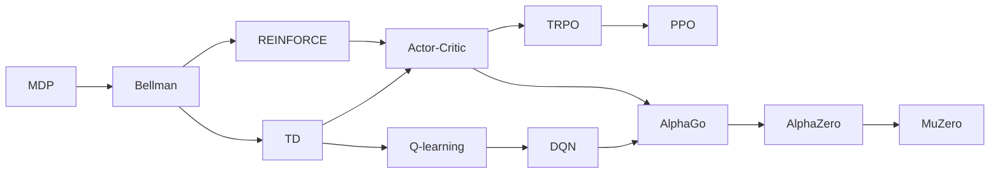

强化学习 (Reinforcement Learning, RL) 研究智能体如何通过与环境交互学习决策策略。与在固定数据上拟合标签的监督学习不同，RL 中的动作会改变后续状态和数据分布，反馈也可能在多步之后才出现。

本文沿着一条经典主线介绍强化学习，主线中的每一步都在解决前一步留下的问题。主线如下图所示：

参考资料：

- [Reinforcement Learning: An Introduction](http://incompleteideas.net/book/the-book-2nd.html)
- [赵世钰老师的强化学习公开课](https://space.bilibili.com/2044042934/lists/748665)

## GridWorld

考虑一个网格世界：智能体从左下角出发，每一步可以选择上、下、左、右，目标是到达右上角。到达目标得到 $+1$，普通移动得到 $-0.01$，撞墙则停在原地。

| 要素 | GridWorld 中的含义 |
| :-- | :-- |
| 状态 $s_t$ | 当前所在格子 |
| 动作 $a_t$ | 上、下、左、右 |
| 奖励 $r_{t+1}$ | 到达终点的正奖励或普通移动的代价 |
| 策略 $\pi(a\mid s)$ | 在某个格子选择各动作的概率 |
| 转移 $P(s'\mid s,a)$ | 执行动作后到达下一格的概率 |

策略的目标不是让某一步奖励最大，而是让整段交互的折扣回报最大：

$$
J(\pi)=\mathbb{E}_{\pi}\left[\sum_{t=0}^{\infty}\gamma^t r_{t+1}\right]
$$

其中 $\gamma\in[0,1]$ 是折扣因子。它控制远期奖励在当前决策中的权重，并使无限时域中的累计回报保持有限。

奖励只是任务目标的代理。若奖励设计错误，智能体可能得到高分却没有完成真实目标；真实交互昂贵或危险时，还必须限制探索范围。

## MDP

马尔可夫决策过程 (Markov Decision Process, MDP) 通常写成：

$$
\mathcal{M}=(\mathcal{S},\mathcal{A},P,R,\gamma)
$$

其中 $\mathcal{S}$ 是状态空间，$\mathcal{A}$ 是动作空间，$P$ 是状态转移概率，$R$ 是奖励函数。马尔可夫性假设当前状态已经包含预测未来所需的信息：给定 $s_t$ 和 $a_t$ 后，下一状态不再依赖更早的历史。

状态价值 $V^\pi(s)$ 表示从状态 $s$ 出发并遵循策略 $\pi$ 时的期望回报；动作价值 $Q^\pi(s,a)$ 则额外固定第一步动作 $a$。前者回答“当前状态有多好”，后者回答“当前状态下这个动作有多好”。

## Bellman

序贯决策的困难在于，当前动作的好坏取决于很久以后的结果。[A Markovian Decision Process](https://doi.org/10.1512/iumj.1957.6.56038) 将最优价值写成当前奖励与后继价值的递归关系：

$$
V^*(s)=\max_a\sum_{s'}P(s'\mid s,a)
\left[R(s,a,s')+\gamma V^*(s')\right]
$$

贝尔曼最优方程把一个长时序问题拆成重复的一步问题。如果 $P$ 和 $R$ 已知，值迭代可以反复应用这个递推式，策略迭代则交替进行策略评估和策略改进。GridWorld 的地图和移动规则完全已知时，就可以用动态规划计算每个格子的价值，再选择通向高价值格子的动作。

问题在于，真实环境通常不会直接给出完整转移概率和奖励模型。机器人只能执行动作并观察结果，游戏程序也只能从对局中取得经验。强化学习因此需要从采样轨迹中近似贝尔曼递推。

## TD

一种无模型方法是蒙特卡洛估计：完整运行一局，再用实际累计回报更新访问过的状态。它不需要环境模型，但必须等到轨迹结束，而且同一状态之后可能发生许多随机事件，回报方差很大。

[Learning to Predict by the Methods of Temporal Differences](https://doi.org/10.1007/BF00115009) 提出的时序差分 (Temporal Difference, TD) 学习结合了采样和贝尔曼递推。TD(0) 不等待最终回报，而是用一步奖励和下一状态的当前估计修正价值：

$$
\delta_t=r_{t+1}+\gamma V(s_{t+1})-V(s_t)
$$

$$
V(s_t)\leftarrow V(s_t)+\alpha\delta_t
$$

这种用已有估计更新当前估计的方法称为 bootstrapping。它让价值学习能够在持续运行的任务中逐步进行；每获得一个新观察，就能立即产生训练信号。代价是目标本身也是估计值，学习率、采样分布和函数近似都可能影响稳定性。

## Q-learning

TD 可以评估一个固定策略，但控制问题还需要决定采取什么动作。若环境模型未知，仅有状态价值还不足以比较各动作。[Q-learning](https://doi.org/10.1007/BF00992698) 直接学习最优动作价值：

$$
Q(s_t,a_t)\leftarrow Q(s_t,a_t)+\alpha
\left[r_{t+1}+\gamma\max_{a'}Q(s_{t+1},a')-Q(s_t,a_t)\right]
$$

行为策略可以用 $\epsilon$-greedy 探索不同动作，更新目标却总使用下一状态中的最大动作价值。因此 Q-learning 是离策略 (off-policy) 方法：产生数据的探索策略与希望学到的贪心策略可以不同。

在 GridWorld 中，Q 表为每个格子保存四个动作的长期价值。经过反复试走后，智能体即使不知道地图的转移模型，也能学到绕开障碍并抵达目标的动作序列。

Q-learning 的限制同样明确：表格必须枚举每个状态与动作。像素画面、机器人关节状态或其他连续高维输入无法用有限 Q 表覆盖，这促使强化学习引入函数近似。

## REINFORCE

Q-learning 先学习动作价值，再选择价值最大的动作。连续动作无法被逐个枚举，随机策略也更适合直接表示为概率分布。策略梯度因此直接参数化 $\pi_\theta(a\mid s)$，让高回报轨迹中动作的概率上升。

[Simple Statistical Gradient-Following Algorithms for Connectionist Reinforcement Learning](https://doi.org/10.1007/BF00992696) 提出的 REINFORCE 使用采样回报估计梯度：

$$
\nabla_\theta J(\theta)
=\mathbb{E}_{\pi_\theta}\left[
\sum_t \nabla_\theta\log\pi_\theta(a_t\mid s_t)G_t
\right]
$$

在 CartPole 中，策略网络可以输出向左或向右施力的概率。若一条轨迹让杆保持平衡更久，轨迹中所选动作的概率便会提高。REINFORCE 实现直接，但完整回报 $G_t$ 的方差很大，而且通常要等一局结束后才能更新。

## Actor-Critic

Actor-Critic 将 TD 和策略梯度合并。Actor 表示并更新策略，Critic 估计状态价值或动作价值，再用优势函数衡量某个动作比当前平均水平好多少：

$$
A^\pi(s,a)=Q^\pi(s,a)-V^\pi(s)
$$

Actor 用 $A_t$ 代替完整回报更新策略，Critic 则通过 TD error 持续学习。这样既保留了策略梯度对随机策略和连续动作的支持，又用学习到的基线降低方差。[Neuronlike Adaptive Elements That Can Solve Difficult Learning Control Problems](https://doi.org/10.1109/TSMC.1983.6313077) 展示了早期 Actor-Critic 控制思想，后来的 [Policy Gradient Methods for Reinforcement Learning with Function Approximation](https://papers.nips.cc/paper/1713-policy-gradient-methods-for-reinforcement-learning-with-function-approximation) 则给出了函数近似下的策略梯度理论。

Actor-Critic 成为许多现代算法的公共框架，但策略数据来自当前策略；参数稍有变化，后续采样分布也会改变。更新幅度过大时，新策略可能迅速丢失旧策略已经学会的行为。

## DQN

函数近似也能扩展 Q-learning。Atari 的状态是连续变化的像素画面，不可能为每幅画面建立 Q 表。[Human-level control through deep reinforcement learning](https://www.nature.com/articles/nature14236) 中的深度 Q 网络 (Deep Q-Network, DQN) 用卷积网络从画面预测每个离散动作的 Q 值。

直接把神经网络接到 Q-learning 上并不稳定：相邻游戏帧高度相关，在线网络又同时参与当前预测和训练目标计算。DQN 使用两项关键机制：

- 经验回放：保存交互样本并随机抽取小批量，降低样本相关性；
- 目标网络：用延迟更新的参数 $\theta^-$ 计算 TD 目标，减缓目标漂移。

其训练目标为：

$$
y=r+\gamma\max_{a'}Q_{\theta^-}(s',a'),\qquad
L(\theta)=\mathbb{E}\left[(y-Q_\theta(s,a))^2\right]
$$

DQN 使同一套算法能够从原始像素学习多款 Atari 游戏，成为深度强化学习兴起的标志。它解决了高维状态表示问题，但原始形式主要面向离散动作，训练仍然消耗大量环境交互。

## TRPO

Actor-Critic 降低了梯度方差，却没有阻止一次更新把策略推得太远。如果新策略与采样数据对应的旧策略差异过大，局部估计便不再可靠。[Trust Region Policy Optimization](https://arxiv.org/abs/1502.05477) (TRPO) 在优化代理目标的同时约束新旧策略的 KL 散度，使每次更新停留在信赖域内。

TRPO 提高了策略更新的稳定性，但需要处理二阶近似、共轭梯度和约束优化，实现成本较高。下一步问题因而变成：能否保留“不要一次更新太远”的思想，同时继续使用普通的一阶梯度优化？

## PPO

[Proximal Policy Optimization Algorithms](https://arxiv.org/abs/1707.06347) (PPO) 使用新旧策略对同一动作的概率比：

$$
r_t(\theta)=\frac{\pi_\theta(a_t\mid s_t)}
{\pi_{\theta_{\mathrm{old}}}(a_t\mid s_t)}
$$

并优化裁剪代理目标：

$$
L^{\mathrm{CLIP}}(\theta)=\mathbb{E}\left[
\min\left(
r_t(\theta)A_t,
\operatorname{clip}(r_t(\theta),1-\epsilon,1+\epsilon)A_t
\right)
\right]
$$

当优势为正时，裁剪限制策略过度提高该动作的概率；优势为负时，则限制策略过度降低其概率。PPO 没有完全复现 TRPO 的理论约束，却在实现复杂度和训练稳定性之间取得了实用折中，因此成为机器人连续控制、游戏和早期大模型 RLHF 的常用基线。语言模型中的奖励模型、参考策略 KL 约束和 PPO 训练见 [强化学习](../../../llm/development/training/stages/rl.md)。

PPO 仍是依赖新策略采样的 On Police 方法，旧数据很快失效，因此稳定性并不等于样本效率高。

## AlphaGo

围棋的分支因子很大，纯搜索难以穷举；只使用策略网络直接落子，又容易因局部判断错误而输掉整局。[Mastering the Game of Go with Deep Neural Networks and Tree Search](https://www.nature.com/articles/nature16961) 将多种方法组成完整系统：先从人类棋谱训练策略网络，再通过自博弈改进策略，并训练价值网络评估局面，最后用蒙特卡洛树搜索 (Monte Carlo Tree Search, MCTS) 结合策略先验与价值估计选择动作。

策略网络让搜索优先探索有希望的落子，价值网络减少了把每个局面模拟到终局的需要，搜索结果又纠正网络的局部误判。该系统在 2016 年以 4:1 击败李世石，说明学习到的策略与价值可以显著增强组合搜索。

AlphaGo 仍依赖人类棋谱初始化，并包含围棋特定的训练流程。接下来的问题是：能否只给出游戏规则，让同一套方法从零学会不同棋类？

## AlphaZero

[Mastering Chess and Shogi by Self-Play with a General Reinforcement Learning Algorithm](https://arxiv.org/abs/1712.01815) 中的 AlphaZero 从随机初始化开始，通过自博弈生成训练数据。单一神经网络同时输出动作先验和局面价值，MCTS 根据网络预测改进落子分布，改进后的搜索分布和最终胜负再用于训练网络。

这形成了策略改进循环：网络指导搜索，搜索产生比当前网络更强的监督目标，新网络再生成更强的自博弈数据。统一框架被用于国际象棋、将棋和围棋，不再依赖人类棋谱。

不过 AlphaZero 的搜索仍能调用精确的游戏规则：给定状态和动作，系统知道下一状态、合法动作和是否终局。真实环境通常没有这样的模拟器。

## MuZero

[Mastering Atari, Go, Chess and Shogi by Planning with a Learned Model](https://arxiv.org/abs/1911.08265) 中的 MuZero 不再要求搜索过程访问真实环境规则。它学习三个相互配合的模块：将观测编码为隐状态的表示模型、预测隐状态转移和奖励的动力学模型，以及预测策略和价值的预测模型。

MuZero 不尝试还原所有像素，只学习规划需要的奖励、策略和价值信息，再在隐空间中执行树搜索。它在不知道真实转移规则的前提下处理了 Atari，也保持了在围棋、国际象棋和将棋上的表现。

这项工作将经典主线推进到“学习模型并在模型中规划”。模型误差、搜索成本和真实交互效率依然是开放问题，但核心思想已经从直接学习动作扩展为学习可供决策使用的环境表示。

## 本文小结

| 阶段 | 代表工作 | 解决的核心问题 | 代表案例 |
| :-- | :-- | :-- | :-- |
| 递归建模 | Bellman / MDP | 如何表达长期回报与最优决策 | GridWorld、库存控制 |
| 从经验估值 | TD | 无模型且不等待轨迹结束 | 持续控制、随机游走 |
| 动作价值控制 | Q-learning | 未知模型下直接学习最优动作 | 离散导航 |
| 直接策略优化 | REINFORCE / Actor-Critic | 随机策略、连续动作与梯度方差 | CartPole、连续控制 |
| 深度函数近似 | DQN | 高维视觉状态无法枚举 | Atari |
| 稳定策略更新 | TRPO / PPO | 策略更新过大导致性能崩溃 | MuJoCo、RLHF |
| 学习结合搜索 | AlphaGo / AlphaZero | 巨大组合空间中的长期规划 | 围棋、国际象棋、将棋 |
| 学习模型并规划 | MuZero | 搜索依赖已知环境规则 | Atari 与棋类 |

这条主线并不包含强化学习的全部分支。离线强化学习、安全强化学习、多智能体、模仿学习和世界模型都建立在这些基础思想之上，但各自需要独立展开。若要进一步理解大模型中的偏好奖励、可验证奖励和 Agent 轨迹训练，可以阅读 [强化学习](../../../llm/development/training/stages/rl.md) 与 [推理能力](../../../llm/development/architecture/reasoning.md)。
