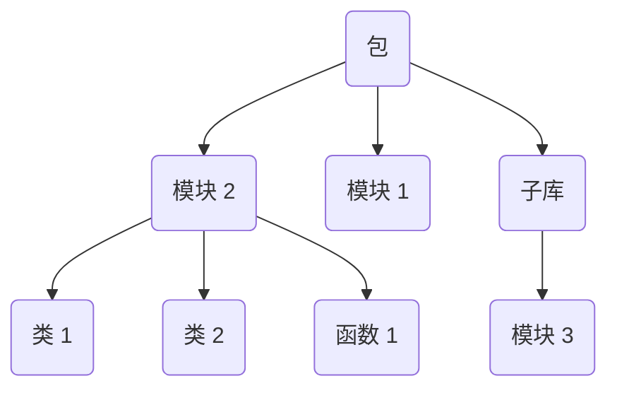

本文介绍 Python 的语法基础，即不 `import` 任何包的情况下涉及的内容。

## 数据类型

Python 是动态类型语言，定义变量时不需要声明类型，赋值时会自动确定。但也支持在定义变量时写上预期的数据类型，不过解释器不会主动检查数据类型不匹配的问题，可以借助第三方类型检查工具（例如 [ty](./index.md#代码管理)）来避免此类错误。

Python 的数据类型还分「可变」与「不可变」两类，不同类型意味着不同的数据操作逻辑。

### 不可变类型

**`bool`**。布尔型，表示二元逻辑。示例用法：

```python
is_active: bool = True
```

**`int`**。整型，表示整数数值。示例用法：

```python
x: int = 10
```

**`float`**。浮点数型，表示带有小数部分的数值。示例用法：

```python
y: float = 3.14
```

**`str`**。字符串，表示由可编码字符组成的数据。示例用法：

```python
# 基本用法
info: str = "Alice"

# 字符转义
info = "hello\tworld"  # hello    world
# 取消字符转义，输出原始内容（r 即 raw）
info = r"hello\tworld"  # hello\tworld

# 字符模板 (f-string)
age = 18.88
info = (f"My age is {age:.1f}, "
        f"and you?")  # My age is 18.9, and you?
# 跨行字符串可以使用小括号包裹
# :.1f 表示给浮点数四舍五入保留 1 位小数

# 字符串拼接
# 使用 str 的 join 方法，将迭代器中的 str 拼接为一个完整版的字符串
# 相较于使用 += 省去了存储中间对象的内存开销，提升了程序的性能
num = [1314, 520, 601]
splice_str = "-".join(str(x) for x in num)  # 1314-520-601
```

**`tuple`**。元组，底层数据结构为 [顺序表](../../../ds-and-algo/topic/ds.md#顺序表)。示例用法：

```python
coordinates: tuple = (10, 20)
print(coordinates[0])  # 访问元组的第一个元素
```

### 可变类型

**`dict`**。字典，底层数据结构为 [哈希表](../../../ds-and-algo/topic/ds.md#哈希表)。示例用法：

```python
# 字典创建（可哈希对象才能作为键，不可变数据类型都可以作为字典的键）
person: dict[str, str | int] = {"name": "Alice", "age": 25}

# 值修改
person["age"] = 26

# 创建新的键值对
person["city"] = "New York"

# 根据键访问值
print(person["name"])
print(person.get("name", "")) 更安全的访问方法，当字典不存在时，返回第二个参数，这里是 ""

# 查询是否存在某个键 O(1)
if "bob" in person:
    pass
# 等价于（基本不这么写）
if "bob" in person.keys():
    pass

# 查询是否存在某个值 O(n)
if "bob" in person.values():
    pass

# 查询是否存在某个键值对 O(1)
if "bob" in person.items():
    pass
```

**`list`**。列表，底层数据结构为 [顺序表](../../../ds-and-algo/topic/ds.md#顺序表)。示例用法：

```python
# 初始化
fruits: list[str] = ["apple", "banana", "cherry"]

# 初始化（列表推导式）
squares = [x**2 for x in range(5)]  # 生成 0 到 4 的平方

# 尾插入 O(1)
fruits.append("orange")

# 尾删除 O(1)
fruits.pop()

# 按值删除 O(n)，删除第一个匹配到的元素
fruits.remove("banana")

# 按索引删除 O(n)
del fruits[1]

# 索引（超出最大索引值会报错 list index out of range）
print(fruits[0])

# 切片（超出最大索引不会报错）
print(fruits[1:3])
```

**`set`**。集合，底层数据结构为 [哈希表](../../../ds-and-algo/topic/ds.md#哈希表)，可以理解为只保留 key 的 `dict`。示例用法：

```python
colors: set[str] = {"red", "green", "blue"}
colors.add("yellow")  # 添加元素
colors.remove("green")  # 删除元素
```

### 不同类型数据的内存机制

Python 中可变与不可变数据类型的内存机制是不一样的，对变量的修改就可以体现出这一点。

对于不可变类型，修改操作本质是「重新赋值」，会开辟新内存，原来的数据保持不变。例如下面的程序。另一个引用变量 $t$ 在进行拼接操作后，对应的内存地址发生了改变，也就是说申请了新的内存空间：

```python
s = "hello"
t = s
print(id(s))  # 2193178293488
print(id(t))  # 2193178293488

t += 'world'
print(id(s))  # 2193178293488
print(id(t))  # 2193178282864
```

对于可变类型，修改操作为原地修改，不会新开内存，因此所有引用同时生效。例如下面的程序。修改了其中一个变量的值以后，三个可变数据类型变量 $a,b,c$ 指向的内存空间没有发生改变，同时其余所有变量也都跟着改变：

```python
a = [1, 2, 3]
b = a
c = b
print(id(a))  # 1441782879424
print(id(b))  # 1441782879424
print(id(c))  # 1441782879424

# a[0] = -1 和 b[0] = -1 效果都是一样的
c[0] = -1

print(id(a))  # 1441782879424
print(id(b))  # 1441782879424
print(id(c))  # 1441782879424

print(a)  # [-1, 2, 3]
print(b)  # [-1, 2, 3]
print(c)  # [-1, 2, 3]
```

## 运算符

Python 有以下 [运算符](https://docs.python.org/zh-cn/3.13/reference/lexical_analysis.html#operators)：

```bash
+       -       *       **      /       //      %      @
<<      >>      &       |       ^       ~       :=
<       >       <=      >=      ==      !=
```

Python 的 [运算符优先级](https://docs.python.org/zh-cn/3.13/reference/expressions.html#operator-precedence)（越往下等级越低）：

|                            运算符                            |                描述                |
| :----------------------------------------------------------: | :--------------------------------: |
|                      `(expressions...)`                      |       绑定或加圆括号的表达式       |
|                      `[expressions...]`                      |              列表显示              |
|                      `{key: value...}`                       |              字典显示              |
|                      `{expressions...}`                      |              集合显示              |
|                          `x[index]`                          |                抽取                |
|                       `x[index:index]`                       |                切片                |
|                      `x(arguments...)`                       |                调用                |
|                        `x.attribute`                         |              属性引用              |
|                          `await x`                           |            await 表达式            |
|                             `**`                             |                乘方                |
|                       `+x`, `-x`, `~x`                       |         正，负，按位非 NOT         |
|                   `*`, `@`, `/`, `//`, `%`                   |     乘，矩阵乘，除，整除，取余     |
|                           `+`, `-`                           |               加和减               |
|                          `<<`, `>>`                          |                移位                |
|                             `&`                              |             按位与 AND             |
|                             `^`                              |            按位异或 XOR            |
|                             `|`                              |             按位或 OR              |
| `in`, `not in`, `is`, `is not`, `<`, `<=`, `>`, `>=`, `!=`, `==` | 比较运算，包括成员检测和标识号检测 |
|                           `not x`                            |           布尔逻辑非 NOT           |
|                            `and`                             |           布尔逻辑与 AND           |
|                             `or`                             |           布尔逻辑或 OR            |
|                         `if -- else`                         |             条件表达式             |
|                           `lambda`                           |           lambda 表达式            |
|                             `:=`                             |             赋值表达式             |

## 流程控制

条件语句 `if`、`elif`、`else` 用于分支控制。例如：

```python
age = 20

if age >= 18:
    print("成人")
else:
    print("未成年")
```

循环语句 `for` 和 `while` 用于重复控制。例如：

```python
# for 循环
for i in range(5):  # 输出 0 到 4
    print(i)

# while 循环
count = 0
while count < 3:
    print("count:", count)
    count += 1  # 增加 count 的值
```

## 函数

Python 使用 `def` 关键字定义函数，可以添加入参和返回值的类型提示，带有默认值的入参要定义在没有默认值入参的后面。例如：

```python
def greet(name: str, school: str = "MIT") -> str:
    return f"Hello {name}, welcome to {school}!"

message = greet("Alice")
print(message)  # Hello Alice, welcome to MIT!
```

### 匿名函数

`lambda` 是 Python 用于定义匿名函数的关键字，适合编写非常简单、一次性的函数逻辑。例如：

```python
square = lambda x: x**2
print(square(5))  # 25
```

不过 [PEP 8](https://peps.python.org/pep-0008/#programming-recommendations) 并不推荐在真实项目中将 `lambda` 赋值给变量，而应当使用 `def` 定义函数。例如：

```diff
- square = lambda x: x**2
+ def square(x):
+     return x**2
```

因为使用 `def` 会让函数名出现在 traceback 中，更有利于调试。`lambda` 的核心价值在于内联使用，作为参数直接传递给高阶函数。例如：

```python
# 示例一
nums = [1, 2, 3]
result = map(lambda x: x * 2, nums)

# 示例二
students.sort(key=lambda s: s.score)
```

### 参数的收集与解包

Python 函数的参数收集与解包机制让参数传递变得更灵活。

Python 函数的参数有两种类型：

1. 位置参数：只有参数值，不同的位置对应不同的参数。

    - 函数定义处：使用元组 `*args` 收集位置参数。

    - 函数调用处：使用 `*` 展开可迭代对象，将其作为多个位置参数传入。

2. 关键字参数：给定参数名和参数值。

    - 函数定义处：使用字典 `**kwargs` 收集关键字参数。

    - 函数调用处：使用 `**` 展开字典，将其作为多个关键字参数传入。

位置参数收集与解包的示例程序：

```python
# 函数定义处，*args 用于接收任意数量的位置参数，并将它们收集为一个元组
def add_all(x, *args):
    print(type(args))  # <class 'tuple'>
    total = 0
    for value in args:
        total += value
    print(total)  # 6

# 函数调用处，* 用于把一个可迭代对象展开为多个位置参数
nums = [1, 2, 3]  # 或 set、tuple 等可迭代对象
add_all(*nums)  # 等价于 add_all(1, 2, 3)
```

关键字参数收集与解包的示例程序：

```python
# 函数定义处，**kwargs 用于接收任意数量的关键字参数，并将它们组织为一个字典
def describe(**kwargs):
    print(type(kwargs))  # <class 'dict'>
    print(kwargs)  # {'name': 'Bob', 'city': Singapore}

# 函数调用处，** 用于把一个字典展开为多个关键字参数
info = {"name": "Bob", "city": "Singapore"}
describe(**info)  # 等价于 describe(name="Bob", city="Singapore")
```

## 类

Python 使用 `class` 关键字定义类，用于面向对象编程。

```python
class Dog:
    def __init__(self, name, age):
        self.name = name
        self.age = age
    
    # 强私有方法（前置双下划线）
    def __calculate_dog_years(self):
        """将狗的年龄转换为人类年龄"""
        return self.age * 7
    
    # 公有方法
    def get_human_age(self):
        # 在类内部可以正常调用
        human_age = self.__calculate_dog_years()
        return f"{self.name} is {human_age} years old in human years."

dog = Dog("Buddy", 3)

# 调用公有方法
print(dog.get_human_age())  # Buddy is 21 years old in human years

# 调用私有方法（报错）
print(dog.__calculate_dog_years())  # AttributeError

# 强制调用私有方法（不推荐）
print(dog._Dog__calculate_dog_years())  # 21
```

## 模块

模块，即一个以 `.py` 为后缀的文本文件，其中可以包括变量、函数、类等任意 Python 对象。

Python 工程的最佳实践是将 Python 对象按功能组织在对应的模块中，并通过导入和导出机制复用这些 Python 对象。

以下面的项目结构为例：

```bash
myapp/
│
├── main.py          # 入口
├── utils.py         # 模块
└── pkg/             # 包
    ├── __init__.py  # 包初始化模块，从 Python 3.3 开始不强制写了
    ├── math_utils.py
    └── string_utils.py
```

### 解释器对模块的搜索顺序

当用 `import xxx` 尝试导入某一个模块时，Python 会按以下顺序搜索模块：

1. **当前执行脚本所在目录**。例如执行 `python main.py` 时，解释器会先在 `myapp` 中找。
2. **环境变量 `PYTHONPATH` 指定的路径**。可以通过 `export PYTHONPATH=/path/to/mylibs` 指定。
3. **标准包路径**。Python 自带的包，如 `os`、`sys` 等。
4. **第三方包路径**。通过 `pip install` 安装的库都在这里，即 `site-packages` 目录。

可以打印 `sys.path` 列表查看解释器的模块搜索路径：


可以看到解释器的确按照上述顺序搜索模块。其中空字符串就表示项目所在根目录，对于示例项目，就是 `/path/to/myapp`。

> [!note] PYTHONPATH $\ne$ 虚拟环境激活
>
> 设置 `PYTHONPATH` 只是告诉解释器额外去某个目录找模块，并没有改变 Python 的运行环境。
>
> 虚拟环境在激活时，会做的不仅仅是修改 `PYTHONPATH`，它还会：
>
> 1. 改变 `sys.prefix` 和 `sys.executable`，让解释器以虚拟环境为主。
> 2. 注入 `sitecustomize.py` 和 `site.py` 的钩子，使包索引、依赖解析与虚拟环境匹配。
> 3. 修改动态链接库的搜索路径。

### 导入方式

Python 对象的导入方式有两种：绝对导入和相对导入。

**绝对导入**。从项目根目录开始写路径，可以保证路径清晰，适合跨包引用。例如：

```python
# main.py
from pkg import math_utils  # 导入模块
from pkg.string_utils import clean_text  # 导入函数
```

**相对导入**。基于当前模块所在位置，使用 `.` 或 `..` 来表示相对路径，便于包的内部维护。例如：

```python
# 在 pkg/math_utils.py 内
from .. import utils             # 导入上一级目录的模块
from . import string_utils       # 导入同级目录的模块
from .string_utils import cos    # 导入同级目录模块的函数
```

### 导出方式

模块内的 `__all__: list[str]` 变量用来约束当前模块导出的对象。有助于明确一个模块中哪些是可以公开调用的，哪些仅仅是内部使用的。

=== "使用 `__all__`"

    ```python title="utils.py" hl_lines="3"
    import math
    
    __all__ = ["Demo", "GLOBAL_VAR"]
    
    GLOBAL_VAR = "hello"
    
    class Demo:
        def __init__(self):
            print(f"cos(1) = {math.cos(1)}")
    
    def fun():
        print("this is function")
    ```
    
    ```python title="main.py"
    from utils import *
    
    print(globals())
    ```
    
    ```text title="Output" hl_lines="11-12"
    {
        '__name__': '__main__',
        '__doc__': None,
        '__package__': None,
        '__loader__': <_frozen_importlib_external.SourceFileLoader object at 0x000001EA08FAC380>,
        '__spec__': None,
        '__annotations__': {},
        '__builtins__': <module 'builtins' (built-in)>,
        '__file__': 'e:\\python\\demos\\fastapi-demo\\src\\main.py',
        '__cached__': None,
        'Demo': <class 'utils.Demo'>,
        'GLOBAL_VAR': 'hello'
    }
    ```

=== "不用 `__all__`"

    ```python title="utils.py" hl_lines="3"
    import math
    
    # __all__ = ["Demo", "GLOBAL_VAR"]
    
    GLOBAL_VAR = "hello"
    
    class Demo:
        def __init__(self):
            print(f"cos(1) = {math.cos(1)}")
    
    def fun():
        print("this is function")
    ```
    
    ```python title="main.py"
    from utils import *
    
    print(globals())
    ```
    
    ```text title="Output" hl_lines="11-14"
    {
        '__name__': '__main__',
        '__doc__': None,
        '__package__': None,
        '__loader__': <_frozen_importlib_external.SourceFileLoader object at 0x0000028A84E6C380>,
        '__spec__': None,
        '__annotations__': {},
        '__builtins__': <module 'builtins' (built-in)>,
        '__file__': 'e:\\python\\demos\\fastapi-demo\\src\\main.py',
        '__cached__': None,
        'math': <module 'math' (built-in)>,
        'GLOBAL_VAR': 'hello',
        'Demo': <class 'utils.Demo'>,
        'fun': <function fun at 0x0000028A84EB0900>
    }
    ```

可以看到，使用 `__all__` 约束后，`main.py` 只导入了 `Demo` 和 `GLOBAL_VAR` 对象；而失去 `__all__` 的约束后，`main.py` 就导入了 `utils.py` 的全部对象：`math`、`Demo`、`GLOBAL_VAR` 和 `fun`。

## 运行方式

Python 主要有两种运行方式：脚本级运行和模块级运行。但无论哪种，都是运行一个 `.py` 文件（模块），所以本节的内容紧跟「模块」一节。

### 脚本级运行

即直接运行指定路径下的 `.py` 文件。例如：

```bash
python src/hello/world.py
```

此时，解释器认为 `world.py` 是顶层脚本，将 `world.py` 所在目录作为根目录搜索其余模块，即 `sys.path[0] = src/hello`。

因此，`world.py` 中无法绝对导入上级目录的模块，也无法使用相对导入。

- 如果绝对导入上级目录的模块，解释器报错：ModuleNotFoundError，因为解释器不会往上一级目录搜索模块。
- 如果相对导入，解释器报错：ImportError: attempted relative import with no known parent package，因为相对导入只适用于包内模块，脚本级运行 `world.py` 时，其 `__package__` 为 `None`，解释器不知道从什么地方开始搜索模块。

脚本级运行方式适用于程序的入口文件。

### 模块级运行

即通过 `-m` 参数运行指定 `.` 索引下的模块。例如：

```bash
python -m src.hello.world
```

此时，解释器将执行命令的目录作为根目录搜索其余模块，即 `sys.path[0] = .`。

因此 `world.py` 可以使用绝对导入（子级或上级模块均可），也可以使用相对导入。

模块级运行适用于调试模块。

### `if __name__ == "__main__"`

当运行指定的 `.py` 文件时，该文件的 `__name__` 变量会被赋值为 `"__main__"` 字符串。

在实际开发中，包内模块往往既要被其他模块导入，又希望能单独测试。此时我们通常会在模块末尾写：

```python
if __name__ == "__main__":
    # 测试代码
    obj = SomeClass()
    obj.run()
```

这样当模块被 `import` 时，测试代码不会执行；当使用 `python -m src.pkg.module` 运行时，测试代码才会执行，从而实现子模块的测试。

## 包

Python 以包 (Package) 的形式组织不同的功能模块，可以简单地将 Python 中的包与 [C++ 中的命名空间](../cpp/index.md#命名空间) 类比：同一个包中不可出现同名模块，不同的包中可以出现同名模块。

Python 包的基本结构如下图所示：



得益于 Python 便捷的开发逻辑，其第三方包相当丰富。包分发系统 (Python Package Index, [PyPI](https://pypi.org/)) 可以非常便捷地分发和管理第三方包。

## 作用域

Python 查找变量的顺序遵循 LEGB 规则：

1. Local：先查找当前函数内的变量；
2. Enclosing：再查找外层函数的变量；
3. Global：然后查找全局变量；
4. Built-in：最后查找内置变量和其他导入的包中的变量。

当且仅当需要修改外层变量时，才需要显示声明变量的位置。一共有两种：

- `global var1, var2, ...`：显式声明全局变量。
- `nonlocal var1, var2, ...`：显式声明往外一层函数的变量。

例如下面的程序：

```python
global_count = 0
def outer():
    nonlocal_count = 10
    def inner():
        global global_count      # 显式声明全局变量
        nonlocal nonlocal_count  # 显式声明外层函数的变量
        global_count += 1
        nonlocal_count += 1
    inner()
    print("nonlocal_count =", nonlocal_count)  # 11

outer()
print("global_count =", global_count)  # 1
```

Python 的 class 变量也完全遵守上述规则，只不过增加了两种变量：实例变量和类变量（私有变量和保护变量的作用域涉及到面向对象，和本节讨论的内容无关，不予讨论）。具体地：

- 实例变量：通过 `self.var` 定义，每个实例独立；
- 类变量：直接定义在类中，所有实例共享。

例如下面的程序。不同的类中，类变量的地址是相同的，实例变量的地址不同：

```python
class Dog:
    category = "animal"   # 类变量
    def __init__(self, kind):
        self.category = kind  # 实例变量

dog1 = Dog("x")
dog2 = Dog("y")

print(dog1.__class__.category)  # animal
print(dog2.__class__.category)  # animal
print(dog1.category)  # x
print(dog2.category)  # y
print(id(dog1))  # 2398902522512
print(id(dog2))  # 2398902520016
print(id(dog1.__class__.category))  # 2398902443632
print(id(dog2.__class__.category))  # 2398902443632
print(id(dog1.category))  # 140733327476928
print(id(dog2.category))  # 140733327729768
```

## 异常

现实场景下，程序的输入或运行几乎不可能始终正确，为了避免程序在出现异常时直接宕机，开发人员需要主动编写代码，来应对可能的异常，以确保系统的鲁棒性。

基本异常处理逻辑主要分两步：

1. 抛出异常：Python 使用 `raise` 关键字来抛出异常。
2. 捕获和处理异常：Python 使用 `try`、`except` 和 `finally` 关键字捕获和处理异常。

### 抛出异常

基本语法：

```python
raise ExceptionObject()
```

在发生 `raise ExceptionObject()` 后，Python 会做三件事：

1. 构造异常对象；
2. 停止当前函数的执行；
3. 基于函数调用栈「逐层向上」查找异常处理器 `try`。

常见异常：

```python
# 模块没找到
raise ModuleNotFoundError("module not found")

# 文件没找到
raise FileNotFoundError("file not found")

# 除零
raise ZeroDivisionError("division by zero")
```

### 捕获和处理异常

> [!note] 原则
>
> 能在当前层级处理的异常就立刻处理，无法处理的异常就抛出让上层处理。

实际编码过程中，往往需要配合标准库中的 [logging](./std-lib.md#logging) 模块，达到最佳实践：

```python
import logging

logger = logging.getLogger(__name__)

try:
    # 正常业务逻辑
    ...
except (
    TimeoutError,
    ConnectionError,
) as e:
    # 可预见的、可解决的异常，直接重试
    retry(e)
except ModuleNotFoundError as e:
    # 可预见的、无法解决的异常，向上抛出
    return error_response(e)
except Exception:
    # 不可预见的异常，先记录，再抛出
    logger.exception("unexpected error")  # 记录异常
    raise  # 向上抛出
finally:
    # 无论上述结果如何，都会执行这段逻辑，例如释放资源等
    ...
```

## 断言

在代码编写的过程中，为了快速验证逻辑，我们一般会使用断言语句，即 `assert`。其基本用法是：

```python
assert statement, assertion
```

这里 `statement` 即为需要验证的逻辑，当 `statement` 为 `True` 时程序才会继续执行下面的语句；`assertion` 即为 `statement` 为 `False` 时抛出的 `AssertionError` 的内容。本质上相当于：

```python
if not x:
    raise AssertionError("something error")
```

不过 Python 在 `-O` 模式下会移除所有 `assert`，所以在生产环境下还是建议使用 `raise` 抛出异常，而不是 `assert` 一个断言：

```diff
- assert statement, "something error"
+ if not statement:
+     raise ValueError("something error")
```

## 迭代器

迭代器 (Iterator) 是一种支持逐元素取出的对象。它的核心接口是 `__next__()`，可以通过内置函数 `next()` 调用；当没有元素时，解释器会抛出 `StopIteration` 异常。

迭代器的特点是惰性计算，即不提前生成全部结果，而是在调用 `next()` 时才计算下一个元素。

### 可迭代对象

可迭代对象 (Iterable Object) 可以通过 `iter()` 转换为迭代器。常见的可迭代对象有 `list`、`tuple`、`dict`、`set`、`str` 等。

```python
nums = [1, 2, 3]

iterator = iter(nums)
print(next(iterator))  # 1
print(next(iterator))  # 2
print(next(iterator))  # 3
print(next(iterator))  # StopIteration
```

`for` 循环本质上就是在帮我们自动调用 `iter()` 和 `next()`。例如：

```python
nums = [1, 2, 3]

for num in nums:
    print(num)
```

上述代码大致等价于：

```python
nums = [1, 2, 3]

iterator = iter(nums)
while True:
    try:
        num = next(iterator)
        print(num)
    except StopIteration:
        break
```

### 迭代器函数

常见的内置迭代器函数有 `map()`、`filter()`、`zip()` 和 `enumerate()`。

`map()` 用于把一个函数依次应用到可迭代对象的每个元素上，返回一个迭代器。例如：

```python
# 示例一：接收单个可迭代对象
nums = [1, 2, 3]
result = map(lambda x: x * 2, nums)
print(result)  # <map object at 0x...>
print(list(result))  # [2, 4, 6]

# 示例二：接收多个可迭代对象
xs = [1, 2, 3]
ys = [10, 20, 30]
result = map(lambda x, y: x + y, xs, ys)
print(result)  # <map object at 0x...>
print(list(result))  # [11, 22, 33]
```

`filter()` 用于按条件过滤元素，返回条件为 `True` 的元素组成的迭代器。例如：

```python
nums = [1, 2, 3, 4, 5]
result = filter(lambda x: x % 2 == 0, nums)
print(result)  # <filter object ax 0x...>
print(list(result))  # [2, 4]
```

`zip()` 用于把多个可迭代对象按位置配对。例如：

```python
# 可迭代对象长度相等
names = ["Alice", "Bob"]
scores = [95, 88]
result = zip(names, scores)
print(result)  # <zip object at 0x...>
print(list(result))  # [('Alice', 95), ('Bob', 88)]

# 可迭代对象长度不等，zip() 会在最短的对象耗尽时停止
xs = [1, 2, 3]
ys = [10, 20]
result = zip(xs, ys)
print(result)  # <zip object at 0x...>
print(list(result))  # [(1, 10), (2, 20)]
```

`enumerate()` 用于在遍历时同时获取索引和值。例如：

```python
names = ["Alice", "Bob", "Carol"]
for index, name in enumerate(names):
    print(index, name)

# 0 Alice
# 1 Bob
# 2 Carol
```

> [!note] 迭代器只能被消费一次
>
> 如果已经被 `list()`、`for` 或 `next()` 消费过，再次遍历就不会得到已经取出的元素。例如：
>
> ```python
> result = map(lambda x: x * 2, [1, 2, 3])
> print(next(result))  # 2
> print(list(result))  # [4, 6]
> print(list(result))  # []
> ```
>
> 因此，如果后续需要多次使用结果，应该主动转换为 `list` 或 `tuple` 保存下来。

## 生成器

生成器 (Generator) 是一种特殊的迭代器，主要用于编写惰性计算逻辑。生成器不会一次性返回所有结果，而是每次执行到 `yield` 时返回一个值，并暂停函数状态；下一次调用 `next()` 时，再从暂停的位置继续执行。

### 生成器基本用法

手动调用 `next()`：

```python
def count_up_to(limit: int):
    count = 1
    while count <= limit:
        yield count
        count += 1

nums = count_up_to(3)
print(next(nums))  # 1
print(next(nums))  # 2
print(next(nums))  # 3
print(next(nums))  # StopIteration
```

配合 `for` 循环：

```python
def count_up_to(limit: int):
    count = 1
    while count <= limit:
        yield count
        count += 1

for num in count_up_to(3):
    print(num)

# 1
# 2
# 3
```

### 生成器适用场景

生成器适合处理数据流场景，尤其是数据量较大、没有必要一次性全部放入内存的情况。例如清洗、过滤、转换日志或表格数据时，可以让数据按需流动，而不是先构造一个完整的中间列表。

对于简单的数据映射或过滤，可以使用生成器表达式（使用 `()` 包裹推导式）。例如下面的程序会从原始用户名中去掉空白项，并统一转成小写：

```python
raw_names = [" Alice ", "", "Bob", "  Carol  "]

clean_names = (name.strip().lower() for name in raw_names if name.strip())
print(list(clean_names))  # ['alice', 'bob', 'carol']
```

对于步骤较多的数据处理逻辑，可以使用生成器函数（使用 `yield` 返回内容）。例如下面的程序会逐行解析销售记录，跳过空行和非正数记录，并把金额字段转换为整数：

```python
def parse_sales(lines: list[str]):
    for line in lines:
        line = line.strip()
        if not line:
            continue

        date, product, amount = line.split(",")
        amount = int(amount)
        if amount <= 0:
            continue

        yield {"date": date, "product": product, "amount": amount}

lines = [
    "2026-07-01,book,3",
    "",
    "2026-07-02,pen,0",
    "2026-07-03,paper,5",
]

print(list(parse_sales(lines)))
# [{'date': '2026-07-01', 'product': 'book', 'amount': 3}, {'date': '2026-07-03', 'product': 'paper', 'amount': 5}]
```
