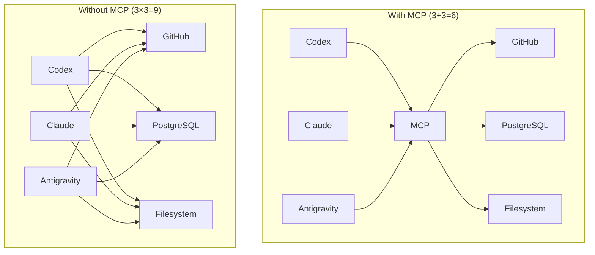
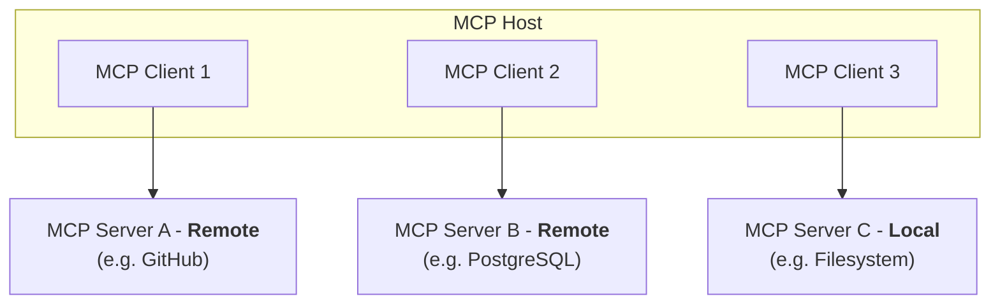
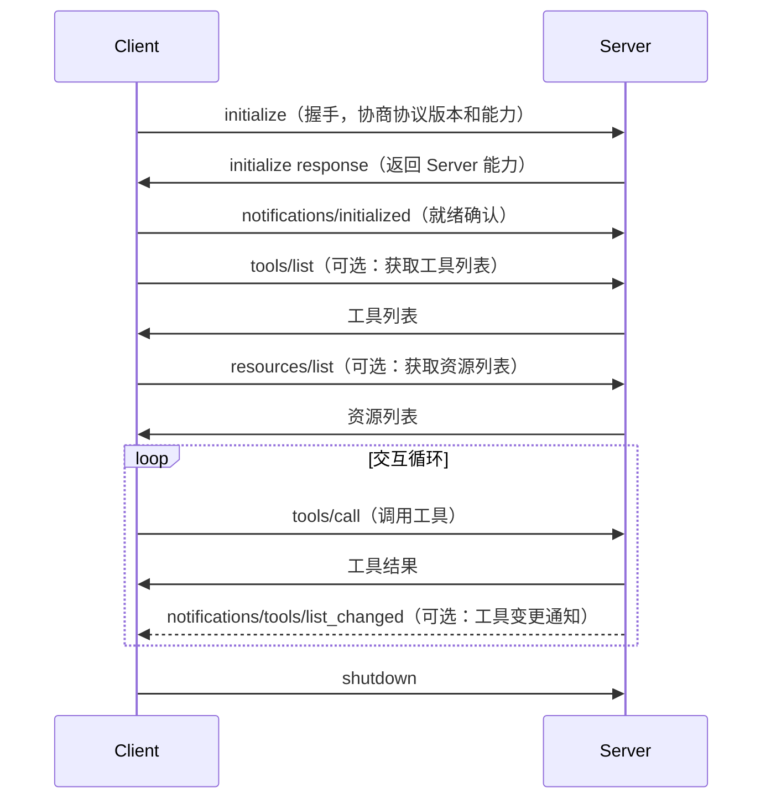

本文介绍模型上下文协议 (Model Context Protocol, MCP) 的基本原理。

## 基本概念

[MCP](https://modelcontextprotocol.io/) 是 Anthropic 于 2024 年推出的协议 [^mcp-anthropic]，旨在标准化大模型与外部工具之间的交互方式。

[^mcp-anthropic]: [Introducing the Model Context Protocol
](https://www.anthropic.com/news/model-context-protocol)

其核心思想是，通过一个中间件，将 $O(n\times m)$ 的集成问题优化到 $O(n + m)$。



如上图所示，在没有 MCP 的情况下，每种应用都需要针对不同的外部工具设计对应的接口，如果有 $N$ 种应用和 $M$ 种外部工具，那么开发者就需要写 $N\times M$ 种接口。这对于日渐丰富的应用和规模庞大的外部工具来说是难以实现的。反之加上一个中间件之后，就可以将接口数量降低到 $N+M$ 种。这将复杂度从平方级直接降低到了线性级。

这是一种很经典的多对多集成问题，历史上已经有类似的问题与解决方案。例如 USB 接口解决了多种 PC 与多种设备的互联问题；HTTP 协议解决了多种浏览器与多种网站的数据传输问题。

## 前世：Function Calling

在 MCP 出现之前，大模型与外部工具的交互主要依靠各厂商的 Function Calling 机制。

Function Calling 的工作原理是：开发者在调用大模型 API 时，在请求体中附带一份工具定义列表 (tools 参数)，每个工具包含名称、描述和 JSON Schema 格式的参数定义。模型在推理时会根据用户输入，自动判断是否需要调用某个工具。如果需要，模型返回一个工具调用请求 (tool_call)，包含工具名称和参数。开发者收到后，在自己的代码中执行对应的函数，然后将结果追加到对话上下文中继续推理。

以 OpenAI 的 Function Calling 为例，一次典型的调用流程如下：

1. 开发者定义工具列表，包含函数名、描述、参数 Schema。
2. 将工具列表和用户消息一起发送给模型 API。
3. 模型返回 tool_call 响应（而非文本回复），指明要调用的函数和参数。
4. 开发者在本地执行对应的函数，获取结果。
5. 将工具执行结果以 tool 角色追加到消息列表，再次请求模型生成最终回复。

这种机制存在几个根本性的局限：

- **厂商锁定**：每家模型厂商的 Function Calling 格式各不相同。OpenAI 使用 `tool_calls` 字段，Anthropic 使用 `tool_use` 内容块，Google 使用 `functionCall`。开发者为不同模型编写适配代码，无法复用。
- **静态定义**：工具列表必须在每次 API 请求中完整传递。如果工具集很大（比如数百个工具），请求体膨胀严重，消耗大量 token 和带宽。且工具列表在请求发起后就固定了，无法在运行时动态增减。
- **无标准发现机制**：客户端无法主动查询服务端有哪些可用工具。开发者需要提前知道所有工具的定义，并在代码中硬编码。
- **客户端强耦合**：工具的实际执行逻辑由客户端自行实现，与服务端分离。这意味着每个 AI 应用都需要独立对接每个外部系统。如果有 5 个 AI 应用都要对接 GitHub API，就需要写 5 份 GitHub 对接代码。
- **无法运行时更新**：一旦 API 请求发出，工具列表就固定了。如果服务端新增了工具或修改了参数 Schema，客户端必须重新发起请求才能感知变化。
- **无状态协议**：每次 Function Calling 都是无状态的 HTTP 请求。模型无法记住上次使用了哪些工具，也无法维护与外部系统的持久连接。

这些局限使得 Function Calling 在原型阶段足够好用，但在需要对接大量外部系统、支持多种模型、追求动态扩展的生产环境中，复杂度会迅速失控。这正是 MCP 要解决的核心问题。

## 今生：MCP

MCP 不再将工具执行的责任推给每个应用开发者，而是引入了一个标准化的中间层。



如上图所示，这个中间层由三个角色组成：

- MCP Host：AI 应用本身（如 Codex、Claude Code、Antigravity、Cursor 等），负责维护与 LLM 的交互并管理 MCP Client 以决定何时调用 MCP Server。
- MCP Client：运行在 Host 内部，负责与特定 MCP Server 建立连接并进行通信。每个 Server 通常对应一个 Client。Client 本质上是 MCP 协议的实现与连接管理组件，负责请求转发和结果接收。多个 Client 对于用户是零感知的。
- MCP Server：用于提供「额外上下文」和「行动能力」的组件，官方将其定义为 Tools、Resources 和 Prompts 三种。可以自己写，也可以用现成的。

与 Function Calling 相比，MCP 的核心差异在于：

- 工具的执行逻辑由 Server 端负责，Client 端只负责转发请求和接收结果。这意味着对接一次 GitHub MCP Server，所有支持 MCP 的 AI 应用都可以直接使用，无需重复开发。
- 通过 `tools/list` 方法动态发现工具，不再需要在每次请求中传递完整的工具定义。
- Server 可以通过通知机制（如 `notifications/tools/list_changed`）主动告知 Client 工具列表的变化，实现运行时更新。
- 协议层面统一了消息格式 (JSON-RPC 2.0)，任何实现了 MCP 的 Client 都可以与任何 MCP Server 通信，不受模型厂商限制。

## 协议细节

MCP 在协议层面分为两层：

- **数据层**：基于 JSON-RPC 2.0，定义了客户端与服务端之间的消息格式和语义，包括生命周期管理、能力协商、工具发现与调用、资源读取和提示词获取。
- **传输层**：负责实际的通信通道和认证，将数据层的 JSON-RPC 消息从一端传递到另一端。

MCP 支持两种传输方式：

- **stdio**：通过标准输入输出通信。Host 以子进程的方式启动 Server，通过 stdin/stdout 传递 JSON-RPC 消息。适合本地工具，延迟极低，无需网络配置和认证，但每个 Server 只能服务一个 Client。
- **Streamable HTTP**：通过 HTTP 进行远程通信。Client 通过 HTTP POST 发送请求，Server 可选地通过 SSE (Server-Sent Events) 推送流式响应和通知。适合云端服务，支持 OAuth、API Key 等标准认证方式，一个 Server 可以同时服务多个 Client。

> [!note]
>
> Streamable HTTP 是 MCP 协议在 2025 年引入的重要更新，替代了此前的 HTTP + SSE 方案。新方案将 SSE 降级为可选项，增加了无状态请求支持，更适合大规模部署和 Serverless 场景。

## 生命周期

MCP 是有状态协议，连接的建立需要经过一个规范的生命周期：

1. **初始化握手**：Client 发送 `initialize` 请求，声明自身支持的协议版本和能力（如是否支持 Elicitation）。Server 返回自身的协议版本和能力（如是否支持 Tools、Resources、Prompts，以及是否支持列表变更通知）。双方通过此步骤协商出一个共同支持的协议版本和功能集。
2. **就绪确认**：Client 收到初始化响应后，发送 `notifications/initialized` 通知，表示连接已就绪，可以开始正常通信。
3. **能力发现**：Client 根据 Server 在初始化时声明的能力，选择性调用 `tools/list`、`resources/list`、`prompts/list` 等方法获取可用资源。
4. **交互循环**：在正常通信阶段，Client 可以调用 `tools/call` 执行工具、`resources/read` 读取资源、`prompts/get` 获取提示词模板。Server 可以通过通知（如 `notifications/tools/list_changed`）主动告知 Client 能力变更。
5. **连接关闭**：通信结束后，双方可以发起关闭流程。



## FastMCP

从上述分析不难发现，MCP Client 由 AI 应用定义，我们能做的就是把各种服务注册为标准 MCP Server，即定义好各种 Tools、Resources 和 Prompts 的逻辑。本节介绍 mcp 的 FastMCP 库，分别实现三种类型的 MCP Server。

安装依赖：

```bash
uv add mcp
```

### `@mcp.tool()`

Tool 是 LLM 可以主动调用的函数。模型根据用户输入自动判断是否需要调用某个 Tool，以及传入什么参数。

下面的例子实现一个简单的数学计算器，提供加减乘除四个操作：

```python
# calculator_server.py
from mcp.server.fastmcp import FastMCP

mcp = FastMCP("Calculator")


@mcp.tool()
def add(a: float, b: float) -> str:
    """计算两个数的和"""
    return f"{a} + {b} = {a + b}"


@mcp.tool()
def subtract(a: float, b: float) -> str:
    """计算两个数的差"""
    return f"{a} - {b} = {a - b}"


@mcp.tool()
def multiply(a: float, b: float) -> str:
    """计算两个数的积"""
    return f"{a} × {b} = {a * b}"


@mcp.tool()
def divide(a: float, b: float) -> str:
    """计算两个数的商，除数不能为零"""
    if b == 0:
        return "错误：除数不能为零"
    return f"{a} ÷ {b} = {a / b}"
```

Tool 的关键特征：

- 由模型控制。LLM 根据对话上下文自动决定是否调用、何时调用、传什么参数。
- 函数的 docstring 会作为 Tool 的描述发送给 LLM，因此需要清晰描述功能。
- 参数的类型注解会自动转换为 JSON Schema，用于 LLM 的参数填充。
- Tool 可以执行写操作（修改文件、发送请求、操作数据库等），通常需要用户确认。

### `@mcp.resource()`

Resource 提供只读的上下文数据，由 AI 应用（而非模型）决定何时读取和使用。Resource 的 URI 类似于文件路径，支持固定资源和参数化模板两种形式。

下面的例子实现一个用户信息查询服务：

```python
# user_server.py
from mcp.server.fastmcp import FastMCP

mcp = FastMCP("UserInfo")

# 模拟用户数据库
USERS = {
    "alice": {"name": "Alice", "role": "Engineer", "team": "Backend"},
    "bob": {"name": "Bob", "role": "Designer", "team": "Product"},
    "carol": {"name": "Carol", "role": "Manager", "team": "Engineering"},
}


@mcp.resource("users://list")
def list_users() -> str:
    """列出所有用户"""
    lines = [f"- {info['name']} ({info['role']}, {info['team']})"
             for info in USERS.values()]
    return "所有用户：\n" + "\n".join(lines)


@mcp.resource("users://{username}")
def get_user(username: str) -> str:
    """获取指定用户的详细信息"""
    user = USERS.get(username)
    if user is None:
        return f"未找到用户：{username}"
    return f"姓名：{user['name']}\n角色：{user['role']}\n团队：{user['team']}"
```

Resource 的关键特征：

- 由应用控制。Host 决定何时读取 Resource 并将其内容作为上下文提供给 LLM。
- 只读语义。Resource 不执行写操作，类似于 GET 请求。
- 支持 URI 模板。`users://{username}` 可以匹配 `users://alice`、`users://bob` 等。
- 适合暴露文件内容、数据库 Schema、API 文档、用户偏好等相对静态的上下文数据。

### `@mcp.prompt()`

Prompt 是预定义的提示词模板，由用户在交互中显式选择使用。它帮助用户快速启动特定领域的对话，而无需每次手动编写复杂的提示词。

下面的例子实现一个代码审查提示词模板：

```python
from mcp.server.fastmcp import FastMCP

mcp = FastMCP("CR_prompt")


@mcp.prompt()
def review_code(language: str, focus: str = "全部") -> str:
    """对代码进行审查，检查潜在问题并提出改进建议。

    Args:
        language: 编程语言，如 Python、JavaScript、Go 等
        focus: 审查重点，可选「全部」「性能」「安全」「可读性」
    """
    focus_hints = {
        "全部": "检查代码的逻辑正确性、性能瓶颈、安全漏洞和可读性问题。",
        "性能": "重点检查时间复杂度、内存分配、缓存利用、不必要的计算等性能相关问题。",
        "安全": "重点检查 SQL 注入、XSS、敏感信息泄露、权限校验等安全问题。",
        "可读性": "重点检查命名规范、函数长度、注释质量、代码结构等可读性问题。",
    }
    hint = focus_hints.get(focus, focus_hints["全部"])
    return f"""你是一位资深的 {language} 代码审查专家。请对以下代码进行严格审查。

审查重点：{hint}

请按以下格式输出审查结果：

1. 总体评价（一句话概括代码质量）
2. 发现的问题（按严重程度排序）
   - 🔴 严重：需要立即修复的问题
   - 🟡 建议：可以改进的地方
   - 🟢 优化：锦上添花的建议
3. 改进后的代码示例（如有必要）

请开始审查。"""
```

Prompt 的关键特征：

- 由用户控制。用户需要显式选择 Prompt 模板，模型不会自动触发。
- 参数化设计。通过参数（这里的 `language`、`focus`）定制模板内容，减少重复输入。
- 可以引用 Tool 和 Resource。Prompt 中可以指导 LLM 使用特定的 Tool 和 Resource 来完成任务。
- 适合封装领域知识。将代码审查、文档生成、数据分析等常见任务的提示词模板化。

### 配置与使用

写好 Server 后，在 AI 应用中配置即可使用。以 Claude Code 为例：

```bash
claude mcp add --scope project CR_prompt -- uv run --directory /home/vincent/projects/mcp-server-demo python src/review_code.p
```


配置完成后，AI 应用会在启动时自动启动这些 Server，并通过 stdio 建立连接。用户在对话中就可以直接使用这些能力了。

### 应用生态

MCP 的生态正在快速发展。以下是一些关键资源：

- [官方 Server 示例](https://github.com/modelcontextprotocol/servers)：Anthropic 官方维护的参考实现，涵盖 Filesystem、GitHub、PostgreSQL、Slack、Google Drive 等常见系统。
- [MCP Registry](https://registry.modelcontextprotocol.io/)：MCP 官方的 Server 注册中心，可以搜索和发现社区贡献的 Server。
- [MCP Inspector](https://github.com/modelcontextprotocol/inspector)：官方提供的调试工具，可以对 MCP Server 进行交互式测试。
- 主流 AI 应用的 MCP 支持情况：Claude Code、Claude Desktop、Codex、Cursor、VS Code (Copilot)、Antigravity 等均已支持 MCP。
