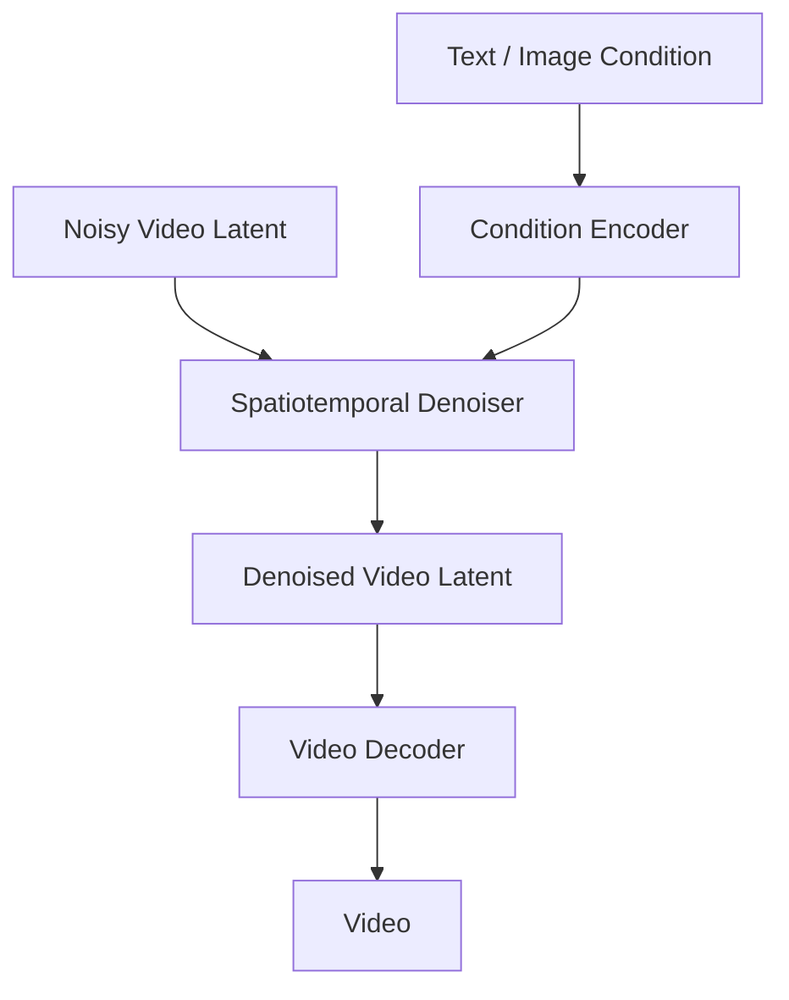

本文介绍扩散模型 (Diffusion Model) 的基本原理，以及它在图像和多模态生成中的位置。

## 快速开始

扩散模型通过“逐步加噪”学习数据如何被破坏，再训练模型执行“逐步去噪”从噪声生成样本。它在图像生成中表现突出，是 Stable Diffusion 等文生图模型的核心路线。

语言模型通常按 token 自回归生成文本，扩散模型通常从随机噪声开始逐步还原图像。二者都是生成模型，但建模方式不同。近年来 Diffusion Transformer、flow matching、rectified flow 等路线进一步把视觉生成和 Transformer 主线连接起来。

## 生成模型背景

深度生成模型主要包括：

| 路线 | 代表方法 | 特点 |
| --- | --- | --- |
| Autoregressive Model | PixelCNN、GPT | 按顺序生成，概率分解清晰 |
| VAE | Variational Autoencoder | 学习潜变量分布，生成较稳定 |
| GAN | Generative Adversarial Network | 图像质量高，但训练不稳定 |
| Flow-based Model | RealNVP、Glow | 可精确计算似然，但结构受限 |
| Diffusion Model | DDPM、Stable Diffusion | 训练稳定，生成质量高 |
| Flow Matching | Rectified Flow 等 | 直接学习分布间连续变换路径 |

扩散模型的优势是训练稳定、覆盖模式较好、能通过条件控制生成结果。

## 前向扩散过程

前向过程逐步向真实数据 $x_0$ 加入高斯噪声，得到 $x_1,x_2,\ldots,x_T$。当步数足够多时，$x_T$ 接近标准高斯噪声。

可以写成：

$$
q(x_t\mid x_{t-1})=\mathcal{N}(x_t;\sqrt{1-\beta_t}x_{t-1},\beta_t I)
$$

其中 $\beta_t$ 控制每一步加入多少噪声。

通过重参数化，可以直接从 $x_0$ 采样任意时刻的 $x_t$：

$$
q(x_t\mid x_0)=\mathcal{N}(x_t;\sqrt{\bar{\alpha}_t}x_0,(1-\bar{\alpha}_t)I)
$$

等价写法为：

$$
x_t=\sqrt{\bar{\alpha}_t}x_0+\sqrt{1-\bar{\alpha}_t}\epsilon
$$

其中 $\epsilon\sim\mathcal{N}(0,I)$。

## 反向去噪过程

生成时从随机噪声 $x_T$ 开始，模型逐步预测并去除噪声，最终得到样本 $x_0$。

模型常被训练为预测噪声 $\epsilon$：

$$
\mathcal{L}=\mathbb{E}_{x_0,t,\epsilon}\left[\|\epsilon-\epsilon_\theta(x_t,t)\|^2\right]
$$

这让训练目标变成一个相对简单的去噪回归问题。

## 预测目标

扩散模型不一定只预测噪声。常见目标包括：

| 目标 | 含义 | 特点 |
| --- | --- | --- |
| $\epsilon$ prediction | 预测加入的噪声 | DDPM 中常见，训练稳定 |
| $x_0$ prediction | 直接预测干净样本 | 直观，但不同噪声等级尺度差异大 |
| v-prediction | 预测混合速度变量 | 常用于改善不同噪声阶段的稳定性 |

训练目标会影响采样稳定性、不同噪声阶段的权重和最终质量。

## DDPM 与 DDIM

去噪扩散概率模型 (Denoising Diffusion Probabilistic Model, DDPM) 奠定了现代扩散模型的标准形式。它生成质量高，但采样步数通常较多。

DDIM 提供了更快的采样方式，可以用更少步数生成样本。之后的采样器继续围绕速度和质量做权衡。

## 采样器谱系

扩散模型训练和推理并不完全一样。训练通常随机采样时间步预测噪声，推理则需要选择采样器从噪声走回样本。

| 采样器 | 特点 |
| --- | --- |
| DDPM | 随机采样，步数较多，质量稳定 |
| DDIM | 可确定性采样，步数更少 |
| PNDM | 使用数值方法加速采样 |
| DPM-Solver | 高阶求解器，少步数下质量较好 |
| Euler / Heun | 常见 ODE/SDE 数值采样器 |

采样器选择会影响速度、质量、多样性和稳定性。

## Score-based Generative Modeling

Score-based Generative Modeling 从估计数据分布梯度的角度理解扩散过程。它与 DDPM 在数学上有紧密联系，提供了连续时间随机微分方程视角。

这个方向的意义是统一了多种噪声扰动和采样过程，也推动了后续更灵活的扩散模型设计。

## 条件生成

扩散模型可以接收条件信息，例如类别、文本、图像、深度图、边缘图等。

常见控制方式包括：

- Classifier Guidance：使用分类器梯度引导生成；
- Classifier-Free Guidance：同时训练有条件和无条件模型，通过插值增强条件控制；
- Cross Attention：在 U-Net 中注入文本条件；
- ControlNet：用额外控制分支注入结构信息。

Classifier-Free Guidance (CFG) 常用形式为：

$$
\hat{\epsilon}=\epsilon_\text{uncond}+s(\epsilon_\text{cond}-\epsilon_\text{uncond})
$$

其中 $s$ 是 guidance scale。$s$ 增大通常会提高提示词相关性，但可能降低多样性、增加过饱和或失真。

## Latent Diffusion

直接在像素空间扩散成本很高。潜空间扩散模型 (Latent Diffusion Model, LDM) 先用自编码器把图像压缩到潜空间，再在潜空间中执行扩散和去噪。

Stable Diffusion 就采用了这一路线。它显著降低了训练和推理成本，使高质量文生图模型更容易部署。

Stable Diffusion 的核心组件包括：

- VAE encoder/decoder：在像素空间和潜空间之间转换；
- text encoder：把提示词编码成条件表示；
- U-Net 或 DiT：执行去噪；
- scheduler：决定采样步长和噪声调度；
- CFG：增强条件控制。

图像 latent 和视频 latent 的差异可以写成：

$$
z_\text{image}\in\mathbb{R}^{C\times H'\times W'}
$$

$$
z_\text{video}\in\mathbb{R}^{T\times C\times H'\times W'}
$$

视频比图像多了时间维度，去噪网络不仅要恢复每一帧的视觉细节，还要保持帧间一致性。

## U-Net 到 DiT

早期扩散模型大量使用 U-Net 作为去噪网络。U-Net 擅长多尺度图像特征处理，适合像素或潜空间图像生成。

Diffusion Transformer (DiT) 将图像潜变量切成 patch token，再用 Transformer 进行去噪。它把视觉生成进一步拉近到 [Transformer 模型](./transformer.md) 的 token 建模框架中。

DiT 的优势是更容易利用 Transformer scaling 经验，代价是训练成本和数据需求较高。

## Flow Matching 与 Rectified Flow

Flow matching 和 rectified flow 试图直接学习从噪声分布到数据分布的连续变换路径。相比传统扩散，它们常被用于减少采样步数、简化路径或改善训练稳定性。

可以粗略理解为：扩散模型学习“逐步去噪”，flow matching 学习“沿一条连续路径把噪声搬运到数据”。二者都属于生成连续信号的重要路线，现代视觉生成模型中经常并行发展。

## 视频生成

视频生成在图像生成基础上增加时间维度。图像扩散只需要生成单个空间样本，视频扩散需要生成一段连续时空信号。

视频扩散训练目标可以写成：

$$
\mathcal{L}_\text{video}
=
\mathbb{E}_{z_0,t,\epsilon,c}
\left[
\|\epsilon-\epsilon_\theta(z_t,t,c)\|^2
\right]
$$

其中 $z_0$ 是干净视频 latent，$c$ 是文本、首帧、参考图、相机轨迹、姿态等条件。

常见路线包括：

- 3D U-Net：在 U-Net 中加入时间维度，直接建模局部时空特征；
- temporal attention：在空间注意力之外加入时间注意力，改善帧间一致性；
- latent video diffusion：在压缩潜空间中生成视频，降低成本；
- Video DiT：将视频 latent 切成时空 token，用 Transformer 去噪；
- image-to-video：用首帧或参考图约束主体身份和场景风格；
- camera/motion condition：用相机轨迹、姿态、深度等条件控制运动。

视频生成的失败模式包括：

| 失败模式 | 表现 |
| --- | --- |
| flickering | 邻近帧纹理、光照或细节闪烁 |
| identity drift | 人物或物体身份逐渐漂移 |
| object permanence failure | 物体突然消失、变形或错误重现 |
| temporal repetition | 动作重复、卡顿或循环感明显 |
| physics violation | 运动、碰撞、遮挡不符合常识 |
| prompt misalignment | 生成视频和文本要求不匹配 |

## 与大语言模型的关系

扩散模型和大语言模型在多模态系统中经常配合使用：

- 语言模型负责理解复杂指令、改写提示词或规划生成步骤；
- 文本编码器把提示词转成条件表示；
- 扩散模型或 flow model 负责图像或视频生成；
- 多模态模型负责理解生成结果并反馈修改。

因此，扩散模型不是大语言模型主线的一部分，但它是 [多模态模型](./multimodal.md) 生态的重要分支。

## 质量权衡

视觉生成模型通常需要在多个目标之间折中：

| 目标 | 影响因素 |
| --- | --- |
| 质量 | 模型规模、数据质量、采样器、步数 |
| 多样性 | 噪声、guidance scale、采样策略 |
| 可控性 | 文本编码器、CFG、ControlNet、布局条件 |
| 速度 | 潜空间、采样步数、蒸馏、flow matching |
| 一致性 | 视频时序建模、多视角约束、数据质量 |
| 安全 | 过滤、版权、人物生成、滥用防护 |

## 常见误区

| 误区 | 更准确的理解 |
| --- | --- |
| 扩散模型只能生成图片 | 它也可用于音频、视频、3D 和其他连续信号 |
| 采样步数越多越好 | 步数、采样器和模型训练目标共同决定质量 |
| CFG 越大越符合提示词 | 过大可能导致失真、过饱和和多样性下降 |
| DiT 只是把 U-Net 换成 Transformer | 它改变了视觉生成中的 token 化、scaling 和训练方式 |

## 参考资料

- [What are Diffusion Models?](https://lilianweng.github.io/posts/2021-07-11-diffusion-models/)
- [Denoising Diffusion Probabilistic Models](https://arxiv.org/abs/2006.11239)
- [Denoising Diffusion Implicit Models](https://arxiv.org/abs/2010.02502)
- [Score-Based Generative Modeling through Stochastic Differential Equations](https://arxiv.org/abs/2011.13456)
- [High-Resolution Image Synthesis with Latent Diffusion Models](https://arxiv.org/abs/2112.10752)
- [Scalable Diffusion Models with Transformers](https://arxiv.org/abs/2212.09748)
- [Flow Matching for Generative Modeling](https://arxiv.org/abs/2210.02747)
