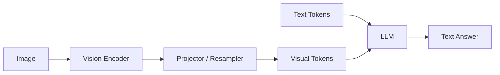
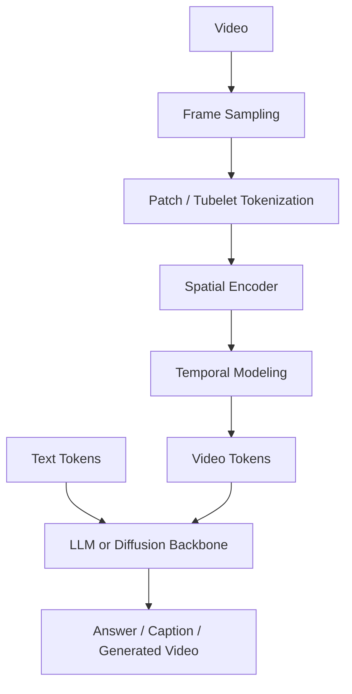
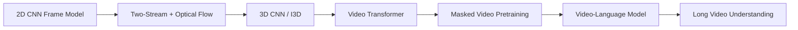
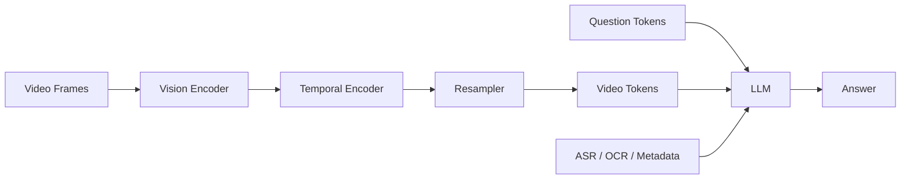
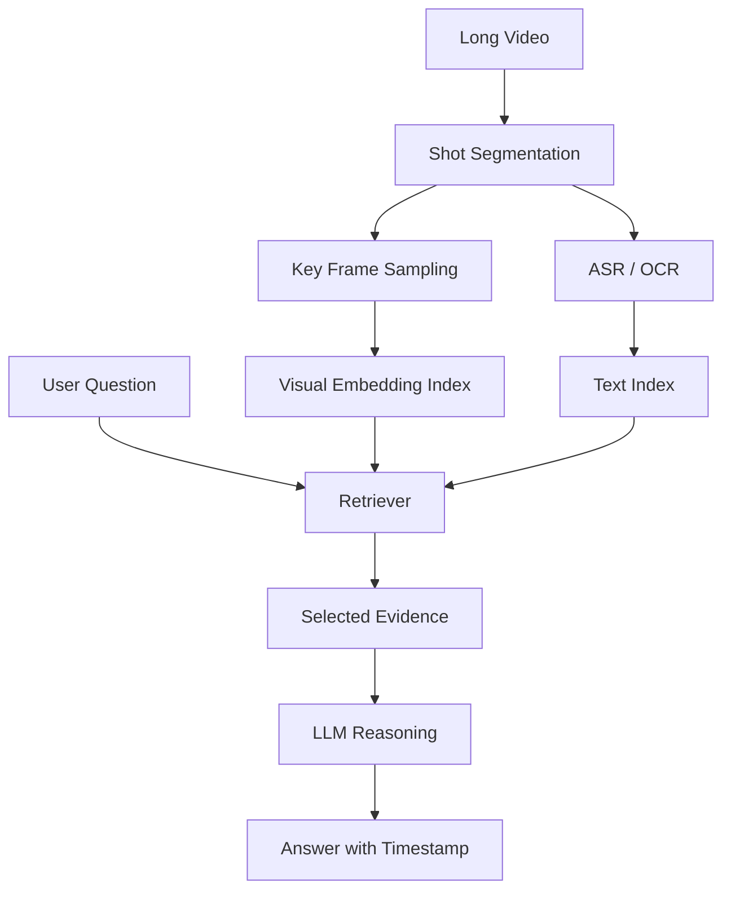

本文介绍大模型从文本扩展到图像、音频、视频等模态的技术路线。

## 快速开始

多模态模型的目标是让模型同时理解和生成多种模态的信息。它不是简单把图片传给语言模型，而是要解决表示对齐、跨模态融合、指令跟随和生成控制等问题。

典型演化路线是：

```text
图文对齐 -> 视觉语言模型 -> 多模态指令微调 -> 原生多模态模型
```

专业理解多模态模型时，要区分两个问题：理解和生成。视觉语言模型 (Vision-Language Model, VLM) 主要解决图像、视频等输入如何接入语言模型；扩散模型和 flow model 主要解决图像、视频等连续信号如何生成。视频是多模态模型中最容易触发 token 爆炸的输入类型，需要同时处理空间细节、时间顺序、事件边界和长上下文压缩。

## 多模态任务分类

| 任务 | 输入 | 输出 | 关键能力 |
| --- | --- | --- | --- |
| Image-Text Retrieval | 图像或文本 | 匹配文本或图像 | 表示对齐 |
| Image Captioning | 图像 | 描述文本 | 视觉理解和语言生成 |
| Visual Question Answering | 图像 + 问题 | 答案 | 视觉问答 |
| OCR | 图像 | 文本 | 字符识别和版面理解 |
| Grounding | 文本 + 图像 | 区域或坐标 | 对象定位 |
| Chart Understanding | 图表 | 结论或数据 | 结构化视觉理解 |
| Video QA | 视频 + 问题 | 答案 | 视觉细节和时序推理 |
| Video Captioning | 视频 | 摘要或描述 | 事件抽象和语言生成 |
| Temporal Grounding | 视频 + 文本 | 时间段 | 文本事件对齐 |
| Long Video Understanding | 长视频 + 问题 | 答案或时间戳证据 | 检索、摘要和长上下文压缩 |
| Audio Understanding | 音频 + 指令 | 文本或动作 | 声学和语义融合 |
| Text-to-Video | 文本 | 视频 | 文本对齐和运动合理性 |
| Image-to-Video | 图像 + 文本 | 视频 | 主体一致和运动生成 |
| Multimodal Generation | 文本/图像/音频 | 图像、视频、音频 | 条件生成 |

不同任务对模型结构要求不同。OCR 和 grounding 更重视局部细节，视频理解更重视时序压缩，生成任务更重视高维连续信号建模。

## 图文对齐

CLIP 使用大量图文对训练图像编码器和文本编码器，让匹配的图片和文本在同一向量空间中靠近，不匹配的样本远离。

CLIP 的对比学习目标可简化理解为：提高匹配图文对的相似度，降低不匹配图文对的相似度。

$$
\mathcal{L}=-\log\frac{\exp(\text{sim}(I_i,T_i)/\tau)}{\sum_j\exp(\text{sim}(I_i,T_j)/\tau)}
$$

其中 $I_i$ 是图像表示，$T_i$ 是文本表示，$\tau$ 是温度参数。实际训练通常同时使用 image-to-text 和 text-to-image 两个方向：

$$
\mathcal{L}=\frac{1}{2}(\mathcal{L}_{I\to T}+\mathcal{L}_{T\to I})
$$

这种对称目标让图像检索文本和文本检索图像都能工作。

这种对比学习方式让模型获得开放词表图像理解能力。它的意义在于把视觉表示和语言表示对齐，为后续图文检索、图像分类、文生图和视觉语言模型打下基础。

## 文本到图像生成

DALL-E、Imagen、Stable Diffusion 等模型让文本描述可以控制图像生成。

其中扩散模型路线逐渐成为主流。文本编码器负责理解提示词，扩散模型负责逐步生成图像。更完整的扩散过程见 [扩散模型](./diffusion.md)。

## 视觉 token 接入 LLM

视觉语言模型通常把图像编码成视觉 token，再与文本 token 一起送入语言模型或跨模态模块。

常见结构包括：

- vision encoder：使用 ViT、CNN 或其他视觉骨干提取图像特征；
- projector：把视觉特征映射到语言模型隐藏维度；
- resampler：压缩大量视觉 patch，减少 token 数；
- cross attention：让语言模型通过注意力读取视觉特征；
- early fusion：视觉 token 和文本 token 早期融合；
- late fusion：视觉和文本先独立编码，再在后续融合。



LLaVA 类模型常采用视觉编码器 + projector + LLM 的结构。Flamingo 使用跨注意力连接视觉特征和语言模型。BLIP-2 使用 Q-Former 在冻结图像编码器和语言模型之间建立桥梁。

## VLM 训练阶段

视觉语言模型通常经历多个训练阶段：

| 阶段 | 目标 | 数据 |
| --- | --- | --- |
| Vision-language pre-training | 学习图文对齐和基础描述 | 图文对、caption 数据 |
| Alignment pre-training | 把视觉 token 对齐到 LLM 表示空间 | 图像-文本说明数据 |
| Multimodal instruction tuning | 学会按用户指令回答视觉问题 | 图像问答、多轮对话、OCR、图表数据 |
| Preference optimization | 改善回答质量和安全性 | 偏好数据、红队数据 |

多模态指令微调解决的是可交互性问题。一个只会图文匹配的模型不一定会回答用户问题，多模态指令微调让模型以助手形式使用视觉能力。

## 高分辨率和长视频问题

图像和视频会带来 token 爆炸。假设图像被切成 patch，分辨率越高，patch 数越多；视频还要乘以帧数。

视频 token 数可以粗略估算为：

$$
N_\text{video}=T\cdot\frac{H}{p_h}\cdot\frac{W}{p_w}
$$

其中 $T$ 是帧数，$H,W$ 是分辨率，$p_h,p_w$ 是 patch 大小。若 $224\times224$ 图像使用 $14\times14$ patch，每帧有 $256$ 个 patch；输入 $32$ 帧时，不做压缩就会得到 $8192$ 个视觉 token。

常见处理方式包括：

- image tiling：把高分辨率图像切块处理；
- dynamic resolution：根据图像内容动态分配 token；
- frame sampling：抽取关键帧；
- temporal pooling：压缩时间维度；
- hierarchical encoding：先局部编码，再全局聚合。

这些方法都在压缩信息和保留细节之间做取舍。OCR、图表理解、小目标识别通常需要更多视觉 token，而普通场景描述可以更激进压缩。

## 原生多模态模型

原生多模态模型希望在训练阶段就统一处理文本、图像、音频、视频等模态，而不是把视觉模块后接到已有语言模型上。

关键问题包括：

- 不同模态如何 token 化；
- 不同模态的序列长度差异如何处理；
- 训练数据如何混合；
- 模态之间如何共享表示；
- 生成任务和理解任务如何统一。

原生路线的优势是模态融合更彻底，代价是训练数据、模型结构和评测都更复杂。外接视觉编码器路线更容易复用现有 LLM，但跨模态表达可能受接口限制。

## 多模态与工具使用

多模态模型不只用于看图问答。它还可以和 OCR、目标检测、浏览器、代码执行、机器人控制等工具结合，形成更复杂的智能体系统。

不过在模型原理层面，核心仍然是跨模态表示、融合和生成。具体工具编排应放到下游应用章节中理解。

## 失败模式与安全问题

多模态模型面临的难点包括：

- 视觉细节容易丢失；
- OCR、计数、空间关系仍可能出错；
- 图表和表格需要结构化理解；
- 视频和长音频带来更长上下文压力；
- 多模态数据质量和版权更复杂；
- 视觉提示注入可能通过图片文字影响模型行为；
- 模型可能对不存在的视觉细节产生幻觉。

未来发展方向是更统一的模态表示、更强的视频理解、更精细的空间推理，以及和外部工具的结合。

## 代表路线

| 路线 | 代表模型 | 核心贡献 |
| --- | --- | --- |
| 图文对齐 | CLIP | 对比学习统一图像和文本表示 |
| 文生图 | DALL-E、Imagen、Stable Diffusion | 文本条件图像生成 |
| 跨注意力 VLM | Flamingo | 少样本视觉语言学习 |
| 桥接模块 | BLIP-2 | Q-Former 连接视觉编码器和 LLM |
| 指令微调 VLM | LLaVA | 视觉指令跟随 |
| 通用 VLM | Qwen-VL、InternVL 等 | 多任务、多分辨率、多语言视觉理解 |
| 视频语言模型 | Video-LLaVA、VideoChat、Qwen-VL 类视频能力 | 把视频 token 接入 LLM，支持视频问答和摘要 |
| 视频生成 | Video Diffusion、Stable Video Diffusion、VideoPoet、Sora 类系统 | 从图像生成扩展到时空一致的视频生成 |

## 常见误区

| 误区 | 更准确的理解 |
| --- | --- |
| 多模态就是图像分类加聊天 | 还包括 OCR、grounding、图表、视频、生成和工具操作 |
| 图像编码器越强就一定越好 | 还要看视觉 token 如何对齐和接入 LLM |
| VLM 能看到图就一定可靠 | 视觉细节、计数、空间关系和幻觉仍是难点 |
| 文生图和 VLM 是同一类模型 | 前者偏生成连续信号，后者偏理解和语言交互 |

## 参考资料

- [Learning Transferable Visual Models From Natural Language Supervision](https://arxiv.org/abs/2103.00020)
- [Flamingo: a Visual Language Model for Few-Shot Learning](https://arxiv.org/abs/2204.14198)
- [BLIP-2: Bootstrapping Language-Image Pre-training with Frozen Image Encoders and Large Language Models](https://arxiv.org/abs/2301.12597)
- [Visual Instruction Tuning](https://arxiv.org/abs/2304.08485)
- [LLaVA-NeXT: Improved reasoning, OCR, and world knowledge](https://llava-vl.github.io/blog/2024-01-30-llava-next/)

## Video

本节面向大模型体系下的视频理解、视频生成和视频多模态面试准备。

### 快速开始

视频不是“多张图片拼接”。图像主要建模空间结构，视频还需要建模时间顺序、运动、事件边界、主体一致性和长程依赖。一个人在视频中转身、遮挡、离开又出现，这些都要求模型理解跨帧状态，而不是只识别单帧内容。

视频模型可以分成两条主线：

- 视频理解：看懂发生了什么，回答问题、定位事件、总结长视频。
- 视频生成：合成连续且可控的时空信号，保证文本对齐、主体一致和运动合理。

典型技术链如下：



面试中要抓住三个问题：视频如何变成 token，模型如何建模时间，系统如何在 token 成本和信息保真之间取舍。

### 视频任务谱系

| 类别 | 任务 | 输入 | 输出 | 关键难点 |
| --- | --- | --- | --- | --- |
| 视频理解 | Action Recognition | 视频 | 类别 | 短时动作特征 |
| 视频理解 | Temporal Action Detection | 长视频 | 起止时间 + 类别 | 动作边界定位 |
| 视频理解 | Video Captioning | 视频 | 描述文本 | 事件摘要和时序表达 |
| 视频理解 | Video QA | 视频 + 问题 | 答案 | 视觉细节 + 时序推理 |
| 视频理解 | Video Grounding | 视频 + 文本 | 时间段或区域 | 文本事件对齐 |
| 视频理解 | Long Video Understanding | 长视频 | 摘要、检索、问答 | token 压缩和记忆 |
| 视频生成 | Text-to-Video | 文本 | 视频 | 文本对齐和运动合理性 |
| 视频生成 | Image-to-Video | 图像 + 文本 | 视频 | 保持主体一致性 |
| 视频生成 | Video Editing | 视频 + 指令 | 修改后视频 | 局部编辑和身份保持 |
| 视频生成 | Video Prediction | 历史帧 | 未来帧 | 物理和运动建模 |

这些任务不是孤立的。一个视频问答系统可能同时用到动作识别、OCR、ASR、事件检索和语言推理；一个视频生成系统也可能同时用到文本理解、图像条件、运动控制和安全过滤。

### 视频表示与 token 化

视频张量常写成：

```text
[B, T, C, H, W]
```

其中 $B$ 是 batch size，$T$ 是帧数，$C$ 是通道数，$H,W$ 是分辨率。

#### Frame Sampling

直接输入所有帧通常不可行。常见采样方式包括：

- uniform sampling：均匀抽帧，简单稳定；
- key frame sampling：选择变化明显或信息密度高的帧；
- adaptive sampling：根据镜头、运动、问题内容动态选帧；
- shot-based sampling：先做镜头切分，再在每个镜头内抽帧。

抽帧越多，信息越完整，但 token 数、attention 成本和显存也会同步增长。

#### Patch Token 与 Tubelet Token

逐帧 patch tokenization 把每一帧切成图像 patch，再把所有帧的 patch 拼起来。tubelet tokenization 则把连续帧中的局部时空块作为 token。

视频 token 数可估算为：

$$
N_\text{token}=\frac{T}{p_t}\cdot\frac{H}{p_h}\cdot\frac{W}{p_w}
$$

其中 $p_t,p_h,p_w$ 分别是时间、高度、宽度方向的 patch 或 tubelet 大小。

标准 self-attention 成本为：

$$
\text{Cost}=O(N_\text{token}^2d)
$$

这说明视频比图像更容易触发 token 爆炸：帧数翻倍，token 约翻倍；分辨率长宽都翻倍，空间 token 约变成 $4$ 倍。

#### PyTorch: Tubelet Embedding

下面的简化实现用 `Conv3d` 把视频切成 tubelet，并投影到隐藏维度：

```python
import torch
import torch.nn as nn

class VideoPatchEmbed(nn.Module):
    def __init__(self, in_chans=3, embed_dim=768, tubelet=(2, 16, 16)):
        super().__init__()
        self.proj = nn.Conv3d(
            in_chans,
            embed_dim,
            kernel_size=tubelet,
            stride=tubelet,
        )

    def forward(self, x):
        # x: [B, T, C, H, W]
        x = x.permute(0, 2, 1, 3, 4)  # [B, C, T, H, W]
        x = self.proj(x)              # [B, D, T', H', W']
        x = x.flatten(2).transpose(1, 2)  # [B, N, D]
        return x

video = torch.randn(2, 16, 3, 224, 224)
embed = VideoPatchEmbed(tubelet=(2, 16, 16))
tokens = embed(video)
print(tokens.shape)
```

输出形状是 `[B, N, D]`，其中 $N=T'\cdot H'\cdot W'$。真实系统还会加入位置编码、时间编码、mask、resampler 或压缩模块。

### 视频理解模型演化

视频理解模型大致经历了以下路线：



| 阶段 | 核心做法 | 优点 | 局限 |
| --- | --- | --- | --- |
| 2D CNN 单帧 | 对每帧做图像识别再聚合 | 复用图像模型 | 时间建模弱 |
| Two-Stream | RGB + Optical Flow | 显式建模运动 | 光流计算成本高 |
| 3D CNN / I3D | 用 3D 卷积建模局部时空 | 局部运动特征强 | 长程依赖有限 |
| Video Transformer | 用 attention 建模时空 token | 长距离建模强 | token 成本高 |
| VideoMAE | 遮蔽视频建模 | 降低标注依赖 | 预训练和下游适配复杂 |
| Video-Language Model | 视频 token 接入 LLM | 支持问答和推理 | token 压缩和对齐困难 |

视频分类可以抽象为：

$$
p(y\mid V)=\text{softmax}(W\cdot f_\theta(V))
$$

其中 $V$ 是视频，$f_\theta$ 是视频编码器，$W$ 是分类头。

一个极简分类头如下：

```python
class VideoClassifier(nn.Module):
    def __init__(self, encoder, hidden_dim, num_classes):
        super().__init__()
        self.encoder = encoder
        self.head = nn.Linear(hidden_dim, num_classes)

    def forward(self, x):
        # x: [B, T, C, H, W]
        tokens = self.encoder(x)      # [B, N, D]
        pooled = tokens.mean(dim=1)   # [B, D]
        logits = self.head(pooled)    # [B, num_classes]
        return logits
```

真实视频模型通常不会只做 mean pooling，但这个例子展示了视频理解最基本的数据流：视频 -> token -> 聚合 -> 任务头。

### 时序建模方法

视频比图像难，主要难在时间维度。常见时序建模方式包括：

| 方法 | 思路 | 适用场景 |
| --- | --- | --- |
| Late Fusion | 逐帧编码后池化 | 粗粒度分类、低成本场景 |
| Early Fusion | 早期混合时空信息 | 短视频动作识别 |
| 3D Convolution | 局部时空卷积 | 运动模式明显的任务 |
| Divided Space-Time Attention | 先空间 attention，再时间 attention | 降低完整时空 attention 成本 |
| Factorized Attention | 分解维度或窗口 | 长视频或高分辨率视频 |
| Hierarchical Attention | 局部到全局 | 长视频摘要和检索 |
| Memory / Compression | 保留摘要或检索索引 | 长视频问答 |

分解时空 attention 可以写成两步。

空间 attention 在同一帧内建模对象关系：

$$
h_{t,i}'=\text{Attn}(q_{t,i},K_t,V_t)
$$

时间 attention 在同一空间位置或聚合 token 上建模运动变化：

$$
h_{t,i}''=\text{Attn}(q_{t,i}',K_i',V_i')
$$

伪代码如下：

```text
输入: video tokens X with shape [T, S, D]
for each transformer layer:
    for each frame t:
        X[t, :, :] = spatial_attention(X[t, :, :])
    for each spatial position s:
        X[:, s, :] = temporal_attention(X[:, s, :])
输出: updated video tokens
```

这种分解不等价于完整时空 attention，但能显著降低成本，并保留空间和时间两类关系。

### 视频接入 LLM

视频语言模型通常把视频编码成少量 video tokens，再与文本 token 一起输入 LLM。



常见组件包括：

- frame encoder：逐帧提取视觉特征；
- temporal encoder：建模帧间关系；
- projector：把视觉维度映射到 LLM hidden size；
- resampler：压缩视觉 token 数；
- Q-Former / Perceiver Resampler：用少量查询 token 聚合视觉信息；
- ASR/OCR/metadata：把语音、字幕、屏幕文字、时间戳作为额外文本证据。

一个极简 projector 如下：

```python
class MeanPoolVideoProjector(nn.Module):
    def __init__(self, vision_dim, llm_dim):
        super().__init__()
        self.proj = nn.Linear(vision_dim, llm_dim)

    def forward(self, frame_features):
        # frame_features: [B, T, P, Dv]
        x = frame_features.mean(dim=2)  # [B, T, Dv]
        x = self.proj(x)                # [B, T, D_llm]
        return x
```

这个例子非常简化。真实模型通常会保留更细粒度的空间 token，并用 resampler 控制 token budget。

视频问答的基本伪代码是：

```text
输入: video, question
frames = sample_frames(video)
visual_tokens = vision_encoder(frames)
video_tokens = temporal_resampler(visual_tokens)
answer = llm.generate([video_tokens, question])
输出: answer
```

### 视频生成的基本问题

视频生成要同时满足文本对齐、画面质量、运动合理性和帧间一致性。

| 任务 | 条件 | 核心约束 |
| --- | --- | --- |
| Text-to-Video | 文本 | 文本对齐、运动合理性 |
| Image-to-Video | 首帧或参考图 | 主体身份和风格保持 |
| Video-to-Video | 原视频 + 指令 | 局部编辑和时序一致 |
| Motion Transfer | 动作或姿态 | 运动迁移和形变控制 |
| Long Video Generation | 长文本或脚本 | 多镜头、剧情和长期一致性 |

视频 latent 比图像 latent 多一个时间维度：

$$
z\in\mathbb{R}^{T\times C\times H'\times W'}
$$

主流视频生成系统通常在压缩潜空间中联合建模空间和时间，再通过 3D U-Net、时间注意力或 Video DiT 完成去噪。扩散目标、Classifier-Free Guidance (CFG)、DiT 和 Flow Matching 的具体机制见 [扩散模型](./diffusion.md#视频生成)。

在多模态系统中，更需要关注不同条件如何约束视频：文本控制语义，首帧和参考图保持主体与风格，深度、姿态、相机轨迹等信号控制运动。与图像生成相比，视频生成还必须处理闪烁、身份漂移、物体持续性和长期时序一致性；CFG 过强也可能放大过饱和和运动不自然。

### 数据、训练和评测

视频模型难训练，原因不只是数据大。

| 问题 | 具体表现 |
| --- | --- |
| 文本标注弱 | caption 常描述静态场景，不描述细粒度运动 |
| 多事件 | 长视频包含多个镜头和事件，单句 caption 不够 |
| 数据异质 | 分辨率、帧率、压缩质量差异大 |
| 成本高 | token 数巨大，batch size 受限 |
| 安全风险 | 肖像、隐私、版权、暴力和伪造风险更高 |
| 评测困难 | 自动指标难覆盖真实观感和时序一致性 |

评测方式包括：

| 方向 | 指标或方法 | 关注点 |
| --- | --- | --- |
| 视频理解 | accuracy、mAP、tIoU、QA accuracy | 分类、定位、问答 |
| 视频生成 | FVD、CLIPScore、human preference | 质量和文本相关性 |
| 一致性 | temporal consistency、identity consistency | 抖动和身份漂移 |
| 安全 | red teaming、watermark、policy eval | 滥用风险 |

FVD 的直觉是在视频特征空间比较真实视频和生成视频分布的距离。它有参考价值，但不能替代人工偏好评测。

### 长视频理解

长视频不能直接把所有帧丢进模型。更常见的做法是检索、摘要和分层记忆。



长视频问答伪代码：

```text
输入: long_video, question
shots = segment_video(long_video)
keyframes = sample_keyframes(shots)
visual_index = build_visual_index(keyframes)
text_index = build_text_index(asr_and_ocr(long_video))
evidence = retrieve(question, visual_index, text_index)
answer = llm.reason(question, evidence)
输出: answer with timestamps
```

面试中如果被要求设计长视频问答系统，应强调：先检索证据，再让 LLM 推理；不要直接把所有帧送入上下文。

### 视频面试高频问题

| 问题 | 回答要点 |
| --- | --- |
| 视频理解和图像理解最大的区别是什么？ | 视频多了时间维度，需要建模运动、事件顺序、状态变化和长期一致性。图像模型可以只看空间结构，视频模型还要判断“何时发生”和“如何变化”。 |
| 为什么视频 token 容易爆炸？ | token 数随帧数和空间 patch 数共同增长，$N=\frac{T}{p_t}\frac{H}{p_h}\frac{W}{p_w}$。标准 attention 又是 $O(N^2)$，所以帧数和分辨率都会迅速放大成本。 |
| 3D CNN 和 Video Transformer 的区别是什么？ | 3D CNN 用局部时空卷积捕获短期运动，归纳偏置强但长程依赖弱。Video Transformer 用 attention 建模全局关系，扩展性强但 token 成本更高。 |
| TimeSformer 的 divided attention 为什么能降成本？ | 它把完整时空 attention 分解为空间 attention 和时间 attention，避免所有时空 token 两两交互，在保留主要关系的同时降低复杂度。 |
| 视频接入 LLM 常见结构是什么？ | 常见结构是 frame/video encoder 提取视觉特征，projector 或 resampler 压缩并映射到 LLM 维度，再和问题 token 一起输入 LLM。ASR、OCR、字幕也常作为文本证据加入。 |
| 长视频问答为什么不能直接把所有帧输入模型？ | 帧数太多会导致 token 和 KV Cache 成本爆炸，而且很多帧和问题无关。更合理的方案是镜头切分、关键帧抽取、ASR/OCR 建索引，再检索相关证据。 |
| 视频生成为什么容易出现闪烁？ | 模型如果逐帧或弱时序建模，邻近帧可能在纹理、身份、光照上不一致。需要 temporal attention、3D U-Net、视频 latent 或一致性约束改善。 |
| Text-to-Video 和 Image-to-Video 的约束有什么不同？ | Text-to-Video 主要受文本语义约束，生成空间更大；Image-to-Video 有首帧或参考图约束，需要保持主体身份、风格和场景一致。 |
| Video Diffusion 和 Image Diffusion 的核心差异是什么？ | Video Diffusion 的 latent 多了时间维度，去噪网络要同时建模空间和时间，还要保持帧间一致性和运动合理性。 |
| Video DiT 相比 3D U-Net 的优势和代价是什么？ | Video DiT 更接近 Transformer scaling 路线，适合大规模 token 建模；代价是 attention 成本高，对数据、算力和训练稳定性要求更高。 |
| CFG 在视频生成中有什么副作用？ | guidance scale 过大可能提升文本相关性，但会降低多样性，放大过饱和、闪烁、运动僵硬和身份漂移。 |
| 如何评价一个视频生成模型？ | 需要同时看视觉质量、文本对齐、运动合理性、时序一致性、主体保持和安全性。FVD、CLIPScore 有用，但人类偏好和任务评测不可替代。 |
| 视频数据清洗要注意什么？ | 要处理低清晰度、重复视频、弱 caption、镜头切换、版权、人物隐私、暴力和评测污染。对生成模型还要关注运动描述是否足够细。 |
| 视频模型有哪些安全风险？ | 包括深度伪造、肖像滥用、隐私泄露、版权侵权、暴力色情内容生成，以及图片或视频中的视觉提示注入。 |
| 如何设计一个视频问答系统？ | 先抽帧和切镜头，再提取视觉、ASR、OCR、字幕特征，建立检索索引；查询时召回相关片段，带时间戳交给 LLM 推理，并输出证据位置。 |

### 常见误区

| 误区 | 更准确的理解 |
| --- | --- |
| 视频就是多帧图像 | 视频还需要运动、事件、时间顺序和长期一致性 |
| 抽更多帧一定更好 | 帧数增加会造成 token 和 attention 成本暴涨 |
| 图像 VLM 加帧采样就是视频模型 | 还需要时序建模、时间对齐和长视频压缩 |
| 视频生成只要每帧好看就行 | 帧间一致性、运动合理性和主体保持同样重要 |
| FVD 低就代表模型一定好 | 自动指标不能完全替代人工偏好和任务评测 |

### 与其他章节的关系

视频是多模态模型的重要分支。视频生成通常依赖 [扩散模型](./diffusion.md)、DiT 或 Flow Matching。视频 token 建模和长上下文成本与 [Transformer 模型](./transformer.md) 和高效架构紧密相关。

传统视频理解基础可参考 [视频理解](../../base/ai/computer-vision/video-understanding.md)。

### 参考资料

- [Two-Stream Convolutional Networks for Action Recognition in Videos](https://arxiv.org/abs/1406.2199)
- [Quo Vadis, Action Recognition? A New Model and the Kinetics Dataset](https://arxiv.org/abs/1705.07750)
- [Is Space-Time Attention All You Need for Video Understanding?](https://arxiv.org/abs/2102.05095)
- [ViViT: A Video Vision Transformer](https://arxiv.org/abs/2103.15691)
- [VideoMAE: Masked Autoencoders are Data-Efficient Learners for Self-Supervised Video Pre-Training](https://arxiv.org/abs/2203.12602)
- [Video-LLaVA: Learning United Visual Representation by Alignment Before Projection](https://arxiv.org/abs/2311.10122)
- [Video Diffusion Models](https://arxiv.org/abs/2204.03458)
- [Stable Video Diffusion](https://arxiv.org/abs/2311.15127)
- [VideoPoet: A Large Language Model for Zero-Shot Video Generation](https://arxiv.org/abs/2312.14125)
- [Scalable Diffusion Models with Transformers](https://arxiv.org/abs/2212.09748)
