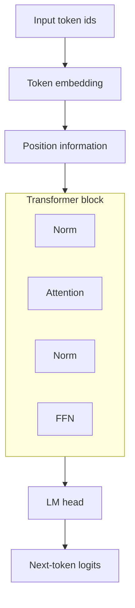
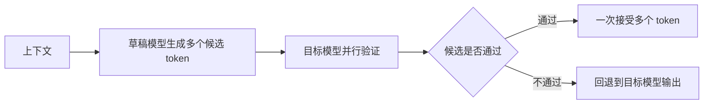

> [!tip]
>
> 推荐一个很直观的 Transformer 可视化交互网站：[Transformer Explainer](https://poloclub.github.io/transformer-explainer/)。

本文介绍 Transformer 模型的基本原理，以及它为什么成为大语言模型的主流架构。

## Language Model

本节介绍从统计语言模型到 Transformer 的关键演化过程。

### 快速开始

语言模型 (Language Model, LM) 的目标是估计一段文本出现的概率，或者根据已有上下文预测下一个 token。它经历了从离散统计、分布式词向量、循环神经网络、编码器-解码器到注意力机制的演化。

这条路线的核心矛盾是：模型需要同时处理变长序列、长距离依赖、语义表示和并行计算。Transformer 的出现不是凭空替代 RNN，而是把注意力机制、序列建模和大规模并行训练统一到了一个更可扩展的结构中。

### 语言建模的形式化

给定 token 序列 $x_1,x_2,\ldots,x_n$，自回归语言模型使用链式法则分解联合概率：

$$
p(x_1,x_2,\ldots,x_n)=\prod_{t=1}^{n}p(x_t\mid x_{<t})
$$

训练时通常最小化交叉熵损失：

$$
\mathcal{L}=-\frac{1}{n}\sum_{t=1}^{n}\log p_\theta(x_t\mid x_{<t})
$$

困惑度 (Perplexity, PPL) 是交叉熵的指数形式：

$$
\text{PPL}=\exp(\mathcal{L})
$$

PPL 越低，说明模型对测试文本分配的概率越高。但 PPL 主要衡量平均预测能力，不等价于对话质量、推理能力或安全性。

### Token 与词

现代语言模型预测的是 token，不一定是自然语言中的词。token 可以是词、子词、字节片段或特殊符号。

| 单位 | 特点 | 影响 |
| --- | --- | --- |
| word | 符合人类直觉 | 词表巨大，未登录词问题严重 |
| subword | 常见于 BPE、SentencePiece | 平衡词表规模和表达能力 |
| byte | 可以覆盖任意文本 | 序列更长，建模压力更大 |
| special token | 表示边界、角色、工具调用等结构 | 影响对话格式和模型行为 |

这意味着“预测下一个词”只是直观说法。严格来说，模型预测的是分词器定义下的下一个 token。分词方式会影响多语种压缩率、代码建模、长上下文成本和推理速度。

### 统计语言模型

n-gram 语言模型使用前 $n-1$ 个词预测当前词：

$$
p(w_i\mid w_1,\ldots,w_{i-1})\approx p(w_i\mid w_{i-n+1},\ldots,w_{i-1})
$$

它简单、可解释，但有明显限制：

- 上下文窗口固定，无法利用更远的信息；
- 词表很大时数据稀疏严重；
- 不能理解词之间的语义相似性；
- 需要人工设计平滑方法处理未见组合。

常见平滑方法包括 Laplace smoothing、Good-Turing smoothing 和 Kneser-Ney smoothing。它们本质上都在回答同一个问题：当某个词序组合在训练集中没出现时，模型是否应该把概率直接设为 $0$。

以加法平滑为例，给定历史 $h$ 和词表大小 $|V|$：

$$
p(w_i\mid h)=\frac{c(h,w_i)+\alpha}{c(h)+\alpha |V|}
$$

其中 $\alpha>0$ 用于给未见组合分配非零概率。

n-gram 的价值在于定义了语言建模任务，也让后续神经语言模型继承了“根据上下文预测 token”这个核心目标。

### 分布式词表示

one-hot 表示把每个词当成独立符号，无法表达“猫”和“狗”比“猫”和“汽车”更相近。Word2Vec、GloVe 等方法将词映射到连续向量空间，让语义相近的词在向量空间中更接近。

Word2Vec 常见训练目标包括：

- Skip-gram：用中心词预测上下文；
- CBOW：用上下文预测中心词。

Skip-gram with Negative Sampling 不直接对全词表做 softmax，而是把真实上下文词作为正样本，把采样词作为负样本，降低训练成本。

其目标可以写成：

$$
\log\sigma({v'_o}^\top v_c)+\sum_{k=1}^{K}\mathbb{E}_{w_k\sim P_n}\log\sigma(-{v'_{w_k}}^\top v_c)
$$

其中 $v_c$ 是中心词向量，$v'_o$ 是真实上下文词向量，$w_k$ 是负样本。这个目标避免了对全词表做归一化。

GloVe 则从全局共现矩阵出发，希望词向量的点积能解释词共现统计。Word2Vec 更偏局部预测，GloVe 更偏全局矩阵分解，但二者都说明语义关系可以被压缩进连续向量。

分布式表示解决了稀疏性问题，但它通常是静态的。同一个词在不同上下文中的含义无法变化，例如“苹果”既可以指水果，也可以指公司。

### 序列模型

循环神经网络 (Recurrent Neural Network, RNN) 通过隐藏状态递推处理序列：

$$
h_t=f(x_t,h_{t-1})
$$

它能处理变长文本，但普通 RNN 容易出现梯度消失或梯度爆炸。训练时需要沿时间展开进行反向传播，这一过程称为 BPTT (Backpropagation Through Time)。序列越长，梯度路径越长，优化越困难。

LSTM 和 GRU 引入门控机制，决定哪些信息写入、保留或遗忘。门控机制缓解了长距离信息传递的问题，但没有改变 RNN 串行计算的本质。

序列模型的主要问题是并行性差。第 $t$ 个 token 的状态依赖第 $t-1$ 个状态，难以充分利用 GPU 并行能力。序列越长，训练和推理越慢。

### 编码器-解码器

Seq2Seq 将输入序列编码为上下文表示，再由解码器生成输出序列，适合机器翻译、摘要、对话等输入输出长度不固定的任务。

早期 Seq2Seq 通常把整个输入压缩成一个固定向量，这会形成信息瓶颈。输入越长，压缩损失越明显。这个问题推动了注意力机制的发展。

### 注意力机制

注意力机制 (Attention) 让解码器在生成每个 token 时，都可以动态查看输入序列的不同位置，而不是只依赖一个固定向量。

可以把注意力写成一次加权检索：

$$
\text{Attention}(q,K,V)=\sum_i \alpha_i v_i
$$

其中 $q$ 是当前查询，$K,V$ 是被检索的键和值，$\alpha_i$ 是注意力权重。权重通常由 query 和 key 的相似度决定：

$$
\alpha_i=\frac{\exp(s(q,k_i))}{\sum_j\exp(s(q,k_j))}
$$

其中 $s(q,k_i)$ 是打分函数，可以是加性打分、点积或缩放点积。

注意力机制解决了 Seq2Seq 的信息瓶颈，也为 Transformer 的自注意力机制奠定基础。区别在于，早期注意力通常连接 Encoder 和 Decoder，而 Transformer 进一步让同一序列内部的 token 彼此注意。

### 上下文相关表示

ELMo 将词表示从静态向量推进到上下文相关表示。同一个词会根据上下文获得不同向量，这让模型能更好地区分一词多义。

ELMo 仍然依赖双向 LSTM，因此并行能力有限。它的意义在于证明了大规模语言模型可以作为通用特征提取器，为后来的 BERT 和 GPT 打开了预训练路线。

### 为什么语言建模目标重新成为主流

早期自然语言处理一度更重视理解任务，例如分类、匹配、抽取。BERT 也证明了双向 Encoder 对理解任务非常强。但随着模型规模扩大，自回归语言建模重新成为主流，原因包括：

- 训练目标简单，可以直接利用大规模文本；
- 生成过程和训练目标一致；
- 对话、代码、写作、工具调用都可以表达为 token 生成；
- 模型可以通过上下文学习把很多任务转成条件生成。

因此，GPT 类模型并不是回到“简单续写”，而是把语言建模目标扩展成统一的任务接口。

### 演化小结

| 阶段 | 核心贡献 | 主要限制 | 对现代 LLM 的影响 |
| --- | --- | --- | --- |
| n-gram | 定义语言建模概率 | 数据稀疏、窗口固定 | 保留了 next-token prediction 的基本形式 |
| Word2Vec/GloVe | 建立连续语义空间 | 静态表示 | 证明语义可以向量化 |
| RNN/LSTM/GRU | 处理变长序列 | 串行计算、长依赖困难 | 形成上下文状态建模思路 |
| Seq2Seq | 支持序列到序列任务 | 固定向量瓶颈 | 奠定 Encoder-Decoder 范式 |
| Attention | 动态对齐输入位置 | 仍常与 RNN 结合 | 成为 Transformer 的核心机制 |
| ELMo | 上下文相关词表示 | 架构扩展性不足 | 推动预训练表示学习 |
| Transformer | 并行自注意力建模 | 注意力复杂度随长度平方增长 | 成为现代大模型主架构 |

### 常见误区

| 误区 | 更准确的理解 |
| --- | --- |
| 语言模型只是文本补全 | 文本补全是统一接口，分类、翻译、代码和工具调用都可以转成条件生成 |
| PPL 低就一定更会对话 | PPL 衡量平均预测能力，不直接衡量指令遵循和安全性 |
| token 等于词 | token 由分词器定义，可能是子词、字节或特殊符号 |
| 注意力解决了所有长距离问题 | 标准注意力有 $O(n^2)$ 成本，长上下文仍需要结构和系统优化 |

### 参考资料

- [Efficient Estimation of Word Representations in Vector Space](https://arxiv.org/abs/1301.3781)
- [GloVe: Global Vectors for Word Representation](https://aclanthology.org/D14-1162/)
- [Sequence to Sequence Learning with Neural Networks](https://arxiv.org/abs/1409.3215)
- [Neural Machine Translation by Jointly Learning to Align and Translate](https://arxiv.org/abs/1409.0473)
- [Deep contextualized word representations](https://arxiv.org/abs/1802.05365)
- [Attention Is All You Need](https://arxiv.org/abs/1706.03762)

## Transformer

### 快速开始

Transformer 用自注意力 (Self-Attention) 替代 RNN 的顺序递推，让序列中任意两个 token 可以直接交互。它的核心结构是：注意力层负责在序列内部或序列之间传递信息，前馈网络负责逐位置非线性变换，残差连接和归一化负责稳定训练。

现代大语言模型大多基于 Transformer Decoder。它们通过自回归目标预测下一个 token，并在推理时使用 KV Cache 复用历史计算。理解现代 LLM，关键不是只记住“有注意力机制”，而是理解 token 表示、注意力形状、FFN 参数量、归一化位置、位置编码和推理缓存如何共同决定训练稳定性与推理成本。

### 产生背景

在 [使用 RNN 进行文本生成任务](../../base/ai/natural-language-processing/text-generation.md) 时，RNN 由于只能按时间步串行计算，导致：

- 信息量上：所有信息被压缩进单一隐状态，在长距离信息传递时容易衰减；
- 扩展性上：无法充分利用 GPU 的并行特性，训练缓慢，难以扩展到大型模型。

[*Attention Is All You Need*](https://arxiv.org/abs/1706.03762) 提出的 Transformer 网络架构让序列中任意两个 token 可以直接交互，不再依赖顺序递推结构，从而提升并行计算能力和长距离建模能力。

### 模型结构

原始 Transformer 由 Encoder-Decoder 结构组成，每个部分包含多个堆叠的 Block。每个 Block 内部采用类似模式：注意力机制、前馈网络、残差连接、层归一化。


可以抽象为下图：



#### 数据形状

设 batch size 为 $B$，序列长度为 $S$，隐藏维度为 $H$，注意力头数为 $A$，每个头维度为 $d_h=H/A$。

输入 token 经过 embedding 后得到：

$$
X\in\mathbb{R}^{B\times S\times H}
$$

注意力层会把 $X$ 投影成：

$$
Q,K,V\in\mathbb{R}^{B\times A\times S\times d_h}
$$

注意力分数的形状为：

$$
QK^\top\in\mathbb{R}^{B\times A\times S\times S}
$$

这也是标准自注意力显存和计算随序列长度平方增长的直接来源。

#### 数据流向

训练阶段，输入序列整体并行进入模型，目标序列通常是输入右移一位。Decoder 通过因果 Mask 只能观察当前位置之前的 token，从而计算：

$$
\text{loss}=-\sum_t \log p_\theta(x_t\mid x_{<t})
$$

推理阶段分为两段：

- prefill：一次性处理 prompt，生成所有历史 token 的 Key 和 Value；
- decode：每次只生成一个新 token，并读取已有 KV Cache。

prefill 的计算更像训练阶段，能并行处理长序列；decode 的瓶颈常在内存带宽和 KV Cache 读取，而不是单纯矩阵乘法。

#### Positional Embedding

Transformer 没有递归结构，无法内建位置信息，必须显式提供。

原论文提出正弦位置编码：

$$
\begin{aligned}
\text{PE}_{(pos,2i)}=\sin\left(\frac{pos}{10000^{2i/d}}\right) \\
\text{PE}_{(pos,2i+1)}=\cos\left(\frac{pos}{10000^{2i/d}}\right)
\end{aligned}
$$

它的特点包括：

- 可外推到比训练时更长的序列；
- 不增加额外参数；
- 可以通过不同频率表达不同位置尺度。

现代大语言模型中，RoPE、ALiBi 等位置编码也很常见，详见 [高效架构](#位置编码演化)。

#### Multi-Head Attention

多头注意力通过为每个 token 生成 $Q,K,V$，再按头划分多个独立子空间捕获不同关系模式。

缩放点积注意力 (Scaled Dot-Product Attention) 的计算方式是：

$$
\text{Attention}(Q, K, V)=\text{softmax}\left(\frac{QK^\top}{\sqrt{d_k}}\right)V
$$

缩放因子 $\sqrt{d_k}$ 用于抑制高维向量点积的数值过大，使 softmax 更稳定。

多头注意力的整体公式为：

$$
\text{MHA}(X)=\text{Concat}(h_1,\ldots,h_A)W_O
$$

每个头独立计算注意力，从而提升多尺度、多关系的表达能力。

下面是缩放点积注意力的最小 PyTorch 实现，重点是看清楚矩阵乘法、mask 和 softmax 的位置：

```python
import math
import torch
import torch.nn.functional as F


def scaled_dot_product_attention(q, k, v, causal=False):
    # q, k, v: [B, A, S, Dh]
    scores = q @ k.transpose(-2, -1) / math.sqrt(q.size(-1))

    if causal:
        s = q.size(-2)
        mask = torch.triu(torch.ones(s, s, device=q.device), diagonal=1).bool()
        scores = scores.masked_fill(mask, float("-inf"))

    weights = F.softmax(scores, dim=-1)
    return weights @ v  # [B, A, S, Dh]
```

这段代码没有包含 dropout、KV Cache、GQA 等工程细节，但已经对应了核心公式 $\text{softmax}(QK^\top/\sqrt{d_k})V$。

#### Masked Multi-Head Attention

Decoder 必须保证只使用已生成的历史 token，因此注意力矩阵中未来位置会被替换为 $-\infty$，经 softmax 后权重为 $0$。

Masked Multi-Head Attention 的计算与普通 Attention 相同，但输入矩阵中会添加因果 Mask：

$$
\text{scores}_{ij}=\begin{cases}
\frac{q_i k_j^\top}{\sqrt{d_k}}, & j\le i \\
-\infty, & j>i
\end{cases}
$$

- 上三角区域被抑制；
- 每个 token 只能关注自己和历史 token；
- 生成流程满足自回归约束。

#### Cross Attention

Cross Attention 用于连接两段序列。其输入 $Q$ 来自 Decoder，$K,V$ 来自 Encoder。

它的作用包括：

- 建立输出与输入的跨序列对齐；
- 捕获翻译、摘要等任务中的输入输出关系；
- 将 Encoder 表示注入 Decoder 生成过程。

现代 Decoder-only 大语言模型通常没有 Cross Attention，但多模态模型和 Encoder-Decoder 模型仍会大量使用类似机制。

#### Feed-Forward Network

每个 Block 中都有位置独立的前馈网络，用于局部非线性变换。常见形式是两层线性层加激活函数：

$$
\text{FFN}(x)=W_2\,\sigma(W_1x+b_1)+b_2
$$

通常 $W_1$ 会将维度扩展为原来的数倍，再缩回原维度。现代模型常使用 SwiGLU、GeGLU 等门控激活函数。SwiGLU 可写成：

$$
\text{SwiGLU}(x)=\text{SiLU}(xW_g)\odot xW_u
$$

再经过下投影回到隐藏维度。FFN 通常占据 Transformer block 的大量参数，因此 [混合专家模型](./mixture-of-experts.md) 常用多个专家 FFN 替换 dense FFN。

#### Residual & LayerNorm

每个子层外部都包裹残差连接和归一化：

- 残差连接让梯度传播路径更短；
- LayerNorm 或 RMSNorm 保持数值稳定，使训练更容易收敛。

典型结构包括：

- Pre-LN：先归一化，再进入子层，现代模型更常用；
- Post-LN：子层后归一化，原始 Transformer 使用这种形式；
- RMSNorm：只保留均方根归一化，计算更简单，常见于 LLaMA 类模型。

#### Dropout

注意力权重、FFN 输出、残差路径都可以使用 Dropout，减少过拟合并稳定训练。在超大规模预训练中，Dropout 的使用会根据数据规模和训练配方调整，有些大模型训练中会显著降低甚至不使用 Dropout。

### 架构变体

Transformer 的三条主要路线共享注意力和前馈网络等基本组件，区别在于信息可见范围和 Encoder、Decoder 的组合方式。

| 路线 | 结构特点 | 典型任务 | 代表模型 |
| --- | --- | --- | --- |
| Encoder-only | 使用双向 Encoder，可同时观察左右上下文 | 分类、匹配、抽取 | BERT、RoBERTa |
| Decoder-only | 使用带因果 Mask 的 Decoder，从左到右生成 | 对话、代码、工具调用 | GPT、LLaMA、Qwen、DeepSeek |
| Encoder-Decoder | Encoder 表示输入，Decoder 通过 Cross Attention 生成输出 | 翻译、摘要、文本改写 | T5、BART |

三类结构对应的语言建模目标和训练路线详见 [预训练范式](../training/pre-training.md)。

### 参数量粗算

一个 dense Decoder-only Transformer 的参数主要来自 embedding、attention projection、FFN 和输出头。

假设词表大小为 $V$，隐藏维度为 $H$，层数为 $L$，FFN 中间维度为 $I$。

- embedding 参数约为 $VH$；
- 每层 attention 的 $Q,K,V,O$ 投影约为 $4H^2$；
- 每层普通 FFN 约为 $2HI$；
- SwiGLU 类 FFN 通常有 gate、up、down 三个投影，约为 $3HI$。

当 $I$ 约为 $4H$ 时，FFN 参数往往多于 attention projection。这也是 MoE 优先替换 FFN 的原因：它能显著增加模型容量，同时控制每个 token 激活的专家数量。

### 性能分析

标准自注意力的主要成本来自注意力矩阵。

计算 $Q,K,V$ 矩阵时，输入 $X_{B\times S\times H}$ 分别乘以 $W_Q,W_K,W_V$，计算量约为 $O(BSH^2)$。

计算注意力分数时，$QK^\top$ 会形成 $B\times A\times S\times S$ 的矩阵，需要 $O(BS^2H)$ 级别计算。softmax 和注意力权重乘以 $V$ 也会带来 $O(S^2)$ 级别的计算和显存开销。

因此：

- 短上下文、大隐藏维度时，FFN 和投影层可能占主导；
- 长上下文时，attention 的 $S^2$ 成本会迅速变成瓶颈；
- 推理 decode 阶段每步只处理一个新 token，但要读取所有历史 KV Cache。

| 阶段 | 主要输入形状 | 近似瓶颈 | 典型优化 |
| --- | --- | --- | --- |
| 训练 | $B\times S\times H$ | attention、FFN、激活显存 | Flash Attention、并行训练、activation checkpointing |
| Prefill | $B\times S_\text{prompt}\times H$ | 长 prompt attention | Flash Attention、chunked prefill |
| Decode | $B\times 1\times H$ + KV Cache | KV Cache 读取、内存带宽 | GQA、MQA、MLA、Paged Attention |

这也是长上下文模型需要 Flash Attention、滑动窗口注意力、GQA、MQA、MLA 等技术的原因。

### 工程影响

Transformer 的结构直接影响大模型训练和推理系统。

- KV Cache：自回归生成时缓存历史 Key 和 Value，避免重复计算历史 token。
- Flash Attention：优化注意力计算的显存读写，提升训练和推理效率。
- 长上下文扩展：通过位置编码缩放、滑动窗口、稀疏注意力等方法延长可处理序列。
- 分布式训练：Transformer Block 结构规整，适合张量并行、流水线并行和数据并行。
- MoE：通常替换 FFN 子层，在总参数规模和每 token 计算量之间做折中。

这些优化不改变 Transformer 的基本目标，但决定了模型能否以可接受成本训练和部署。

### 常见误区

| 误区 | 更准确的理解 |
| --- | --- |
| Attention 权重就是解释 | 注意力权重反映计算路径，不一定等价于人类可解释因果依据 |
| Decoder-only 只能做生成 | 很多理解任务可以通过提示词转成条件生成 |
| KV Cache 会减少训练成本 | KV Cache 主要用于自回归推理，训练阶段通常不这样缓存 |
| 长上下文只要改位置编码 | 还需要数据、注意力模式、显存管理和评测共同支持 |
| FFN 只是附属模块 | FFN 往往占大量参数，对模型容量非常关键 |

### 代码实现

参考：

- [Transformer Model Tutorial in PyTorch: From Theory to Code](https://www.datacamp.com/tutorial/building-a-transformer-with-py-torch)
- [hyunwoongko/transformer](https://github.com/hyunwoongko/transformer)
- [The Illustrated Transformer](https://jalammar.github.io/illustrated-transformer/)

## Efficient Transformer

本节介绍大模型中用于降低训练和推理成本的结构改进。

### 快速开始

高效架构关注的是：在模型能力尽量不下降的前提下，让训练更稳定、上下文更长、推理更快、显存占用更低。

它不是单一技术，而是一组围绕 Transformer 的改造：位置编码、注意力计算、KV Cache、稀疏注意力、分组查询、投机解码等。本文只讨论模型结构和算法动机，部署框架放在 [模型部署](../serving/index.md) 章节中。

### 效率瓶颈拆解

训练和推理的瓶颈并不相同。

| 阶段 | 主要瓶颈 | 典型优化 |
| --- | --- | --- |
| 训练 | FLOPs、激活显存、通信、checkpoint | 混合精度、Flash Attention、并行策略、activation checkpointing |
| Prefill | 长 prompt 的 attention 计算 | Flash Attention、chunked prefill、长上下文注意力优化 |
| Decode | KV Cache 读取、内存带宽、小 batch 利用率 | GQA/MQA/MLA、Paged Attention、continuous batching、投机解码 |
| 长上下文 | $O(n^2)$ attention、位置外推、KV Cache | RoPE scaling、sliding window、sparse attention、KV 压缩 |

因此，同一个技术可能只改善某个阶段。例如 Flash Attention 对训练和 prefill 很重要，但 decode 阶段常常更受 KV Cache 读取影响。

### 位置编码演化

Transformer 本身没有递归结构，必须显式注入位置信息。

#### Sinusoidal 与 Learned Position Embedding

原始 Transformer 使用正弦位置编码，BERT、GPT 等模型也常使用可学习位置向量。它们简单有效，但在长度外推上存在限制。

可学习位置向量在训练长度内效果稳定，但超过训练长度后没有天然外推能力。正弦位置编码可以计算任意位置，但模型是否能使用更长位置仍取决于训练分布。

#### RoPE

旋转位置编码 (Rotary Position Embedding, RoPE) 将位置信息编码到 Query 和 Key 的旋转变换中。它适合自回归模型，因此被 LLaMA、Qwen 等模型广泛采用。

RoPE 的优势是能自然表达相对位置信息，配合缩放策略后可以支持更长上下文。对一对二维分量，可以写成旋转矩阵：

$$
\begin{bmatrix}
x'_{2i} \\
x'_{2i+1}
\end{bmatrix}
=
\begin{bmatrix}
\cos m\theta_i & -\sin m\theta_i \\
\sin m\theta_i & \cos m\theta_i
\end{bmatrix}
\begin{bmatrix}
x_{2i} \\
x_{2i+1}
\end{bmatrix}
$$

其中 $m$ 是位置，$\theta_i$ 是该维度对应的频率。Query 和 Key 经过位置相关旋转后，它们的点积会自然包含相对位置信息。

常见长上下文扩展包括 NTK-aware scaling、YaRN、LongRoPE 等。

长度外推失败通常不只是位置编码问题，还可能来自训练时没有见过长距离依赖、注意力模式未适配、长上下文数据质量不足。

#### ALiBi

ALiBi 直接在注意力分数中加入与距离相关的偏置，让模型更倾向关注近处 token。它不需要单独的位置向量，在长度外推上更直接。

对第 $h$ 个头，可以把注意力分数改成：

$$
\text{score}_{ij}^{(h)}=\frac{q_i k_j^\top}{\sqrt{d}}-m_h(i-j)
$$

其中 $m_h$ 是该注意力头的斜率，$i-j$ 表示当前位置和历史位置的距离。

ALiBi 的取舍是表达形式较受限，但实现简单，适合强调外推稳定性的场景。

### 注意力复杂度

标准自注意力需要计算 $n\times n$ 的注意力矩阵，时间和显存复杂度都是 $O(n^2)$。当上下文长度增加时，这会成为主要瓶颈。

优化方向包括：

- 稀疏注意力：只关注局部或特定位置；
- 线性注意力：用近似方法降低复杂度；
- 滑动窗口注意力：让每个 token 只看附近窗口；
- 全局 token：保留少量可以跨窗口通信的位置；
- Flash Attention：通过 IO 优化减少显存读写。

Flash Attention 不改变注意力数学形式，而是改变计算组织方式，让注意力计算更适合 GPU。它避免显式 materialize 完整注意力矩阵到高带宽显存之外的慢路径中，从而提升速度并降低显存占用。

### MHA、MQA、GQA 与 MLA

多头注意力中，每个头都有自己的 Query、Key、Value。推理时，Key 和 Value 需要缓存，头数越多，KV Cache 越大。

| 机制 | Key/Value 共享方式 | 优点 | 代价 |
| --- | --- | --- | --- |
| MHA | 每个 Query 头独立 K/V | 表达能力强 | KV Cache 最大 |
| MQA | 所有 Query 头共享一组 K/V | KV Cache 最小 | 可能损失质量 |
| GQA | 一组 Query 头共享一组 K/V | 平衡质量和显存 | 需要选择分组数 |
| MLA | 用潜在表示压缩 K/V | 显著降低长上下文缓存 | 结构更复杂 |

多查询注意力 (Multi-Query Attention, MQA) 让多个 Query 头共享一组 Key 和 Value，显著减少缓存。分组查询注意力 (Grouped Query Attention, GQA) 介于 MHA 和 MQA 之间，让一组 Query 头共享 Key 和 Value。

多头潜在注意力 (Multi-Head Latent Attention, MLA) 进一步通过低维潜在表示压缩 KV Cache，降低长上下文推理成本。

### KV Cache

自回归生成时，每一步都会用到历史 token 的 Key 和 Value。如果每次都重新计算历史部分，成本会很高。

KV Cache 将历史 Key 和 Value 缓存下来，新 token 只需要计算自己的 Query、Key、Value，再与缓存交互。

KV Cache 大小可粗略估算为：

$$
\text{KV bytes}\approx 2\times L\times B\times S\times H_{kv}\times d_h\times \text{bytes}
$$

其中 $L$ 是层数，$B$ 是 batch size，$S$ 是上下文长度，$H_{kv}$ 是 KV head 数，$d_h$ 是 head dimension，前面的 $2$ 分别表示 Key 和 Value。

这个公式说明：长上下文、批量大小、层数、KV head 数都会线性增加显存压力。GQA、MQA、MLA 的价值就在于降低 $H_{kv}$ 或压缩 K/V 表示。

KV Cache 的 prefill/decode 伪代码如下：

```text
# prefill
K_cache, V_cache = [], []
for layer in layers:
    q, k, v = project(hidden_states)
    K_cache[layer] = k
    V_cache[layer] = v
    hidden_states = attention(q, k, v)

# decode one token
for layer in layers:
    q_new, k_new, v_new = project(new_hidden_state)
    K_cache[layer].append(k_new)
    V_cache[layer].append(v_new)
    new_hidden_state = attention(q_new, K_cache[layer], V_cache[layer])
```

prefill 负责一次性建立缓存，decode 负责逐 token 追加缓存。

### Paged Attention

Paged Attention 借鉴虚拟内存分页思想，把 KV Cache 划分成块进行管理，减少显存碎片，提高动态批处理效率。

它主要影响推理系统，但背后的瓶颈来自模型自回归生成中的 KV Cache，因此也属于理解大模型效率时必须掌握的概念。

### 投机解码

投机解码 (Speculative Decoding) 使用一个较小的草稿模型先生成多个候选 token，再由大模型并行验证。若候选通过验证，就可以一次接受多个 token。

基本流程是：



它不改变最终输出分布，但能降低大模型逐 token 解码的等待时间。适用效果取决于草稿模型质量、验证通过率、batch 形态和目标模型吞吐。

Medusa、EAGLE 等方法可以看作投机解码思想的变体：用额外头或特征预测多个未来 token，再由主模型验证。

伪代码如下：

```text
输入: context, draft_model, target_model
while not finished:
    draft_tokens = draft_model.generate_k_tokens(context)
    target_logits = target_model.verify(context, draft_tokens)
    accepted = longest_prefix_accepted(draft_tokens, target_logits)
    context.append(accepted)
    if accepted is shorter than draft_tokens:
        context.append(sample_from_target(target_logits))
输出: context
```

接受率越高，加速越明显；如果草稿模型经常被拒绝，额外验证开销可能抵消收益。

### 非标准 Transformer 路线

除了优化标准注意力，也有路线尝试减少甚至替代注意力的二次复杂度，例如 linear attention、state space model、Mamba、RWKV 等。

这些方法通常在长序列效率上有优势，但是否能在通用语言建模、多轮对话、复杂推理和工具使用上全面替代 Transformer，还取决于训练规模、生态支持和实际评测。当前主流大语言模型仍以 Transformer 及其变体为主。

### 与模型演化的关系

高效架构的价值在于支撑更大的模型、更长的上下文和更低的推理成本。它与 [扩展定律](./scaling-law.md) 和 [混合专家模型](./mixture-of-experts.md) 共同构成现代大模型规模化的工程基础。

需要注意边界：Flash Attention 更偏 kernel 实现，Paged Attention 更偏服务系统，GQA/MQA/MLA 更偏模型结构。它们处在不同层次，但都围绕同一个核心问题：如何让 Transformer 在更长序列和更大吞吐下仍然可用。

### 常见误区

| 误区 | 更准确的理解 |
| --- | --- |
| 长上下文只靠 RoPE scaling | 还需要长上下文数据、注意力模式、缓存管理和评测 |
| Flash Attention 改变了模型表达能力 | 它主要是精确注意力的高效实现，不改变数学定义 |
| MQA 一定优于 MHA | MQA 节省缓存，但可能损失质量；GQA 常作为折中 |
| 投机解码一定加速 | 加速取决于草稿模型接受率和系统调度，不是无条件成立 |
| Paged Attention 是模型结构 | 它主要是 KV Cache 管理和服务系统技术 |

### 参考资料

- [RoFormer: Enhanced Transformer with Rotary Position Embedding](https://arxiv.org/abs/2104.09864)
- [Train Short, Test Long: Attention with Linear Biases Enables Input Length Extrapolation](https://arxiv.org/abs/2108.12409)
- [FlashAttention: Fast and Memory-Efficient Exact Attention with IO-Awareness](https://arxiv.org/abs/2205.14135)
- [FlashAttention-2: Faster Attention with Better Parallelism and Work Partitioning](https://arxiv.org/abs/2307.08691)
- [Fast Transformer Decoding: One Write-Head is All You Need](https://arxiv.org/abs/1911.02150)
- [Efficient Memory Management for Large Language Model Serving with PagedAttention](https://arxiv.org/abs/2309.06180)
- [Mamba: Linear-Time Sequence Modeling with Selective State Spaces](https://arxiv.org/abs/2312.00752)
