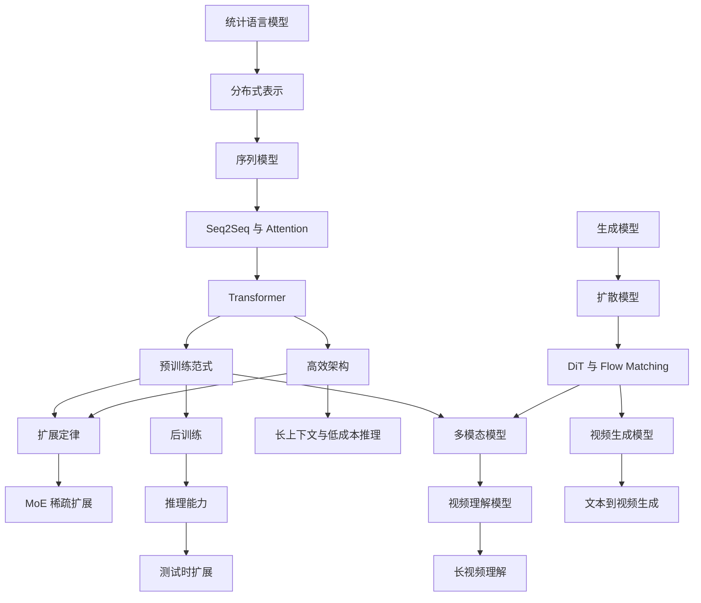

## 独立专题

- [Tokenizer](./tokenizer.md)
- [Embedding](./embedding.md)
- [Transformer](./transformer.md)
- [Attention](./attention.md)
- [位置编码](./positional-embedding.md)
- [Decoder-only](./decoder-only.md)
- [Encoder](./encoder.md)
- [MoE](./moe.md)
- [长上下文](./long-context.md)
- [多模态](./multimodal.md)
- [Diffusion](./diffusion.md)

本文按技术演化顺序整理大模型相关的核心模型、训练范式和研究方向。

## 快速开始

大模型不是单一技术，而是一条从语言建模、表示学习、Transformer、预训练、规模化训练、后训练、多模态生成逐步演化出来的技术链。学习时可以先抓住三条主线：

- 模型结构主线：n-gram -> RNN -> Attention -> Transformer -> MoE 与高效注意力。
- 训练范式主线：词向量 -> 预训练 -> 指令微调 -> 偏好优化 -> 推理强化。
- 能力扩展主线：文本生成 -> 长上下文 -> 工具使用 -> 多模态理解与生成。

专业读者不应只记住模型名称，而应关注每一阶段的目标函数、瓶颈、约束和可扩展性。一个模型为什么有效，通常取决于它如何在数据、计算、参数、推理成本和评测目标之间做取舍。

## 如何阅读本章

不同读者可以按不同路径阅读：

| 目标 | 推荐路径 | 关注重点 |
| --- | --- | --- |
| 建立基础概念 | 语言模型演化 -> [Transformer 模型](./transformer.md) -> [预训练](../training/stages/pre-training.md) | token、语言建模、注意力、训练目标 |
| 理解现代 LLM 架构 | [Transformer 模型](./transformer.md) -> 高效架构 -> [MoE](./moe.md) | Decoder-only、KV Cache、GQA、MoE |
| 理解能力来源 | [预训练](../training/stages/pre-training.md) -> [扩展定律](./scaling-law.md) -> [有监督微调](../training/stages/sft.md) | 数据、算力、监督适配、评测 |
| 研究推理模型 | [强化学习](../training/stages/rl.md) -> [推理能力](./reasoning.md) -> [扩展定律](./scaling-law.md) | RLVR、GRPO、verifier、test-time scaling |
| 研究多模态生成 | [多模态模型](./multimodal.md) -> [扩散模型](./diffusion.md) -> [Transformer 模型](./transformer.md) | 图文对齐、视觉 token、DiT、flow matching |
| 准备视频多模态面试 | [多模态模型](./multimodal.md) -> 视频模型 -> [扩散模型](./diffusion.md) | 视频 token、时序建模、视频 VLM、视频生成、评测 |

如果只想快速把握整体脉络，可以先读本页的技术演化表和分层视角，再按主题跳转。

## 技术演化表

| 阶段 | 代表技术 | 核心问题 | 后续影响 |
| --- | --- | --- | --- |
| 统计语言模型 | n-gram | 用条件概率建模词序列 | 定义语言建模任务 |
| 分布式表示 | Word2Vec、GloVe | 缓解 one-hot 表示稀疏问题 | 建立词向量与语义空间 |
| 序列模型 | RNN、LSTM、GRU | 处理变长文本序列 | 形成上下文状态建模思路 |
| 编码器-解码器 | Seq2Seq、Attention | 支持输入到输出序列映射 | 推动机器翻译和生成任务 |
| Transformer | Self-Attention | 并行建模长距离依赖 | 成为大模型主架构 |
| 预训练模型 | ELMo、BERT、GPT、T5 | 从大规模语料中学习通用能力 | 形成基础模型 (Foundation Model) 范式 |
| 扩展定律 | Kaplan Scaling Law、Chinchilla | 研究参数、数据、算力的配比 | 指导大规模训练预算分配 |
| 稀疏扩展 | MoE、Switch Transformer、Mixtral | 降低单 token 计算成本 | 支持更大总参数规模 |
| 后训练 | SFT、RLHF、DPO、GRPO | 让模型更符合指令和偏好 | 形成 ChatGPT 类交互模型 |
| 推理能力 | CoT、Self-Consistency、verifier | 显式组织多步求解过程 | 推动测试时计算扩展 |
| 高效架构 | RoPE、GQA、Flash Attention、KV Cache | 降低训练和推理开销 | 支持长上下文与高吞吐服务 |
| 多模态模型 | CLIP、Flamingo、LLaVA | 对齐文本、图像、音频等模态 | 走向原生多模态模型 |
| 视频模型 | TimeSformer、VideoMAE、Video-LLaVA、Video Diffusion | 建模长时序、运动和帧间一致性 | 推动视频问答、长视频理解和视频生成 |
| 扩散模型 | DDPM、Stable Diffusion、DiT | 高质量图像和视频生成 | 成为视觉生成主流路线 |

## 演化路线

这张图强调依赖关系，而不是严格年份。例如 MoE 的思想很早出现，但它真正成为大模型训练中的重要路线，是在 Transformer 和规模化训练需求成熟之后。扩散模型也不是大语言模型主线的一部分，但它在多模态生成中与语言模型紧密配合。

## 现代大模型的分层视角

理解大模型时，建议把系统拆成多个层次，而不是把所有技术都混在“模型”这个词里。

| 层次 | 典型对象 | 关键问题 | 对应文章 |
| --- | --- | --- | --- |
| 表示层 | token、embedding、position | 如何把离散输入变成可计算表示 | 语言模型演化、高效架构 |
| 架构层 | attention、FFN、normalization、MoE | 如何组织参数和计算路径 | [Transformer 模型](./transformer.md)、[MoE](./moe.md) |
| 训练层 | pre-training、continued pre-training | 能力如何从数据和算力中形成 | [预训练](../training/stages/pre-training.md)、[扩展定律](./scaling-law.md) |
| 对齐层 | SFT、RLHF、DPO、GRPO | 模型如何变得可用、可控、可交互 | [有监督微调](../training/stages/sft.md)、[强化学习](../training/stages/rl.md) |
| 推理层 | decoding、verifier、test-time scaling | 如何在回答时分配计算预算 | [推理能力](./reasoning.md)、高效架构 |
| 多模态层 | VLM、Diffusion、DiT | 如何理解和生成非文本模态 | [多模态模型](./multimodal.md)、[扩散模型](./diffusion.md) |
| 评测层 | benchmark、human eval、contamination check | 如何判断能力是否真实可靠 | [预训练](../training/stages/pre-training.md)、[强化学习](../training/stages/rl.md) |

这种分层能避免常见混淆。例如 Flash Attention 主要优化计算实现，不改变语言建模目标；DPO 改变后训练目标，不改变 Transformer 的基本结构；MoE 增加总参数量，但每个 token 激活的参数量未必同步增加。

## 常见误区

| 误区 | 更准确的理解 |
| --- | --- |
| 参数越大模型一定越强 | 参数量必须和 token 数、数据质量、训练预算、后训练策略一起看 |
| Transformer 等于大模型 | Transformer 是主流架构，但大模型还包括数据、训练、后训练、推理和评测 |
| 推理能力只来自 CoT 提示词 | 推理能力还来自预训练数据、SFT 轨迹、RLVR、verifier 和测试时计算 |
| 多模态就是给 LLM 接一个图片编码器 | 多模态还涉及跨模态对齐、token 融合、指令微调和安全评测 |
| 扩散模型是 LLM 的替代路线 | 扩散模型主要处理连续信号生成，常与语言模型在多模态系统中协作 |

## 参考资料

- [CS 336: Language Modeling from Scratch](https://stanford-cs336.github.io/spring2025/)
- [深度学习论文精读](https://github.com/mli/paper-reading)
- [LLM 架构图集](https://sebastianraschka.com/llm-architecture-gallery/)
- [Attention Is All You Need](https://arxiv.org/abs/1706.03762)
- [Scaling Laws for Neural Language Models](https://arxiv.org/abs/2001.08361)
- [Training Compute-Optimal Large Language Models](https://arxiv.org/abs/2203.15556)

