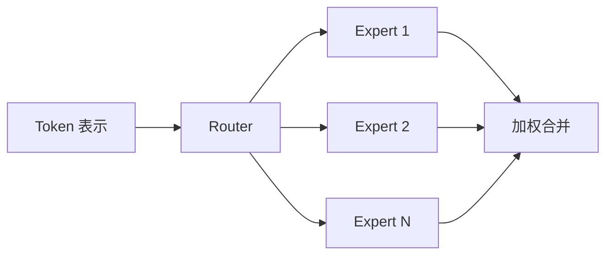

本文介绍混合专家模型在大模型中的基本结构、训练难点和演化路线。

## 快速开始

混合专家模型 (Mixture of Experts, MoE) 的核心思想是：模型内部放置多个专家网络，每个 token 只路由到其中少数几个专家。这样可以增加总参数量，同时避免每个 token 都经过全部参数。

Dense 模型是“所有 token 走同一套参数”，MoE 是“不同 token 选择不同专家”。它的主要收益是降低单 token 计算成本，主要代价是路由不稳定、负载不均衡和分布式通信复杂。

专业理解 MoE 时要区分三个量：total parameters、active parameters 和 FLOPs per token。MoE 的总参数可以很大，但每个 token 实际激活的参数只是一部分。

## 为什么需要 MoE

大模型规模扩大后，Dense 模型的训练和推理成本会快速上升。继续堆参数虽然可能提升能力，但每个 token 的计算量也同步上升。

MoE 希望把“模型容量”和“单次计算量”部分解耦：

- 总参数量很大，提供更强容量；
- 每个 token 只激活少数专家，控制计算量；
- 不同专家可以学习不同模式或领域。

这与 [扩展定律](./scaling-law.md) 直接相关：MoE 用稀疏激活改变了参数规模和计算预算之间的关系。

## Dense 与 Sparse 的计算账本

| 概念 | Dense 模型 | MoE 模型 |
| --- | --- | --- |
| Total parameters | 总参数约等于每 token 可用参数 | 总参数可以远大于每 token 激活参数 |
| Active parameters | 每个 token 经过主要参数路径 | 每个 token 只经过 Top-k 专家 |
| FLOPs per token | 随模型宽度和层数增长 | 与激活专家数量关系更直接 |
| 通信成本 | 主要来自并行策略 | 额外包含 token 分发和专家通信 |
| 训练稳定性 | 相对简单 | 路由、负载和专家塌缩更复杂 |

MoE 的优势不是“免费增加参数”，而是用路由和通信复杂度换取更大的模型容量。

例如一个 MoE 层有 $64$ 个专家，但每个 token 只激活 Top-2 专家。总专家容量约是单专家的 $64$ 倍，但单 token 的专家计算只经过 $2$ 个专家。实际成本还要加上 router、dispatch、all-to-all 通信和负载均衡损失。

## 基本结构

一个典型 MoE 层包含路由器和多个专家：



路由器为每个 token 计算专家得分，并选择 Top-k 个专家。专家通常是前馈网络 (Feed-Forward Network, FFN)，因此 MoE 常用于替换 [Transformer 模型](./transformer.md) Block 中的 FFN 层。

## MoE 层的数学形式

给定 token 表示 $x$，路由器先计算专家得分：

$$
g=\text{softmax}(W_rx)
$$

选择得分最高的 Top-k 专家集合 $S(x)$ 后，输出为：

$$
y=\sum_{i\in S(x)}g_iE_i(x)
$$

其中 $E_i$ 是第 $i$ 个专家网络，$g_i$ 是该专家的路由权重。

Top-1 路由只选择一个专家，计算更便宜，但更容易负载不均。Top-2 或 Top-k 路由选择多个专家，表达能力更强，但通信和计算成本更高。

一个 MoE dispatch 的伪代码如下：

```text
输入: tokens X, experts E, router R, top_k, capacity
scores = softmax(R(X))
routes = top_k(scores, k=top_k)
for each expert e:
    bucket[e] = select tokens routed to e up to capacity
    out[e] = E[e](bucket[e])
combine expert outputs by router weights
输出: mixed token representations
```

这段伪代码中的 `bucket` 往往分布在不同设备上，因此会触发通信和容量控制问题。

## 路由与负载均衡

路由器如果只追求当前 token 的最高得分，容易让大量 token 涌向少数专家，导致热门专家过载、冷门专家训练不足。

常见控制手段包括：

- auxiliary loss：鼓励不同专家接收更均衡的 token；
- capacity factor：限制每个专家最多处理多少 token；
- token dropping：超过容量的 token 被丢弃或走备用路径；
- router jitter：给路由得分加入扰动，减少早期塌缩；
- z-loss：约束 router logits 的数值范围，提升稳定性。

负载均衡不是纯粹的工程细节，它会直接影响专家是否能学到有效分工。

一种常见辅助目标的思想是同时约束专家接收 token 的比例 $f_i$ 和 router 分配给专家的概率质量 $p_i$：

$$
\mathcal{L}_\text{balance}\propto E\sum_{i=1}^{E} f_i p_i
$$

其中 $E$ 是专家数量。目标不是让所有 token 完全平均，而是避免少数专家长期过载、其他专家几乎不训练。

## 专家粒度

现代 MoE 不一定只是“很多完整 FFN 专家”。常见设计包括：

- routed expert：通过路由器动态选择的专家；
- shared expert：所有 token 都经过的共享专家，用于保留通用能力；
- fine-grained expert：把专家拆得更细，提高组合灵活性；
- hierarchical MoE：先选择专家组，再选择组内专家。

DeepSeekMoE 类路线强调细粒度专家和共享专家结合，让模型同时具备通用路径和专门化路径。

## 通信与并行

MoE 的系统难点通常来自 expert parallelism 和 all-to-all communication。

在分布式训练中，不同专家可能放在不同设备上。每一层 MoE 都需要根据路由结果把 token 分发到对应专家，计算后再收集回来。这会带来：

- all-to-all 通信开销；
- batch 内 token 分布不均；
- 设备利用率不稳定；
- 小 batch 推理时专家并行效率下降。

因此 MoE 在训练上可以很强，但部署未必比 Dense 模型简单。


这张图说明 MoE 的瓶颈经常不在专家 FFN 本身，而在 token 分发、跨设备通信和结果合并。

## 训练难点

MoE 的难点不在单个专家，而在系统整体：

- 路由离散，训练稳定性更差；
- 专家负载不均衡会降低硬件利用率；
- 跨设备交换 token 带来通信开销；
- 批量大小、专家容量和丢 token 策略都会影响效果；
- 推理时需要更复杂的调度和缓存策略。

因此，MoE 适合大规模分布式训练，但对工程系统要求更高。

## 推理部署难点

MoE 推理并不总是更便宜。原因包括：

- 单个请求的 token 数少时，专家并行难以充分利用；
- 热门专家可能成为瓶颈；
- 动态路由让 batch 内 token 计算路径不同；
- KV Cache 与专家路由组合后，调度更复杂；
- 总参数量大，模型加载和显存占用仍然高。

因此，MoE 更适合高吞吐批处理和大规模服务场景。对于小模型、本地部署或低并发场景，Dense 模型可能更直接。

## 代表模型

| 模型 | 核心贡献 | 关键点 |
| --- | --- | --- |
| Adaptive Mixtures of Local Experts | 早期专家混合思想 | 专家分工和门控网络 |
| Sparsely-Gated MoE | 稀疏门控专家网络 | 大规模稀疏激活 |
| GShard | 将 MoE 扩展到机器翻译 | 专家并行和分布式训练 |
| Switch Transformer | 简化为 Top-1 路由 | 提升可扩展性 |
| GLaM | 大规模稀疏语言模型 | 更低训练计算下扩大容量 |
| Mixtral | 开放权重 MoE 代表 | Top-2 路由，推理生态成熟 |
| DeepSeekMoE | 专家细粒度划分 | 共享专家与路由专家结合 |

## MoE 与 Dense 模型的取舍

| 维度 | Dense 模型 | MoE 模型 |
| --- | --- | --- |
| 参数激活 | 每个 token 经过主要参数路径 | 每个 token 只激活部分专家 |
| 训练稳定性 | 相对简单 | 路由和负载更复杂 |
| 推理部署 | 调度更直接 | 需要专家并行和通信优化 |
| 适用场景 | 中小规模和通用部署 | 超大规模训练和高容量模型 |
| 可解释分工 | 参数整体混合 | 可能出现专家专门化，但不保证语义清晰 |

MoE 不是 Dense 模型的全面替代。对于小模型或部署资源有限的场景，Dense 模型仍然更简单可靠。对于追求大容量和较低单 token 计算成本的场景，MoE 更有吸引力。

## 常见误区

| 误区 | 更准确的理解 |
| --- | --- |
| MoE 总参数越大，每 token 计算越贵 | 每 token 计算主要看激活专家数量和专家大小 |
| MoE 一定比 Dense 推理便宜 | 通信、调度、小 batch 可能抵消稀疏激活收益 |
| 专家一定会自动学成领域专家 | 专家分工受数据、路由、负载损失和训练动态影响 |
| Top-1 一定优于 Top-2 | Top-1 便宜但可能更不稳定，Top-2 表达更强但成本更高 |

## 后续发展

MoE 与 [扩展定律](./scaling-law.md)、高效架构紧密相关。未来改进方向通常集中在更稳定的路由、更低的通信成本、更好的专家利用率和更易部署的推理系统。

## 参考资料

- [Adaptive Mixtures of Local Experts](https://www.cs.toronto.edu/~hinton/absps/jjnh91.pdf)
- [Outrageously Large Neural Networks: The Sparsely-Gated Mixture-of-Experts Layer](https://arxiv.org/abs/1701.06538)
- [GShard: Scaling Giant Models with Conditional Computation and Automatic Sharding](https://arxiv.org/abs/2006.16668)
- [Switch Transformers: Scaling to Trillion Parameter Models with Simple and Efficient Sparsity](https://arxiv.org/abs/2101.03961)
- [DeepSeekMoE: Towards Ultimate Expert Specialization in Mixture-of-Experts Language Models](https://arxiv.org/abs/2401.06066)
