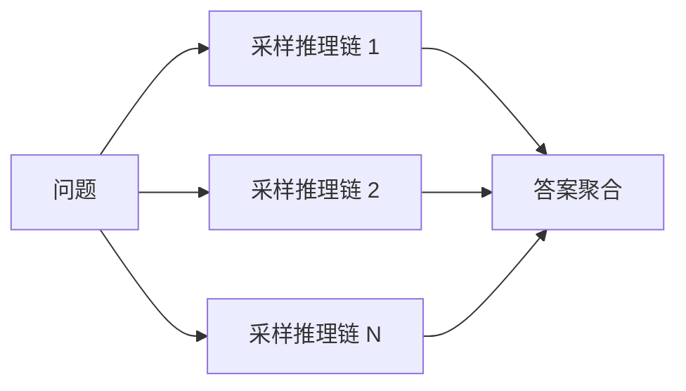
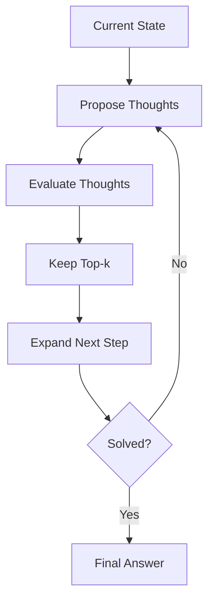

本文介绍大语言模型推理能力相关的技术演化，包括 Chain-of-Thought、Self-Consistency、Tree-of-Thought、过程监督和测试时扩展。

## 快速开始

推理能力不是只由模型参数决定，也受到提示方式、训练数据、搜索策略、验证器和测试时计算量影响。Chain-of-Thought 让模型在回答前生成中间推理步骤，Self-Consistency 通过多次采样投票提升稳定性，Tree-of-Thought 把推理过程扩展成搜索树，过程监督则直接评价中间步骤。

这条路线的核心问题是：如何让模型在复杂任务中不只给出答案，还能组织可检查、可修正、可扩展的求解过程。

## 推理能力的来源

大模型推理能力通常来自多个层次：

| 来源 | 作用 | 例子 |
| --- | --- | --- |
| 预训练 | 学习题型、语言模式、代码和数学知识 | 数学语料、代码仓库、论坛问答 |
| SFT | 学习解题格式和步骤化回答 | CoT 数据、代码解释、证明过程 |
| RLVR/GRPO | 用可验证奖励强化正确解 | 数学答案校验、单元测试 |
| 测试时计算 | 在回答阶段投入更多采样、搜索和验证 | best-of-N、Self-Consistency、verifier |

因此，推理模型不是简单“提示词更长”，而是训练期和推理期共同塑造的结果。

## Chain-of-Thought

思维链 (Chain-of-Thought, CoT) 是一种提示和训练方法，让模型在输出最终答案前先生成中间推理步骤。

在数学题、逻辑题、符号推理、代码分析等任务中，CoT 往往比直接回答更有效，原因包括：

- 把复杂问题拆成多个较短步骤；
- 增加中间状态，减少一步到位的压力；
- 让模型有机会在生成过程中使用更多计算；
- 便于人类或另一个模型检查错误。

CoT 的局限是中间步骤不一定真实反映模型内部机制，也可能生成看似合理但实际错误的解释。因此，CoT 更适合作为外显求解轨迹，而不是对模型内部思考的严格解释。

## Zero-shot CoT

Zero-shot CoT 通过简单提示触发模型逐步推理，例如让模型先一步步分析再回答。这说明大模型在预训练中已经学习到一些推理模式，只是需要合适的输出格式激活。

随着指令微调和后训练发展，许多模型不再需要显式写出固定触发语，也能在复杂任务中生成分步解答。

## Self-Consistency

Self-Consistency 不只采样一条推理路径，而是采样多条 CoT 路径，再对最终答案投票或聚合。

它利用了一个事实：复杂问题中单条推理链可能走错，但多条独立路径如果收敛到同一答案，可靠性通常更高。

基本流程如下：



代价是推理成本随采样次数增加，因此更适合高价值问题或离线评测。

伪代码如下：

```text
输入: question, sample_count N
answers = []
for i in 1..N:
    rationale, answer = model.generate_reasoning(question)
    answers.append(extract_final_answer(answer))
return majority_vote(answers)
```

如果答案不是离散形式，可以用 verifier 或 reward model 代替多数投票。

## Best-of-N 与验证器

Best-of-N 先生成 $N$ 个候选答案，再用验证器或奖励模型选择最优答案：

$$
y^*=\arg\max_{y_i}\ v(x,y_i)
$$

其中 $v$ 可以是奖励模型、规则校验器、单元测试、编译器、数学答案检查器或另一个语言模型。

验证器可分为：

| 类型 | 判断对象 | 适合场景 |
| --- | --- | --- |
| Outcome Verifier | 最终答案 | 数学答案、选择题、代码测试 |
| Process Verifier | 中间步骤 | 多步数学、证明、复杂推理 |
| Tool Verifier | 工具返回结果 | 代码执行、搜索、数据库查询 |
| Human Verifier | 人类偏好和事实判断 | 开放问答、写作、安全评测 |

可验证任务更适合推理强化，因为奖励信号更可靠。

Best-of-N 的伪代码如下：

```text
输入: question, sample_count N, verifier v
candidates = []
for i in 1..N:
    y = model.generate(question)
    score = v(question, y)
    candidates.append((score, y))
return argmax(candidates)
```

在代码任务中，$v$ 可以是单元测试；在数学任务中，$v$ 可以是答案解析器或符号校验器。

## Tree-of-Thought

思维树 (Tree-of-Thought, ToT) 将推理过程从线性链扩展为树搜索。模型可以生成多个中间候选状态，再评价、保留或回溯。

ToT 更适合需要探索和规划的问题，例如谜题、组合搜索、复杂代码修复。它把语言模型从单次生成器变成搜索过程中的生成器和评估器。

与 CoT 相比，ToT 的优势是可回溯，劣势是计算成本和调度复杂度更高。Monte Carlo Tree Search 也可以与语言模型结合，用于需要长期规划和状态评估的问题。



ToT 的关键不是让模型输出更长，而是让生成、评估、保留、回溯成为一个显式搜索过程。

## 过程监督

结果监督只判断最终答案对不对，过程监督 (Process Supervision) 会评价中间步骤是否正确。

在数学和复杂推理中，过程监督更细粒度，可以告诉模型哪一步开始出错。它的难点是标注成本高，需要大量高质量步骤级数据。

过程监督与 [强化学习](../training/stages/rl.md) 结合后，可以让模型不只是追求最终答案，还学习更可靠的推理路径。

## 测试时扩展

测试时扩展 (Test-time Scaling) 指在推理阶段投入更多计算提升答案质量。常见方式包括：

- 生成更长的推理过程；
- 多次采样并投票；
- 使用搜索树探索多个分支；
- 用验证器或奖励模型筛选答案；
- 让模型反思和修正候选解。

它与预训练阶段的参数扩展不同。参数扩展是在训练前增加模型容量，测试时扩展是在回答问题时增加计算预算。

测试时扩展适合答案可验证、错误代价高、推理链较长的问题。不适合低延迟、开放式、主观性强且难以验证的任务。

推理成本可以粗略写成：

$$
\text{Cost}\approx N_\text{samples}\cdot(T_\text{prompt}+T_\text{reasoning}+T_\text{answer})+\text{Cost}_\text{verifier}
$$

这说明采样数、推理长度和验证器都会增加成本。测试时扩展的核心问题是：额外成本是否换来了足够的正确率提升。

## 长思考模型

长思考模型通常在训练时强化长推理轨迹，在推理时允许模型生成更长的中间过程。它们与普通聊天模型的区别不只是输出更长，而是训练目标和推理预算都偏向复杂问题求解。

常见训练信号包括：

- 高质量推理轨迹；
- 可验证最终答案；
- 过程奖励模型；
- 组内相对奖励；
- 错误反思和修正数据。

长思考会增加延迟和 token 成本，因此需要在准确率、成本和用户体验之间权衡。

## 与后训练的关系

推理能力既来自提示和测试时搜索，也来自训练阶段的能力塑造。现代推理模型通常先用高质量推理轨迹做 SFT，再通过偏好优化或 GRPO 等方法强化可验证的正确答案和可靠推理路径；具体训练方法见 [有监督微调](../training/stages/sft.md) 与 [强化学习](../training/stages/rl.md)。

整体演化可以概括为：提示触发 CoT -> 多路径采样 -> 搜索式推理 -> 过程监督 -> 训练和测试时计算协同扩展。

## 可靠性问题

推理增强也会失败：

- 中间步骤看似合理但实际错误；
- 多条推理链自洽地收敛到错误答案；
- 模型过度推理，把简单问题复杂化；
- 验证器本身有漏洞；
- 开放问题缺少客观奖励，难以可靠扩展。

因此，推理能力的关键不只是“想得更久”，而是能否用可靠反馈筛选和修正推理过程。

## 使用注意

在产品和文档中展示推理过程时，要区分“解题步骤”和“模型内部机制”。用户需要的是可验证的推导、依据和结论，而不是把模型生成的每句话都当成真实内部思考。

更稳妥的做法是展示摘要式推导、关键依据、检查结果和最终结论，而不是声称完整呈现模型内部思考。

## 常见误区

| 误区 | 更准确的理解 |
| --- | --- |
| CoT 就是模型真实思考 | CoT 是外显解题轨迹，可能包含事后合理化 |
| 采样越多一定越准 | 如果模型或验证器有系统性偏差，多采样可能放大错误 |
| 长思考适合所有任务 | 简单任务会增加延迟和成本，收益有限 |
| verifier 总是可靠 | 验证器也可能被规避、污染或覆盖不足 |

## 参考资料

- [Chain-of-Thought Prompting Elicits Reasoning in Large Language Models](https://arxiv.org/abs/2201.11903)
- [Self-Consistency Improves Chain of Thought Reasoning in Language Models](https://arxiv.org/abs/2203.11171)
- [Large Language Models are Zero-Shot Reasoners](https://arxiv.org/abs/2205.11916)
- [Tree of Thoughts: Deliberate Problem Solving with Large Language Models](https://arxiv.org/abs/2305.10601)
- [Let's Verify Step by Step](https://arxiv.org/abs/2305.20050)
- [DeepSeekMath: Pushing the Limits of Mathematical Reasoning in Open Language Models](https://arxiv.org/abs/2402.03300)
