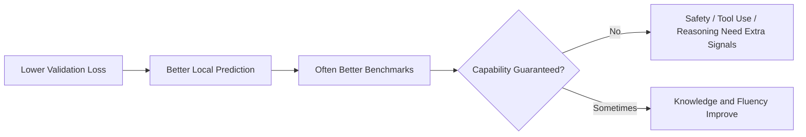

本文介绍大模型训练中的扩展定律，以及参数量、数据量、计算量之间的关系。

## 快速开始

扩展定律 (Scaling Law) 研究模型性能如何随参数量、训练数据和计算量变化。它不是简单说明“参数越大越好”，而是在给定算力预算下回答：模型应该多大、数据应该多少、训练应该多久。

大语言模型从 GPT-3 之后快速变大，很大程度上依赖扩展定律提供的经验规律。Chinchilla 之后，研究者更加重视 token 数量和数据质量，而不是只堆参数。

专业地看，scaling law 主要预测 loss 的平均趋势，不保证每个能力、每个 benchmark、每个产品场景都按同样规律提升。

## 基本变量

扩展定律通常关注三个变量：

| 符号 | 含义 | 说明 |
| --- | --- | --- |
| $N$ | 参数量 | 通常指非 embedding 或总参数，论文口径可能不同 |
| $D$ | 训练 token 数 | 不等于原始文本量，受 tokenizer 和去重影响 |
| $C$ | 训练计算量 | 常用 FLOPs 衡量 |
| $L$ | loss | 通常是验证集交叉熵 |

对于 dense Transformer，训练计算量常用近似为：

$$
C\approx 6ND
$$

这个估算来自前向和反向传播的主要矩阵乘法成本。粗略理解是：前向传播约需要 $2ND$ FLOPs，反向传播通常约为前向的两倍，因此总量约为 $6ND$。它忽略了 embedding、attention 二次项、通信、重计算等细节，但足以做早期预算估算。

## 产生背景

Transformer 架构确定后，模型能力提升越来越依赖规模化训练。但规模化训练成本极高，如果不知道如何分配预算，就容易出现两类浪费：

- 参数很多但训练 token 不够，模型没有充分训练；
- 数据很多但模型太小，模型容量不足以吸收数据。

扩展定律试图用经验公式描述损失函数与规模变量之间的关系。

## Kaplan Scaling Law

Kaplan 等人的研究发现，在一定范围内，语言模型损失会随着参数量、数据量、计算量呈幂律下降。

可以粗略理解为：

$$
L(N,D,C)=L_\infty+aN^{-\alpha}+bD^{-\beta}+cC^{-\gamma}
$$

其中 $L_\infty$ 表示不可约损失，后面几项分别表示参数、数据和计算带来的可下降空间。公式本身不是重点，重点是性能提升在很大范围内可预测。

这使得研究者可以在训练超大模型前，先用小模型实验估计大模型效果。

幂律关系在 log-log 坐标下会近似变成直线。例如 $L=aN^{-\alpha}$ 取对数后：

$$
\log L\approx \log a-\alpha\log N
$$

这也是小规模实验可以外推大规模趋势的原因之一。需要注意，外推只在数据分布、优化状态和模型族相近时更可信。

## Chinchilla Scaling Law

Chinchilla 的关键结论是：许多早期大模型参数量偏大、训练 token 偏少。在相同计算预算下，更小但训练更充分的模型可能效果更好。

Chinchilla 推动了一个重要转向：

- 从只强调参数量，转向强调参数量与训练 token 的平衡；
- 从粗放收集数据，转向重视数据质量、去重和配比；
- 从单次大训练，转向更精细的预算规划。

| 维度 | Kaplan 时代的常见理解 | Chinchilla 之后的理解 |
| --- | --- | --- |
| 能力来源 | 更大参数量很关键 | 参数和 token 需要匹配 |
| 预算分配 | 倾向训练更大模型 | 倾向训练 compute-optimal 模型 |
| 数据角色 | 训练数据够用即可 | 高质量 token 是核心瓶颈 |
| 训练策略 | 大模型少 token | 较小模型更多 token 可能更优 |

## IsoFLOP 与预算规划

IsoFLOP 指在相同计算预算下比较不同参数量和数据量组合。实践中可以训练一组小模型，拟合在固定 FLOPs 下的最优 $N$ 和 $D$，再外推到更大预算。

一个典型流程是：

```text
输入: 模型尺寸集合 N_list，训练 token 集合 D_list，预算集合 C_list
for C in C_list:
    for N in N_list:
        D = C / (6 * N)
        train pilot model with (N, D)
        record validation loss
fit loss_surface(N, D, C)
select (N*, D*) with minimum predicted loss under target budget
输出: compute-optimal training recipe
```

风险在于外推范围过大时，小模型规律不一定完全延续到大模型，尤其是数据质量、优化稳定性和能力涌现可能改变曲线形态。

## 数据质量

扩展定律通常把数据量写成 token 数，但真实训练中数据质量同样关键。低质量、重复、污染评测集的数据会让模型看似训练充分，实际泛化能力下降。

常见数据工程包括：

- 去重；
- 过滤低质量网页；
- 控制代码、数学、多语种、对话数据比例；
- 检查评测集污染；
- 使用合成数据补充稀缺能力。

因此，现代训练配方中的“数据”不只是数量问题，而是数量、质量和分布的共同问题。

## 数据受限时代

高质量公开文本并不是无限的。模型规模继续扩大后，训练会遇到数据受限问题：

- 重复训练相同数据可能导致过拟合或收益递减；
- 低质量数据会拉低有效 token 数；
- 合成数据可以补足数学、代码、指令等能力，但也可能放大模型自身偏差；
- 评测集污染会让 benchmark 分数失真。

这使得数据筛选、合成数据质量控制和数据配比成为 scaling law 之后的核心问题。

## 与 MoE 的关系

Dense 模型扩大参数量时，每个 token 都要经过所有参数中的主要计算路径。MoE 通过稀疏激活，让模型拥有更大的总参数量，但每个 token 只激活少量专家。

这可以看作对扩展成本的再优化：用通信和路由复杂度换取更低的单 token 计算成本。详见 [MoE](./moe.md)。

MoE 中需要区分 total parameters 和 active parameters。前者影响模型容量，后者更直接影响每个 token 的计算量。

## Train-time Scaling 与 Test-time Scaling

传统 scaling law 主要讨论训练时扩展：增加参数、数据和训练计算。推理模型兴起后，测试时扩展 (Test-time Scaling) 也变得重要：同一个模型在回答时使用更多采样、搜索、验证器或长推理，也可能提升复杂任务表现。

两者的区别是：

| 类型 | 扩展对象 | 成本发生位置 | 适合任务 |
| --- | --- | --- | --- |
| Train-time Scaling | 参数、数据、训练 FLOPs | 训练阶段 | 通用能力、知识、语言建模 |
| Test-time Scaling | 采样、搜索、验证、推理长度 | 推理阶段 | 数学、代码、规划、可验证任务 |

测试时扩展不替代预训练规模，但它改变了“能力来自哪里”的成本结构。详见 [推理能力](./reasoning.md)。

## Loss Scaling 与能力 Scaling

验证集 loss 平滑下降，不代表所有能力都平滑提升。原因包括：

- 某些任务在训练数据中占比很低；
- benchmark 需要多步推理，而 loss 更偏局部预测；
- 安全、诚实、工具调用依赖后训练；
- 长上下文能力依赖训练长度和数据格式；
- 评测可能被污染或过拟合。

因此，scaling law 是预算规划工具，不是完整能力理论。



这张图的重点是：loss 下降通常有帮助，但复杂能力还依赖数据分布、后训练、推理策略和评测设计。

## 局限与后续发展

扩展定律主要描述平均损失和规模变量之间的关系，但不能完整预测所有能力。数学推理、代码生成、工具调用、多轮对话、安全性等能力，还会受到数据分布、后训练和推理策略影响。

后续发展集中在：

- 更高质量的数据配方；
- 合成数据和自举训练；
- 稀疏模型 scaling；
- 多模态 scaling；
- test-time compute scaling；
- 从 loss 预测转向能力预测。

## 常见误区

| 误区 | 更准确的理解 |
| --- | --- |
| 参数量是唯一指标 | token 数、数据质量、训练计算和后训练同样关键 |
| token 越多越好 | 低质量或重复 token 的边际收益很低 |
| scaling law 能预测所有能力 | 它主要预测平均 loss，不直接预测安全、推理和产品体验 |
| MoE 参数大就一定计算贵 | 需要区分 total parameters 和 active parameters |
| benchmark 分数就是真实能力 | 要考虑污染、样本分布和实际任务差异 |

## 参考资料

- [Scaling Laws for Neural Language Models](https://arxiv.org/abs/2001.08361)
- [Training Compute-Optimal Large Language Models](https://arxiv.org/abs/2203.15556)
- [Scaling Laws for Generative Mixed-Modal Language Models](https://arxiv.org/abs/2301.03728)
- [Beyond neural scaling laws: beating power law scaling via data pruning](https://arxiv.org/abs/2206.14486)
