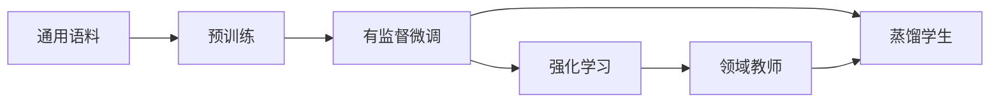

模型训练阶段按监督信号的来源组织为四篇文章：预训练从原始语料构造自监督目标；有监督微调学习目标回答；强化学习从当前策略的结果奖励更新；蒸馏则迁移教师分布、序列或多专家能力。

## 快速开始

建议按依赖顺序阅读：

1. [预训练](./pre-training.md)：理解 next-token loss、数据配方和持续预训练；
2. [有监督微调](./sft.md)：理解 Chat Template、response mask 与监督适配；
3. [强化学习](./rl.md)：理解偏好、奖励、PPO、GRPO、DAPO、GSPO 与 Agentic RL；
4. [蒸馏](./distillation.md)：理解 Knowledge Distillation、Sequence-level KD、OPD 与 MOPD。

这不是每个模型都必须完整执行的固定流水线。例如小模型可以直接蒸馏已有教师，普通助手也不一定需要在线 RL；但每次训练都应明确数据由谁产生、监督信号是什么、哪些 token 参与 loss。

## 四类监督信号

| 文章 | 训练数据或状态 | 直接监督信号 | 代表方法 |
| :-- | :-- | :-- | :-- |
| [预训练](./pre-training.md) | 大规模连续语料 | 真实 token 或被破坏文本 | CLM、MLM、Continued Pre-training |
| [有监督微调](./sft.md) | 指令与目标回答 | assistant / tool call token | Full SFT、LoRA、QLoRA |
| [强化学习](./rl.md) | 当前策略回答或环境轨迹 | 偏好奖励、验证器、任务回报 | RLHF、DPO、PPO、GRPO、DAPO、GSPO |
| [蒸馏](./distillation.md) | 固定数据、教师序列或学生 rollout | 教师 logits、序列或表示 | KD、SeqKD、OPD、MOPD |

LoRA 与 QLoRA 改变的是可训练参数和基座权重表示，见 [参数高效微调](../peft.md)；它们可以用于 SFT、偏好优化或蒸馏，不单独构成监督阶段。DPO 被收录在强化学习文章中用于建立偏好优化全貌，但标准 DPO 在固定偏好数据上训练，不依赖当前策略 rollout。

## Loss 阅读方法

四篇文章统一从张量形状解释 loss。阅读任何训练目标时，先回答：

1. 模型输出 logits 是 $[B,S,V]$、$[B,G,L,V]$ 还是其他形状；
2. labels、reward、advantage 与 mask 如何广播到 token；
3. 先沿词表、长度、group 还是 batch 维归约；
4. 分母是样本数、有效 token 数还是每条序列长度；
5. 最终是否得到单个标量并对正确参数反向传播。

公式相似不代表算法相同。SFT 与 SeqKD 都能表现为交叉熵，但目标回答来源不同；GRPO 与 DAPO 都使用组优势，但 loss reduction 与裁剪策略不同；OPD 与 RL 都需要学生 rollout，但一个匹配教师分布，另一个根据奖励与信用分配更新。

## 评测原则

每个阶段都要保留训练前基线和独立验证集。预训练重点检查语言建模与能力覆盖，SFT 检查格式和指令遵循，RL 检查奖励真实性与策略漂移，蒸馏检查教师能力保留与实际成本收益。loss 下降只证明当前优化目标被拟合，不能单独证明模型更正确、更安全或更快。
