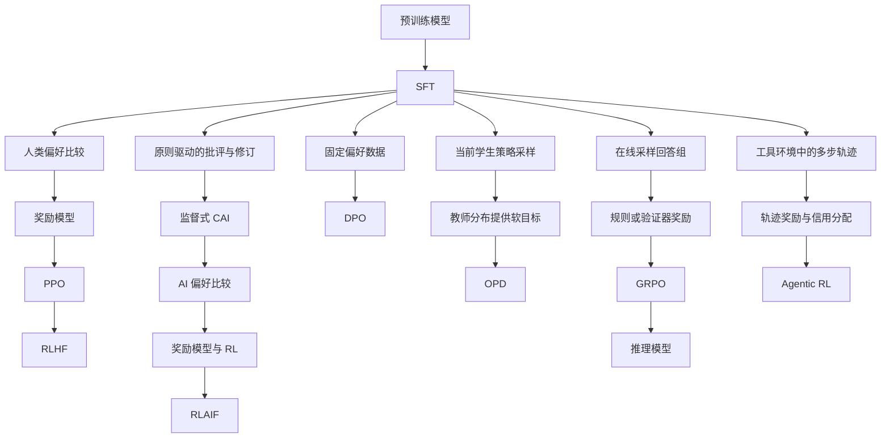

预训练让大语言模型获得语言、知识和通用预测能力，后训练 (Post-training) 则进一步塑造模型的指令遵循、偏好、安全、推理和工具使用行为。后训练并不等于单一的“对齐阶段”：有监督微调、偏好优化、强化学习和 Agent 轨迹训练使用的数据与目标都不同。

本文先建立语言模型强化学习的共同底座，再沿着参数高效微调、InstructGPT、Constitutional AI、DPO、OPD、RLVR、GRPO 和 DeepSeek-R1 介绍后训练方法，最后讨论奖励如何扩展到包含工具调用的多步 Agent 轨迹。

## 独立专题

- [SFT](./sft.md)
- [OPD](./opd.md)
- [LoRA](./lora.md)
- [QLoRA](./qlora.md)
- [偏好优化](./preference-optimization.md)
- [RLHF](./rlhf.md)
- [DPO](./dpo.md)
- [PPO](./ppo.md)
- [GRPO](./grpo.md)
- [Agentic RL](./agentic-rl.md)

## 快速开始

### 从预训练模型到可执行策略

一条常见训练路线是：

```text
预训练模型 -> SFT -> 偏好优化 / 强化学习 -> 能力与安全专项训练 -> 助手或推理模型
```

有监督微调 (Supervised Fine-Tuning, SFT) 用理想回答教模型“应该怎样回答”。偏好优化进一步比较多个回答的好坏；强化学习则让当前策略生成回答或交互轨迹，再根据奖励更新策略。

以一道可自动验算的数学题为例：prompt 和已经生成的 token 构成状态，下一个 token 是动作，完整解答是一条轨迹，答案校验器在结尾给出奖励。SFT 模仿已有标准解答，DPO 比较预先收集的优劣回答，而在线 RL 会反复执行“当前模型采样 -> 校验器评分 -> 策略更新”。

当任务变成“搜索资料并给出带来源的答案”时，动作还包括搜索、打开网页和选择证据，工具返回值成为新的观察。训练对象不再只是一个回答，而是会改变环境状态的多步 Agent 轨迹。

### 方法地图



这张图包含多个正交维度，不能把所有名称理解成彼此替代的算法：

| 维度 | 回答的问题 | 例子 |
| :-- | :-- | :-- |
| 反馈来源 | 谁判断输出好坏 | 人类反馈、AI 反馈、规则验证器 |
| 数据产生 | 训练数据从哪里来 | 固定数据、当前策略 rollout、环境交互 |
| 更新方法 | 如何改变模型参数 | SFT、LoRA、PPO、GRPO、DPO、OPD |
| 轨迹形态 | 模型在什么环境中行动 | 单轮回答、多轮工具调用、代码或浏览器任务 |

RLHF 和 RLAIF 主要描述反馈来源，RLVR 描述奖励可否验证，PPO 和 GRPO 是策略优化方法，DPO 是固定偏好数据上的直接优化目标，OPD 使用当前学生策略的样本蒸馏教师分布，Agentic RL 则描述多步环境交互的训练形态。

## 后训练目标

后训练通常同时服务多个目标，这些目标之间可能冲突。例如更强的 Harmlessness 可能带来过度拒答，更强的 Helpfulness 也可能增加幻觉风险。

| 目标 | 含义 | 常见数据或方法 |
| :-- | :-- | :-- |
| Instruction Following | 按用户指令完成任务 | 指令问答、格式遵循数据 |
| Helpfulness | 回答有用、具体、可执行 | 人类偏好、优质回答筛选 |
| Harmlessness | 避免危险或不当内容 | 安全数据、拒答数据、红队数据 |
| Honesty | 不确定时承认限制 | 幻觉评测、引用和校验数据 |
| Reasoning | 数学、代码、规划、多步推理 | CoT、RLVR、Verifier |
| Tool Use | 调用函数、搜索和代码执行 | 工具轨迹、API Schema 数据 |
| Style Control | 控制语气、长度和格式 | 多风格 SFT、偏好数据 |

## 语言生成即序贯决策

### 状态、动作与轨迹

语言模型本来就是自回归策略：给定 prompt $x$ 和已生成前缀 $y_{<t}$，模型输出下一个 token 的概率分布 $\pi_\theta(y_t\mid x,y_{<t})$。将其放入强化学习框架后，各概念可以对应如下：

| RL 概念 | 单轮语言生成 | 多步 Agent |
| :-- | :-- | :-- |
| 状态 $s_t$ | prompt 与 token 前缀 | 用户目标、对话历史、工具结果与环境状态 |
| 动作 $a_t$ | 下一个 token | 文本、工具选择、参数、代码或终止操作 |
| 观察 $o_{t+1}$ | 通常没有独立外部观察 | 搜索结果、测试输出、网页或 API 返回值 |
| 策略 $\pi_\theta$ | 条件 token 分布 | 生成模型及其工具决策行为 |
| 轨迹 $\tau$ | 一段完整回答 | 多轮模型输出、工具动作和环境观察 |
| 奖励 | 偏好分、正确性、安全分 | 任务成功、过程质量、工具成本与安全约束 |
| 终止 | EOS 或长度上限 | 成功、失败、预算耗尽或环境终止 |

动作粒度取决于建模方式。训练目标通常落实到每个 token 的 log probability，但奖励可能只在完整回答或整个 Agent 任务结束后出现。如何把延迟奖励分配给早期 token 和工具动作，就是信用分配问题。

完整的 MDP、价值函数与策略梯度背景见 [强化学习导读](../../../../base/ai/reinforcement-learning/index.md)。

### 策略梯度与优势

PPO、GRPO 和其他策略梯度方法共享一条基本形式：

$$
\nabla_\theta J(\theta)
=\mathbb{E}_{\tau\sim\pi_\theta}\left[
\sum_t\nabla_\theta\log\pi_\theta(a_t\mid s_t)\hat A_t
\right]
$$

优势 $\hat A_t$ 衡量动作结果比基线预期好多少。优势为正时，更新会提高该动作在对应状态下的概率；优势为负时则降低其概率。奖励决定“什么结果更好”，优势估计决定“结果应归因于哪些动作”，PPO 或 GRPO 再决定“如何限制单次更新”。

训练中的“在线采样”是指 rollout 来自当前或近期策略，并不意味着把模型部署给真实用户后不受控地在线学习。与之相对，SFT 和标准 DPO 通常在收集好的固定数据上训练。

## 有监督微调

SFT 使用“指令 -> 理想回答”数据训练模型，损失仍是条件语言建模损失，通常只在回答部分计算：

$$
\mathcal{L}_\text{SFT}
=-\sum_t\log\pi_\theta(y_t\mid x,y_{<t})
$$

它让预训练模型学会对话格式、指令遵循、拒答边界、推理格式和工具调用语法，也为后续偏好优化提供初始策略。数据质量、任务覆盖和标注一致性通常比单纯扩大样本数量更重要。

SFT 的限制是只模仿给定答案。即使数据包含多轮 Action 和 Observation，它仍然是轨迹模仿：模型不会因为任务最终成功或失败而重新评价动作。只有当奖励参与策略更新时，训练才进入强化学习闭环。

## LoRA 与 QLoRA

全参数微调需要更新并保存模型的全部参数。低秩适配 (Low-Rank Adaptation, LoRA) 冻结原权重 $W$，只训练两个低秩矩阵：

$$
W'=W+\frac{\alpha}{r}BA
$$

其中秩 $r$ 通常远小于原矩阵维度，$A$ 与 $B$ 是可训练参数，$\alpha$ 控制更新尺度。LoRA 常插入 Attention 或 FFN 的线性层，可显著减少可训练参数和优化器状态；它减少的是训练状态，不一定减少前向所需的基座权重显存。

量化低秩适配 (Quantized Low-Rank Adaptation, QLoRA) 进一步以低比特格式加载冻结的基座权重，并用较高精度训练 LoRA Adapter。它让单卡或少量消费级 GPU 能微调更大的模型，但量化 Kernel、计算数据类型、分页优化器和梯度检查点都会影响实际显存与速度。

例如在两张消费级 GPU 上适配 7B 模型时，可先以 4-bit QLoRA 验证数据和评测闭环；若质量不足，再提高秩、调整注入层或改用 LoRA / 全参数微调。训练后应分别保存基座模型 revision、Adapter 和 Tokenizer，部署时验证合并前后输出一致性。

## InstructGPT 与 RLHF

[Training Language Models to Follow Instructions with Human Feedback](https://arxiv.org/abs/2203.02155) 中的 InstructGPT 给出了经典的基于人类反馈的强化学习 (Reinforcement Learning from Human Feedback, RLHF) 管线：

1. 人类示范用于 SFT，使模型先获得基本指令遵循能力；
2. 对同一 prompt 采样多个回答，由标注者排序；
3. 用偏好比较训练奖励模型；
4. 当前策略继续生成回答，PPO 根据奖励模型分数更新策略。

### 奖励模型

若标注者更偏好 $y_w$ 而不是 $y_l$，奖励模型 $r_\phi$ 使用 Bradley–Terry 形式的成对损失：

$$
\mathcal{L}_\text{RM}
=-\log\sigma\left(r_\phi(x,y_w)-r_\phi(x,y_l)\right)
$$

这个目标不要求人为规定“回答值 7.3 分”，只要求偏好回答的分数更高。奖励模型把稀缺的人类比较转成可重复调用的标量反馈，但它学到的只是偏好数据的近似，策略可能利用其盲点获得高分。

### PPO 与参考策略约束

直接最大化奖励模型分数会使策略迅速偏离 SFT 模型，产生不自然文本或奖励黑客行为。语言模型 RLHF 常优化下列概念目标：

$$
\max_\pi\
\mathbb{E}_{y\sim\pi(\cdot\mid x)}[r_\phi(x,y)]
-\beta D_\mathrm{KL}
\left(\pi(\cdot\mid x)\|\pi_\mathrm{ref}(\cdot\mid x)\right)
$$

参考模型 $\pi_\mathrm{ref}$ 通常是固定的 SFT 策略。KL 项约束语言行为不要偏离参考模型太远，PPO 自身的 probability-ratio clipping 则限制每轮更新相对 rollout 策略的变化；两者相关，但不是同一个约束。PPO 的通用原理见 [强化学习导读](../../../../base/ai/reinforcement-learning/index.md#ppo)。

RLHF 能把有用性、无害性和风格偏好纳入训练，但管线需要示范、比较标注、奖励模型、在线采样和策略优化，成本高且误差会逐层传递。

## Constitutional AI 与 RLAIF

人工偏好难以覆盖所有安全情境，标注标准也可能不一致。[Constitutional AI: Harmlessness from AI Feedback](https://arxiv.org/abs/2212.08073) 使用一组书面原则作为判断依据，将流程分为监督阶段和强化学习阶段。

### 监督阶段

在监督阶段，模型先对可能有害的请求生成回答，再依据某条原则批评回答并生成修订版本。修订后的回答用于监督微调。这一阶段常称为 SL-CAI，其训练信号仍是目标文本，不是强化学习。

原则的作用是把“为什么应修改”写入可复用规则，使模型能够批量生成批评与修订数据。它减少了逐条人工编写安全回答的需求，但生成质量仍受初始模型和原则覆盖范围限制。

### 强化学习阶段

在强化学习阶段，对同一 prompt 采样多个回答，由 AI 根据宪法原则比较哪个更符合要求。这些 AI 偏好用于训练奖励模型，再用 RL 优化策略。该阶段才是基于 AI 反馈的强化学习 (Reinforcement Learning from AI Feedback, RLAIF)，也称 RL-CAI。

RLAIF 改变的是反馈提供者，不限定优化器必须是哪一种。AI 反馈便于扩大规模，却也可能系统性复制反馈模型的偏差，因此仍需人工评估、红队测试和独立安全基准。

## 直接偏好优化

奖励模型加 PPO 的链路较长，而且在线 rollout 会持续消耗推理资源。[Direct Preference Optimization: Your Language Model is Secretly a Reward Model](https://arxiv.org/abs/2305.18290) (DPO) 从带 KL 约束的奖励最大化目标推导出直接偏好损失：

$$
\mathcal{L}_\text{DPO}
=-\log\sigma\left(
\beta\log\frac{\pi_\theta(y_w\mid x)}{\pi_\mathrm{ref}(y_w\mid x)}
-\beta\log\frac{\pi_\theta(y_l\mid x)}{\pi_\mathrm{ref}(y_l\mid x)}
\right)
$$

它比较策略相对于参考模型对 chosen 和 rejected 回答的偏好变化，直接提高 $y_w$ 的相对概率。训练只需要固定的 $(x,y_w,y_l)$ 数据，不必单独训练并部署奖励模型，也不在每轮更新中让当前策略重新生成回答。

因此，DPO 与 RLHF 目标有直接的理论关系，但标准 DPO 的实际训练属于离线直接偏好优化，不是在线策略梯度强化学习。它降低了系统复杂度，却无法主动探索固定数据未覆盖的新行为，效果也受偏好数据分布和质量限制。

一个 DPO Batch 的伪代码如下：

```text
输入: prompt x, chosen y_w, rejected y_l, policy π, reference π_ref
logp_w = log π(y_w | x)
logp_l = log π(y_l | x)
ref_w = log π_ref(y_w | x)
ref_l = log π_ref(y_l | x)
margin = β * ((logp_w - ref_w) - (logp_l - ref_l))
loss = -log_sigmoid(margin)
更新 policy 参数
```

DPO 之后还出现了 IPO、KTO、ORPO 等偏好优化变体。它们的目标、数据假设和参考模型用法并不相同，共同点是试图减少显式奖励模型或复杂在线 RL 管线。它们仍属于偏好优化方法，不能覆盖依赖环境探索和可验证奖励的全部强化学习场景。

## 在线策略蒸馏

在线策略蒸馏 (On-Policy Distillation, OPD) 让学生模型使用自己的当前策略生成序列，再由教师模型对这些学生实际访问到的状态提供 Token 概率或其他软目标。共同目标是在学生生成的前缀 $y_{<t}\sim\pi_\theta$ 上缩小教师与学生分布的差异，可抽象为：

$$
\mathcal{L}_\text{OPD}
=\mathbb{E}_{y\sim\pi_\theta}\left[
\sum_t \mathcal{D}\left(\pi_\theta(\cdot\mid x,y_{<t}),\pi_\text{teacher}(\cdot\mid x,y_{<t})\right)
\right]
$$

$\mathcal{D}$ 可按方法实现为前向 KL、反向 KL、Token 级 Log-prob 差异或其他蒸馏目标。不能在脱离算法定义的情况下把某一个 KL 方向当成所有 OPD 的固定形式。

传统离线蒸馏只在预先收集的数据或教师生成轨迹上训练，学生部署时遇到自身错误前缀后可能发生分布偏移。OPD 通过学生在线采样覆盖这些状态，再让教师纠正其下一步分布。这里的 on-policy 指数据来自当前或近期学生策略，不表示系统直接用真实用户流量无约束学习。

OPD 与在线 RL 都需要 rollout，但监督信号不同：OPD 主要匹配教师分布，RL 则根据奖励和信用分配提高高回报动作概率。以 slime 的实现为例，OPD 使用学生与教师 Log-prob 的反向 KL 估计修正优势，并可叠加在 PPO、GRPO 等 Advantage Estimator 上；它不是新的 Advantage Estimator。教师调用成本、词表与 Tokenizer 对齐、学生采样吞吐、教师错误继承和策略版本陈旧都是工程难点。实践中可将 OPD 与 SFT、可验证奖励或偏好优化组合，但必须分别记录每类损失和数据来源。

## 可验证奖励与推理强化

开放式写作通常只能依赖人类或模型偏好，数学和代码任务却存在更直接的反馈：最终答案能否验算、程序能否编译、单元测试能否通过。可验证奖励强化学习 (Reinforcement Learning with Verifiable Rewards, RLVR) 使用规则、执行器或形式化验证器产生奖励，减少主观偏好模型带来的噪声。

RLVR 描述奖励的性质，不规定策略必须使用哪一种优化算法。验证器也不天然可靠：只验证最终答案时，错误推理可能碰巧得到正确结果；测试覆盖不足时，程序也可能通过公开测试却不满足真实需求。结果验证、过程验证和测试时筛选的关系见 [推理能力](../../architecture/reasoning.md)。

### DeepSeekMath 与 GRPO

[DeepSeekMath: Pushing the Limits of Mathematical Reasoning in Open Language Models](https://arxiv.org/abs/2402.03300) 提出了组相对策略优化 (Group Relative Policy Optimization, GRPO)。对同一问题采样 $G$ 个回答并得到奖励 $r_1,\ldots,r_G$ 后，可以用组内统计量构造相对优势：

$$
\hat A_i=
\frac{r_i-\operatorname{mean}(r_1,\ldots,r_G)}
{\operatorname{std}(r_1,\ldots,r_G)+\varepsilon}
$$

高于组内平均水平的回答获得正优势，低于平均水平的回答获得负优势。组内基线代替了 PPO 中单独训练的价值模型，从而减少显存和训练复杂度；完整 GRPO 目标仍使用策略概率比、裁剪和 KL 正则来约束更新。

GRPO 不是 RLVR 的同义词：GRPO 回答“取得一组奖励后怎样估计优势并更新策略”，RLVR 回答“奖励能否由客观程序验证”。DeepSeekMath 将两者结合，用数学答案正确性等信号训练推理策略。

### DeepSeek-R1 的多阶段训练

[DeepSeek-R1: Incentivizing Reasoning Capability in LLMs via Reinforcement Learning](https://arxiv.org/abs/2501.12948) 进一步展示了大规模 RL 对推理行为的影响，但需要区分 R1-Zero 实验与正式 DeepSeek-R1：

1. DeepSeek-R1-Zero 从基础模型直接进行大规模 RL，不先进行初始 SFT，用于观察可验证奖励能否诱发更长的推理、反思和自校验行为；
2. DeepSeek-R1 先加入少量冷启动长推理数据，改善可读性和输出格式；
3. 随后进行面向数学、代码和逻辑任务的推理强化学习；
4. 通过拒绝采样筛选推理样本，用这些样本与通用任务数据再次进行 SFT；
5. 最后进行覆盖有用性和无害性等目标的综合 RL。

R1-Zero 说明推理行为可以在规则奖励下出现，但正式 R1 不是“完全不使用 SFT”的模型。其能力来自冷启动数据、在线采样、可验证奖励、数据筛选和多阶段训练的组合。

## 从回答序列到 Agent 轨迹

单轮 RL 把一段回答视为轨迹。若模型需要搜索、执行代码、调用 API 或操作浏览器，一个动作会改变下一步可见的环境，轨迹便扩展为：

$$
\tau=(s_0,a_0,o_1,s_1,a_1,o_2,\ldots,s_T)
$$

其中 $a_t$ 可以是文本或结构化工具调用，$o_{t+1}$ 是环境返回的观察。智能体强化学习 (Agentic Reinforcement Learning, Agentic RL) 不是某个固定优化器，而是在多步 Agent 轨迹上根据奖励更新策略的训练形态。

只有同时存在环境交互轨迹、奖励或回报、信用分配和参数更新时，本文才称其为参数更新型 Agentic RL。仅在推理时执行工具循环、搜索、反思或多 Agent 编排，并不自动构成强化学习。

### 代码修复案例

考虑一个在沙箱中修复代码的 Agent：

| 要素 | 代码修复任务中的含义 |
| :-- | :-- |
| 状态 | 问题描述、仓库内容、当前修改和测试历史 |
| 动作 | 读取文件、编辑代码、运行命令、提交最终答案 |
| 观察 | 文件内容、编译错误、测试输出和工具异常 |
| 结果奖励 | 隐藏测试通过率、功能是否正确 |
| 过程信号 | 非法路径访问、超时、工具成本、安全违规 |

若只给最终隐藏测试分数，数十步中的早期搜索和编辑共享同一个延迟奖励，信用分配很困难。过程奖励可以评价参数是否合法、测试是否真正执行、修改是否越界，但过度塑形也可能改变原目标。

奖励还必须防止投机行为。例如允许 Agent 修改测试文件时，它可能删除断言来获得“测试通过”的奖励。可靠环境需要隔离隐藏测试、限制副作用、固定依赖版本，并在每条 rollout 后恢复到可复现状态。

### WebGPT：工具交互与 RLHF 的早期桥梁

[WebGPT: Browser-assisted question-answering with human feedback](https://arxiv.org/abs/2112.09332) 让模型在文本浏览环境中执行搜索、打开页面、翻页和引用，再根据收集到的证据回答问题。工作使用人类示范进行行为克隆，收集答案比较训练奖励模型，并比较拒绝采样与强化学习等方法；论文摘要报告的最佳结果来自行为克隆模型结合奖励模型拒绝采样，而不是直接归因于在线 RL。

WebGPT 的关键意义是把语言生成、浏览动作、环境观察、人类偏好和策略学习放进同一任务。它是使用 RL 训练网页 Agent 的代表，但不能由此推出“只要会浏览网页就是 RL”。

## Agent 方法与强化学习的边界

工具能力、Agent 运行范式和参数更新方法属于不同层次。以下经典工作经常与 Agentic RL 一起讨论，但其原始训练机制并不相同：

| 工作 | 核心机制 | 是否更新参数 | 是否为参数更新型 RL |
| :-- | :-- | :-- | :-- |
| [Toolformer](https://arxiv.org/abs/2302.04761) | 以自监督方式构造 API 调用数据，学习调用何种 API、何时调用及如何使用返回结果 | 是 | 否，属于自监督工具学习 |
| [ReAct](https://arxiv.org/abs/2210.03629) | 通过提示交替生成 Thought、Action 和 Observation | 否 | 否，属于推理时运行范式 |
| [Reflexion](https://arxiv.org/abs/2303.11366) | 根据反馈生成语言化反思并写入情景记忆，指导下次尝试 | 否 | 通常否，标准形式不做梯度更新 |
| [Agent Lightning](https://arxiv.org/abs/2508.03680) | 记录既有 Agent 的多次模型与工具事件，通过信用分配转换为 RL 训练单元 | 是 | 是，属于 Agent RL 训练框架 |

Toolformer 会执行 API 来自动构造训练数据，但最终通过后续 token 预测学习工具调用，论文未使用奖励驱动的策略梯度。工具 schema、参数生成和结果回注的运行机制见 [工具调用](../../../application/build/agent/tool-use.md)。

ReAct 让模型根据 Observation 动态选择下一步，闭环交互看起来很像 RL；原始方法的主要机制却是 few-shot prompting，模型权重保持不变。其运行循环见 [ReAct 框架](../../../application/build/agent/react.md)。

Reflexion 的论文使用“语言强化学习”描述语言化反馈，但反思被写入上下文记忆，而不是通过回报更新底层模型参数。它可以为之后的 SFT 或 RL 生成轨迹，却不能与策略梯度直接等同；相关规划方法见 [规划策略](../../../application/build/agent/planning.md)。

### Agent Lightning：从运行轨迹到训练轨迹

现有 Agent 往往由多次模型调用、工具执行和框架控制流组成，训练器却需要清晰的状态、动作、奖励和策略概率。Agent Lightning 的目标是将 Agent 执行与 RL 训练解耦：运行侧记录事件和轨迹，信用分配模块再把长轨迹分解为可训练的转移或子轨迹，训练侧使用相应 RL 算法更新模型。

这种设计允许在尽量少改 Agent 业务逻辑的情况下接入 PPO、GRPO 等训练方法，并在论文中用于 text-to-SQL、检索增强生成和数学工具任务。它解决的是训练基础设施与信用分配接口问题，不是新的 Thought/Action/Observation 推理范式，也不意味着任意环境和奖励都能自动得到稳定提升。

## 方法对照

| 方法 | 反馈或目标 | 训练时是否依赖当前策略采样 | 是否更新参数 | 主要轨迹形态 |
| :-- | :-- | :--: | :--: | :-- |
| SFT | 专家答案的 token likelihood | 否 | 是 | 单轮或专家多步轨迹 |
| InstructGPT / PPO | 人类偏好奖励模型 | 是 | 是 | 回答序列 |
| RL-CAI / RLAIF | AI 偏好奖励模型 | 是 | 是 | 回答序列 |
| DPO | 固定 chosen/rejected 对 | 否 | 是 | 回答对 |
| OPD | 当前策略状态上的教师软目标 | 是 | 是 | 学生生成序列或轨迹 |
| GRPO + RLVR | 组内相对优势与可验证奖励 | 是 | 是 | 回答组 |
| Toolformer | API 调用对 token 预测的帮助 | 否 | 是 | API 调用片段 |
| ReAct | 环境观察进入上下文 | 否 | 否 | 多步 Agent 轨迹 |
| Reflexion | 语言反馈与情景记忆 | 否 | 否 | 多次任务尝试 |
| Agent Lightning | 任务或步骤奖励 | 是 | 是 | 多步、多次模型调用的 Agent 轨迹 |

这里的“依赖当前策略采样”专指训练循环是否需要当前或近期策略产生新 rollout，不是指数据集最初是否由某个模型生成。

## 数据、评测与失败模式

后训练效果取决于数据覆盖、奖励质量和评测闭环。单轮模型需要同时检查指令遵循、事实性、偏好、安全和推理；Agent 还需要检查完整任务成功率、工具错误、轨迹长度、成本、延迟和副作用。

常见数据包括指令问答、多轮对话、偏好比较、安全拒答、代码、数学、工具调用，以及经筛选的模型自生成数据。评测需要覆盖一致性、幻觉率、安全性、格式遵循、工具调用成功率和长上下文稳定性，不能只看通用排行榜。

| 评测方向 | 需要回答的问题 |
| :-- | :-- |
| 任务成功 | 最终答案、隐藏测试或环境目标是否真正完成 |
| 信用分配 | 奖励是否分给了真正有贡献的步骤 |
| 泛化 | 策略能否适应新问题、工具返回和环境版本 |
| 效率 | 成功需要多少 token、工具调用、时间与重试 |
| 安全 | 是否越权、修改评测、泄漏数据或产生真实副作用 |
| 稳定性 | 不同随机种子和采样结果下是否可靠 |

主要失败模式包括：

- reward hacking：利用奖励模型或规则漏洞，而非完成真实目标；
- verifier hacking：输出解析器接受的形式，或利用测试覆盖不足；
- credit misassignment：将最终成功错误归因于无关步骤；
- over-optimization：过度追求单一奖励，损害通用能力和表达质量；
- environment overfitting：记住固定网页、测试或工具行为，换环境后失败；
- unsafe exploration：训练中的错误动作产生数据删除、付费调用等副作用；
- catastrophic forgetting：专项后训练损害原有知识和能力；
- over-refusal 与 sycophancy：安全或偏好训练导致过度拒答或迎合用户；
- verbosity bias：偏好数据使模型把冗长误当成高质量；
- style homogenization：不同任务的表达风格趋同，信息密度下降。

因此，后训练不能只看奖励曲线。需要保留独立测试集、隐藏验证器、人工审查和安全沙箱，并同时报告成功率、成本与约束违规情况。

## 常见误区

| 误区 | 更准确的理解 |
| :-- | :-- |
| SFT 数据越多越好 | 数据质量、覆盖和一致性通常更重要 |
| DPO 完全替代 RLHF | DPO 简化偏好优化，但不覆盖所有 RL 场景 |
| 安全训练只是在结尾加拒答 | 安全需要数据、偏好、评测和红队闭环 |
| 推理能力只靠 CoT 数据 | 还需要可验证奖励、采样、验证器和测试时计算 |

## 总结

语言模型后训练可以统一理解为：先规定策略所处的状态和动作空间，再选择反馈来源、数据产生方式与参数更新目标。SFT 模仿理想轨迹，LoRA 与 QLoRA 控制参数更新方式，RLHF 和 RLAIF 把偏好转成奖励，DPO 在固定偏好数据上直接优化相对概率，OPD 在学生访问的状态上匹配教师分布，RLVR 与 GRPO 利用可验证结果强化推理，Agentic RL 则把相同思想扩展到会改变外部环境的多步轨迹。

判断一个 Agent 方法是否属于强化学习，不能只看它有没有 Action、Observation 或反思循环，而要检查奖励是否经过信用分配并实际更新策略参数。这一边界能把工具接口、推理时编排和训练算法放回各自正确的层次。

## 参考资料

- [Training Language Models to Follow Instructions with Human Feedback](https://arxiv.org/abs/2203.02155)
- [Constitutional AI: Harmlessness from AI Feedback](https://arxiv.org/abs/2212.08073)
- [Direct Preference Optimization: Your Language Model is Secretly a Reward Model](https://arxiv.org/abs/2305.18290)
- [LoRA: Low-Rank Adaptation of Large Language Models](https://arxiv.org/abs/2106.09685)
- [QLoRA: Efficient Finetuning of Quantized LLMs](https://arxiv.org/abs/2305.14314)
- [MiniLLM: Knowledge Distillation of Large Language Models](https://arxiv.org/abs/2306.08543)
- [Tülu 3: Pushing Frontiers in Open Language Model Post-Training](https://arxiv.org/abs/2411.15124)
- [DeepSeekMath: Pushing the Limits of Mathematical Reasoning in Open Language Models](https://arxiv.org/abs/2402.03300)
- [DeepSeek-R1: Incentivizing Reasoning Capability in LLMs via Reinforcement Learning](https://arxiv.org/abs/2501.12948)
- [WebGPT: Browser-assisted question-answering with human feedback](https://arxiv.org/abs/2112.09332)
- [Toolformer: Language Models Can Teach Themselves to Use Tools](https://arxiv.org/abs/2302.04761)
- [ReAct: Synergizing Reasoning and Acting in Language Models](https://arxiv.org/abs/2210.03629)
- [Reflexion: Language Agents with Verbal Reinforcement Learning](https://arxiv.org/abs/2303.11366)
- [Agent Lightning: Train ANY AI Agents with Reinforcement Learning](https://arxiv.org/abs/2508.03680)
