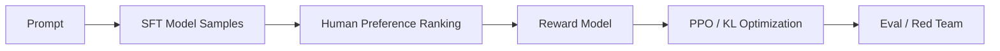
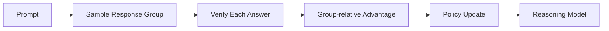

本文介绍大语言模型从基础模型走向助手模型的后训练技术。

## 快速开始

后训练 (Post-training) 是预训练之后的一组训练过程，目标是让模型更会遵循指令、更符合人类偏好、更安全，并在特定能力上表现更强。

典型路线是：

```text
预训练模型 -> SFT -> 偏好优化 / 强化学习 -> 安全和能力专项训练 -> 助手模型或推理模型
```

预训练让模型学会语言和知识，后训练让模型学会如何回答。对于现代大模型，后训练已经不只是“对齐”，还包括工具调用、长上下文、代码、数学、风格控制和推理强化。

## 后训练目标拆解

后训练通常同时服务多个目标：

| 目标 | 含义 | 常见数据或方法 |
| --- | --- | --- |
| Instruction following | 按用户指令完成任务 | 指令问答、格式遵循数据 |
| Helpfulness | 回答有用、具体、可执行 | 人类偏好、优质回答筛选 |
| Harmlessness | 避免危险或不当内容 | 安全数据、拒答数据、红队数据 |
| Honesty | 不确定时承认限制 | 幻觉评测、引用和校验数据 |
| Reasoning | 数学、代码、规划、多步推理 | CoT、RLVR、verifier |
| Tool use | 调用函数、搜索、代码执行 | 工具轨迹、API schema 数据 |
| Style control | 控制语气、长度、格式 | 多风格 SFT、偏好数据 |

这些目标之间可能冲突。例如更强的 harmlessness 可能带来过度拒答，更强的 helpfulness 可能增加幻觉风险。

## 有监督微调

有监督微调 (Supervised Fine-Tuning, SFT) 使用人工构造或筛选的指令数据训练模型。数据通常是“指令 -> 理想回答”的形式。

SFT 的作用是建立基础交互格式：

- 理解用户指令；
- 按对话格式回答；
- 学习拒答、解释、步骤化输出等基本行为；
- 为后续偏好优化提供初始策略模型。

SFT 数据设计比数量更关键。常见类型包括单轮问答、多轮对话、拒答、格式遵循、工具调用、代码、数学、长上下文和多语种数据。

SFT 的限制是它只模仿标注答案，不直接优化“哪个答案更好”。

SFT 损失仍然是条件语言建模损失，只是只在回答部分计算：

$$
\mathcal{L}_\text{SFT}=-\sum_t\log\pi_\theta(y_t\mid x,y_{<t})
$$

其中 $x$ 是用户指令或对话上下文，$y$ 是标注回答。实践中通常会 mask 掉 prompt 部分，只让模型学习 assistant response。

## RLHF

基于人类反馈的强化学习 (Reinforcement Learning from Human Feedback, RLHF) 通常包含三个阶段：



1. 使用 SFT 得到初始策略模型；
2. 收集多个回答的人类偏好排序，训练奖励模型；
3. 使用 PPO 等强化学习算法优化策略模型。

奖励模型常被训练为给 chosen 回答比 rejected 回答更高分。pairwise loss 常写成：

$$
\mathcal{L}_\text{RM}=-\log\sigma(r_\phi(x,y_w)-r_\phi(x,y_l))
$$

其中 $y_w$ 是偏好回答，$y_l$ 是较差回答。

策略优化时通常加入 KL penalty，防止模型偏离参考模型太远：

$$
\max_\pi\ \mathbb{E}[r_\phi(x,y)]-\beta\,\text{KL}(\pi(y\mid x)\|\pi_\text{ref}(y\mid x))
$$

RLHF 的价值在于把人类偏好转化为可优化信号。它能提升有用性、无害性和回答风格，但训练链路复杂，奖励模型也可能被策略模型钻空子。

## DPO

直接偏好优化 (Direct Preference Optimization, DPO) 试图绕开奖励模型和在线强化学习，直接用偏好数据优化模型。

DPO 的常见数据形式是：同一个问题下，一个 chosen 回答和一个 rejected 回答。目标可以直观理解为提高 chosen 相对 rejected 的概率，同时受参考模型约束。

简化形式为：

$$
\mathcal{L}_\text{DPO}=-\log \sigma\left(\beta\log\frac{\pi_\theta(y_w\mid x)}{\pi_\text{ref}(y_w\mid x)}-\beta\log\frac{\pi_\theta(y_l\mid x)}{\pi_\text{ref}(y_l\mid x)}\right)
$$

其中 $y_w$ 是偏好回答，$y_l$ 是较差回答，$\beta$ 控制偏离参考模型的强度。

相比 RLHF，DPO 更简单、稳定、易复现，但它仍依赖高质量偏好数据。

一个 DPO batch 的伪代码如下：

```text
输入: prompt x, chosen y_w, rejected y_l, policy π, reference π_ref
logp_w = log π(y_w | x)
logp_l = log π(y_l | x)
ref_w = log π_ref(y_w | x)
ref_l = log π_ref(y_l | x)
margin = β * ((logp_w - ref_w) - (logp_l - ref_l))
loss = -log_sigmoid(margin)
更新 policy 参数
```

DPO 的关键是比较“相对参考模型，policy 是否更偏向 chosen 而不是 rejected”。

## DPO 系列方法

DPO 之后出现了多种偏好优化变体，例如 IPO、KTO、ORPO。它们的共同目标是简化偏好优化流程，减少对奖励模型或复杂 RL 训练的依赖。

需要注意，这些方法是偏好优化，不等价于完整强化学习。对于可验证的数学、代码任务，直接使用环境或验证器反馈的强化学习仍然很重要。

## RLAIF 与 Constitutional AI

基于 AI 反馈的强化学习 (Reinforcement Learning from AI Feedback, RLAIF) 使用模型辅助生成偏好反馈，降低人工标注成本。

Constitutional AI 使用一组原则约束模型行为，让模型根据原则自我批判和修正回答。这类方法的重点是把安全、诚实、有帮助等要求写入反馈过程。

AI feedback 的优势是成本低、规模大，但风险是反馈模型自身偏差会被放大。因此它通常需要人工审核、红队评测和安全基准配合。

## 推理强化

推理模型的后训练越来越依赖可验证奖励。可验证奖励强化学习 (Reinforcement Learning with Verifiable Rewards, RLVR) 使用规则、测试、答案校验器或编译器判断回答是否正确。

适合 RLVR 的任务包括：

- 数学题：最终答案可校验；
- 代码题：可运行单元测试；
- 形式逻辑：可用符号工具验证；
- 工具调用：可检查 API 调用结果。

组相对策略优化 (Group Relative Policy Optimization, GRPO) 常用于推理模型训练。它对同一问题采样一组回答，用组内相对表现构造优势估计，减少对单独价值模型的依赖。



这类方法与 [推理能力](../architecture/reasoning.md#测试时扩展) 中的测试时扩展密切相关。

## 数据与评测

后训练效果高度依赖数据质量。常见数据类型包括：

- 指令问答数据；
- 多轮对话数据；
- 偏好比较数据；
- 安全拒答数据；
- 代码、数学、工具调用等能力数据；
- 模型自生成并经筛选的数据。

评测不能只看通用榜单，还要看实际使用中的一致性、幻觉率、安全性、格式遵循、工具调用成功率和长上下文稳定性。

| 评测方向 | 关注问题 |
| --- | --- |
| 指令遵循 | 是否按要求格式、范围和约束回答 |
| 安全 | 是否拒绝危险请求，是否过度拒答 |
| 幻觉 | 是否编造事实、链接、引用或 API |
| 推理 | 数学、代码、规划、多步问答是否可靠 |
| 工具调用 | 参数是否正确，是否能处理错误返回 |
| 人类偏好 | 实际用户是否觉得有用、清晰、可信 |

## 副作用与失败模式

后训练可能带来新的问题：

- over-refusal：对安全请求也过度拒绝；
- sycophancy：迎合用户错误观点；
- verbosity bias：偏好冗长回答；
- reward hacking：利用奖励模型漏洞；
- style homogenization：风格趋同，信息密度下降；
- catastrophic forgetting：专项训练损害通用能力。

这些问题说明后训练不是单向提升，而是在多个目标之间做平衡。

## 常见误区

| 误区 | 更准确的理解 |
| --- | --- |
| SFT 数据越多越好 | 数据质量、覆盖和一致性通常更重要 |
| DPO 完全替代 RLHF | DPO 简化偏好优化，但不覆盖所有 RL 场景 |
| 安全训练只是在结尾加拒答 | 安全需要数据、偏好、评测和红队闭环 |
| 推理能力只靠 CoT 数据 | 还需要可验证奖励、采样、验证器和测试时计算 |

## 参考资料

- [Training language models to follow instructions with human feedback](https://arxiv.org/abs/2203.02155)
- [Direct Preference Optimization: Your Language Model is Secretly a Reward Model](https://arxiv.org/abs/2305.18290)
- [Constitutional AI: Harmlessness from AI Feedback](https://arxiv.org/abs/2212.08073)
- [DeepSeekMath: Pushing the Limits of Mathematical Reasoning in Open Language Models](https://arxiv.org/abs/2402.03300)
